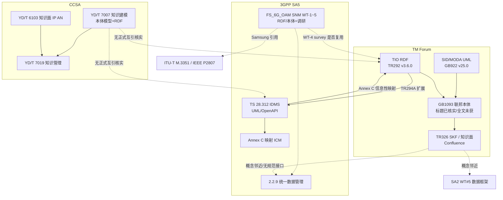
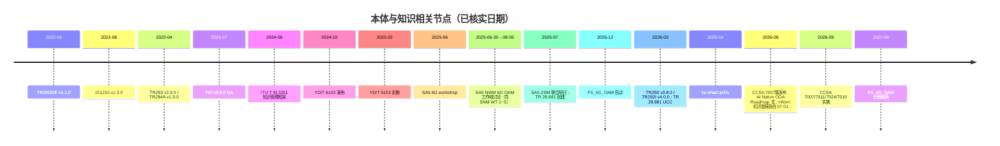

# TM Forum × CCSA × 3GPP SA5 本体标准统一分析

> 子题：`ontology-standards-tmf-ccsa-3gpp`  
> 调研日：2026-09-20  
> 配套： [主题卡](../wiki/topics/ontology-standards-tmf-ccsa-3gpp.md) · [精读笔记](../research/notes/ontology-standards-tmf-ccsa-3gpp.md) · [术语：本体](../wiki/glossary/ontology.md) · [术语：知识面](../wiki/glossary/knowledge-plane.md)

---

## 0. 执行摘要

**判断一 [高]**：TM Forum 目前真正 GA 且以 RDF 交付的本体是 **TIO（TR292 族，v3.6.0 / 局部 2026-03-27 更新）**；SID/MODA 仍以 UML/XMI/Excel 交付（GB922 v25.0，2025-07-18）。"基于 SID/eTOM 的 BSS/OSS 本体"是 AI Native ODA Roadmap v1.0（2026-06-18）的优先事项，不是已发布规范。联邦本体 GB1093 仅能从社区讨论核实标题与 MODA-440 编号，全文为 Confluence 内部页。

**判断二 [高]**：CCSA 已形成可实施的知识图谱/知识管理/知识面行业标准簇（YD/T 7007/7011/7024/7019 于 2026-09-01 实施；YD/T 6103-2024 于 2025-02-01 实施）。公开目录中华为、中兴均为**起草单位**，第一起草单位多为中国移动或北京邮电大学；**未核实到华为牵头的 CCSA"本体"专项规范**。

**判断三 [高]**：3GPP SA5 已在 TS 28.312 Annex C 给出 IntentExpectation ↔ TM Forum ICM 的**信息性映射**，并用 TR294A 做反向扩展；但 Rel-20 FS_6G_OAM（WI 1100014，2025-12 → 2027-06）才把 RDF/知识图谱/本体（含 TM Forum）列为 WT-4 **调研对象**。RDF 作为新 solution set 仍是公司提议（Ericsson），不是已批准规范。

---

## 1. 问题界定与三层辨析

本分析的问题不是"要不要知识图谱"，而是：**电信运维语义应以何种形式化程度、由哪个组织、在哪一层接口上成为可互操作资产**。必须先切开三个常被混用的层。

| 层 | 回答的问题 | 典型交付 | 能否自动推理 / 校验 |
|---|---|---|---|
| **信息模型** | 业务/网管对象有哪些属性与关联？ | SID/MODA UML、3GPP NRM（TS 28.541/28.622）、YANG、OpenAPI | 结构约束为主；UML 无标准 OWL 语义 |
| **本体** | 概念的共享形式化规格（类、关系、公理）是什么？ | TIO Turtle、W3C OWL/RDFS、SHACL shapes | 可做一致性、约束、部分推理 |
| **知识图谱** | 实例三元组/属性图如何存储、融合、查询？ | CCSA KG、OpenAN KG、运维图谱 | 依赖其上的本体/模式；图谱本身不等于本体 |

**OWL-RDF-SHACL vs UML vs YANG [高]**

- **UML（SID/MODA、3GPP NRM）**：适合人读的领域分解与代码生成；缺描述逻辑公理与全局 IRI。Catalyst C26.0.910 把 MODA 25.5 转成 OWL，本身证明官方 SID 仍不是 OWL。
- **YANG / OpenAPI**：3GPP SA5 现行 Stage-3 solution set。Ericsson `openapi-to-rdf` 把 Rel-18/19 MnS OpenAPI 转成 RDFS+SHACL，说明 **RDF 是转译产物，不是规范面**。
- **RDF/RDFS + OWL + SHACL**：TIO 走此路径。tio-shacl（arXiv:2604.27359，2026-04-30）给出 56 个 node shapes、69 个 property shapes，覆盖 87 类 / 109 属性 / 72 函数——这是目前唯一对 TMF 本体的系统化校验实证。

工程含义：从 SID UML 到可执行语义，至少要过 **标识（IRI）→ 词汇（RDFS/OWL）→ 约束（SHACL）→ 实例（KG）** 四步；跳步会把"本体项目"做成又一个数据字典。

**易混点（写进术语卡的工作定义）**

- 把 SID 叫"本体"：SID 提供共享词汇，但交付物是 UML 类图与 Excel，缺全局 IRI 与描述逻辑。Catalyst 必须再做一遍 OWL 化，说明官方并不认为 SID 已经是本体。
- 把知识图谱叫"本体"：YD/T 7007 把二者分层——本体模型是模式，实例化模型才是图谱。没有模式的图谱无法跨厂商对齐。
- 把 YANG/OpenAPI 当语义层：它们能约束语法与基数，不能表达"告警 A 是故障 B 的根因"这类可推理公理，除非外挂本体或 SHACL。

Ericsson 两条开源线恰好对应断层的两端：`tio-shacl` 给**已经是 RDF 的 TIO**补校验；`openapi-to-rdf` 给**还不是 RDF 的 3GPP MnS**做转译。二者都不是 SDO 规范性 solution set，但证明工程上"UML/YAML → RDF/SHACL"可自动化，成本在工具链而非从零手写公理。

---

## 2. TM Forum 本体体系全景

下列每份文档均注明**状态 / 日期 / 获取方式**。tmforum.org 与 engage.tmforum.org 受 Cloudflare 防护，部分页面 WebFetch 失败，标题与版本以搜索摘要及可打开的 inform/ETSI/3GPP/GitHub 页为准，并标注"仅摘要可见"。

### 2.1 TIO（TR292 系列）——已 GA 的意图本体

- **定位**：为意图表达与意图管理提供 RDF 词汇，支撑 TMF921 与 AN 意图控制环。
- **TR292 TIO v3.6.0**：Team approved 2024-07-04，TM Forum Approved 2024-08-30，GA，资源页公开。[官方]
- **套件构成（toolkit 摘要 + Ericsson 论文交叉）**：TR290 ICM（v3.8.0，2026-03-27，会员）；TR290A Expression / TR290B Reporting（v3.6.0，2024-07-04，公开）；TR291 扩展（A Validity v3.7.0 于 2026-03-27；B Probing、C Best Intent 为 v3.6.0；D/E 仍见 v1.1.0 于 2022-06-01）（TR291 子项仅 toolkit 摘要可见，未逐一打开资源页 [中]）；TR292A–I（A–G 多随 v3.6.0；H Functions v3.7.0 于 2025-11-21；I Security Ontology v4.0.0 于 2026-03-27）；TR292R 参考文献；TR299 Intent Specification v3.6.0。Ericsson 称规范性 Turtle 共 **15 个模块**。
- **TR293 Connector Model v2.0.0**（2023-04-11）：为对接其他 SDO 的扩展模型提供基础词汇。
- **TR294A**（2023-04-11）：面向 3GPP TS 28.312 的意图扩展，覆盖无线网络与无线即服务。
- **IG1253 v1.3.0**（2022-08-01）、**IG1358 v1.2.0**（2026-03-27）：使用与运行指南。
- **获取**：v3.6.0 主干多"Available to all"；2026-03-27 增量多为会员。
- **与 SID 的关系**：TIO 不试图替换 SID。它只覆盖意图表达所需的管理元素、量、逻辑算子、安全等横切词汇。BSS 产品/客户/服务 ABE 仍在 SID。因此"上了 TIO"不等于"完成 ODA 本体化"。Roadmap 把 BSS/OSS 本体单列优先事项，正是承认这道缝。
- **与 eTOM 的关系**：公开材料未给出 eTOM→OWL 规范。eTOM 是过程框架，本体化需要把过程步骤变成可被 agent 调用的技能/任务类型（C26.0.910 用 BPMN→Task-T，是实现层近似，不是 eTOM 标准本体）。

**TIO 模块口径说明（避免数错）**：Ericsson 论文写"15 个规范性 Turtle 模块"并引用 TR290、TR292A–E、TR291A/C/G/H/I、TR299 等。Toolkit 摘要另外列出 TR292F/G/H/I、TR290A/B。两份清单不完全重合。本分析采用：**v3.6.0 存在一组约 15 个 RDF 模块（Ericsson 实测）+ toolkit 可见的 ICM/扩展/安全增量**；不以自行拼凑的编号表冒充官方枚举。官方 15 模块表仍为缺口。

### 2.2 SID / MODA ——信息模型，尚非本体

- **GB922 Information Framework Models Suite v25.0**（Team Approved 2025-07-18）：SID Excel + MODA UML 2.5.1/XMI + HTML。GA，会员下载。
- eTOM（GB921）回答"How"，SID 回答"What"（TMF SID 介绍页）。
- **GB1072 MODA DevOps Guidebook v1.0.0**（2024-12）：MODA 软件运维，不是本体规范。

SID 是联邦本体与 BSS/OSS 本体化的**原料**，不是 OWL 产品。

### 2.3 联邦本体 GB1093

- **核实到的标题**：*The Federated TM Forum Ontology*（MODA-440）。来源：engage.tmforum.org 社区讨论（仅摘要可见），指向 MODA Confluence。
- **未能核实**：版本号、Team Approved 日期、联邦机制的条款级描述（如何挂接 TIO、SID、eTOM、外部 SDO）。
- **合理工作假设（[低]，不得当事实）**：名称暗示"联邦"而非单一 SID 超本体，与 ODA 多框架并存一致；全文未公开，分析中只作缺口。

### 2.4 GB1094

**GB1094：标题与内容未能公开核实**（已尝试 query：`"GB1094" tmforum ontology`；`"GB1094" "TM Forum"`；`TM Forum ontology guidebook GB1093 GB1094 MODA tiger team`；`site:tmforum.org GB1094`）。检索结果均为电力变压器国标 GB 1094 或无关 GB10xx。**绝不猜测标题。** 登记为 P1 缺口。

### 2.5 治理与路线：TR328 / TR329

| 编号 | 核实到的标题 | 状态 | 获取 |
|---|---|---|---|
| TR328 | The Case for Ontologies: A Roadmap for TM Forum | tiger team 技术文档 | 仅社区帖标题；无公开资源页 |
| TR329 | TM Forum Ontology Programme Governance: Requirements and Feasibility（MOD-441） | 同上；社区帖称 draft | 同上 |

要点级摘要**不可得**。只能确认：TMF 认为需要独立的本体路线与治理，且挂在 MODA 变更号下。

### 2.6 运营化：TR326、Semantic Knowledge Fabric、知识面

- **TR326 v2 Suite** 标题 *Operationalizing Ontologies for AI-Native Autonomous Networks – Components and Canvas* 来自同一社区讨论，并称文档在 TM Forum Confluence，内容为创建**联邦 Semantic Knowledge Fabric**，形式化表示知识与上下文，作为知识面与 AI/人类治理之间的语义契约。公开资源页未独立打开（Cloudflare）。计划文档记 2026-06 发布，本轮**未核到带日期的公开版本页**，发布日期保持"社区所称 / 未独立核实"。
- **Inform 报告** *Building knowledge planes to scale autonomous networks*（Charlotte Patrick，**2026-07-01**）：L4 需要从管数据/流程转向管知识；知识面把碎片数据变为 agent 可推理的语境。仅摘要可见。
- **Appledore/Vitria 白皮书**（2026-04）：知识面可与 data fabric **并行**建设，不必等待完整编织。厂商观点 [低]。

### 2.7 AI Native ODA Roadmap v1.0

Andy Tiller 文（inform.tmforum.org，**2026-06-18**）公布 Roadmap v1.0 原则与优先事项。任务编号 TMF448 **未在该文出现**，编号保持"计划基线/未在正文核实"。与本体直接相关的优先事项原话是：基于 ODA 框架（如 SID、eTOM）的 **Telecoms BSS / OSS ontologies**，以支持 agent 推理、决策与可解释性。原则 2.6 要求 ontology-driven semantics。

### 2.8 Catalyst 实证：C26.0.910 Agent Fabric

公开站点 agent-fabric.github.io：SID Ontology = SID as OWL KG（派生 MODA 25.5），SPARQL/MCP；A2A-T 携带 TIO 与 TS 28.312。这是**实现层**对 SID 本体化的先行，正在反向影响 TMF 本体方向（Inform PoC 文）。IG1453 公开资源页为 v1.0.0，站点自称 v2.1.0——版本以官方资源页为准，站点口径单列。

---

## 3. CCSA 知识图谱 / 知识管理 / 本体规范

### 3.1 YD/T 7007-2026《网络运营管理知识图谱技术要求 知识建模方法》

- **发布 2026-06-01，实施 2026-09-01**；归口 CCSA，主管部门工信部；备案 106655-2026。[高] SAMR + NDLS
- 起草单位：北邮、中国电信、华为、浪潮通信技术、中国联通、**中兴**、中通服设计院。第一起草单位为北邮。
- 第三方解读（antpedia，**不等同原文**）[中]：区分**本体模型**（类/属性/关系）与**实例化模型**；RDF 三元组与带图名/时间的多元组；七类专项建模——配置、性能、告警、故障、规则、意图、运营；准则为准确性/完整性/一致性/开放性/可扩展性；形式化可用 OWL/XML/JSON。性能类示例用四元组表达指标计算关系（成功次数、请求次数、除法、成功率）；告警可关联根故障；故障分层到板卡/光模块；规则可带置信度。这些细节在未购正式文本前不得当 [高] 证据，但足以判断 7007 的工程粒度已到运维对象级，而不是空泛"要建图谱"。

### 3.2 YD/T 7011-2026 总体框架

同日发布/实施。规定总体框架、角色职责、交互流程、系统能力与接口。起草单位含**中国移动（列表首位）**、北邮、中兴、华为、移动设计院、浪潮、中国电信等。

### 3.3 YD/T 7024-2026 知识图谱构建

覆盖建模、数据获取、抽取、存储、融合、推理与质量评估。起草单位：北邮、中国电信、华为、浪潮（NDLS 列表）。

### 3.4 YD/T 7019-2026《自智网络 知识管理技术要求》

- 发布/实施同 7007；SAMR 起草单位首位为中国移动；含联通、**中兴**、北邮、**华为**、亚信、新华三、诺基亚、浪潮、中国信科。
- 第三方解读 [中]：DIKW；显性知识四类——事实/原理/技能/人际；元知识；分层（业务/服务/网络/网元）+ 集中智能域；功能含构建、加工、共享、应用、更新、推荐。解读称"六大"活动，与 6103 的六大**模块**不是同一列表，引用时需区分。

### 3.5 YD/T 6103-2024《IP 自智网络 知识面技术要求》

- **发布 2024-10-24，实施 2025-02-01**；适用于基于 IP 技术的自智网络知识面。
- 起草单位：中国移动、北邮、华为、中国信通院、中兴、新华三、上海诺基亚贝尔。
- 报批稿/解读可见六模块：知识表征、网络数据、知识库、网络验证仿真、策略生成、策略验证，及 I1–I8 接口。这是国内"知识面"最早落地的行业标准，范围限于 IP AN，不是全专业网管本体。

### 3.6 华为角色核实结论 [高]

公开信息中，华为在上述 YD/T 中均为**参与起草单位，而非明确牵头方（第一起草单位）**。另：T/CCSA 690-2025 数字孪生资产团体标准起草列表华为居首，但不是本体规范；信通院《本体智能研究报告（1.0）》提到"华为行业本体"平台实践。ADN 白皮书强调专家知识入图谱，无 CCSA 本体标准号。

**找不到明确的"华为牵头 CCSA 本体规范"** → 登记缺口，不升格为"华为主导 CCSA 本体体系"。

检索补充（仍非牵头证明）：CCSA TC7 自 2021 年起铺"信息与通信网络智能运营管理 / 自智网络"系列，公开报道含架构、分级、意图、知识管理等立项，**未见单独以"本体"命名且华为为第一起草人的行业标准号**。华为云知识图谱产品把本体设计作为图谱构建第一步，属产品能力。信通院《本体智能研究报告（1.0）》把"华为行业本体"与中国移动梧桐 KnoVa 等并列，属于平台实践盘点。T/CCSA 690-2025 数字孪生资产管理中华为列起草首位，对象是资产与孪生，不是 OWL 本体。

对中兴的含义：在国内标准桌面上，知识图谱话语权目前由**运营商+高校**挂名牵头、设备商参编。中兴已出现在 7007/7011/7019/6103 起草列表，具备"按标准做引擎嵌入"的合法身份，但不具备"改写本体条款"的牵头身份，除非后续立项。

---

## 4. 3GPP SA5

### 4.1 意图管理：TS 28.312 + Annex C、TR 28.914、TR 28.881

- **TS 28.312**：Intent driven MnS；Stage-2 UML + Stage-3 OpenAPI/YAML。Rel-19 仍在演进（ETSI TS 128 312 V19.5.0），ETSI 出版 2026-04。
- **Annex C（informative）**：3GPP IntentExpectation ↔ TMF ICM TR290A（expectationObject↔icm:target 等）；IntentReport ↔ TR290B。这是**字段级信息模型映射**，不是 TIO OWL 对齐。
- **Annex F.3**：TMF Intent API 用于 CSC↔CSP；3GPP IDMS 用于 CSP↔NOP / NOP↔NEP。
- **TR294A** 从 TMF 侧补 3GPP 扩展词汇，与 Annex C 方向相反、层次对称性不足（TMF 扩展是 Alpha/Member Evaluated；Annex C 已进 TS）。
- **TR 28.914 V19.0.0**：IDMS Phase 3；规范性引用含 IG1253、ZSM GR 011。
- **TR 28.881 / FS_IDMS_MN_Ph4（WI 1080006）**：Study on intent driven management service … phase 4。Portal：开始 2025-06-05，结束 2026-03-03，2026-03-05 进度 100%；规范 2025-07-07 创建、2026-03-16 UCC。ZSM 联合研讨材料写"2025-08 启动、2026-06 完成/发布"。**两套日期并存**，分析以 portal 为准，研讨材料作计划口径。

### 4.2 Rel-20 FS_6G_OAM 语义网管 WT-1~5

WI 1100014，TR 32.801-01 Draft，WI Rapporteur：Bahar Sadeghi（AT&T）；TR 32.801-01 规范 rapporteur：谢鹏翔（中兴）；2025-12-03 → 2027-06-06。

讨论文稿 v0.0.7 **2.2.4 Semantic Network Management** 原文：

1. WT-1 语义与知识术语  
2. WT-2 用例与需求  
3. WT-3 对 6G 管理架构的影响及与**数据管理**等特性的关系  
4. WT-4 调研其他组织（e.g. TM Forum）的 RDF、知识图谱、本体，评估能否支撑已识别用例  
5. WT-5 管理知识、获取语义的利弊权衡  

Inbox 已出现 KSM2/KSM3 等 pCR 文件名（知识场景、知识架构），正文需会员稿。

### 4.3 与 DMFW（数据管理）的关系

同文稿 **2.2.9 Data Management** 研究统一管理数据机制：PM/CM/trace/alarms/UE 数据的采集控制、处理、分析、注册、发现、访问控制、发布、分发、暴露、编目、销毁、质量报告与变更管理——即既有主题卡所称 DMFW 范围。

**SNM WT-3 显式要求研究与 data management 的关系。** Nokia 主张知识讨论应并入数据管理；Ericsson 主张独立 Knowledge Management 工作域名；Samsung 坚持 Semantic Network Management，认为把知识用进 SON/CCL 已超出"知识管理"。关系未定论：[中]

- 互补假说：DMFW 管数据产品生命周期，SNM 管数据之上的可推理语义。
- 重叠风险：术语、API、LCM 若两套并行，将重复 SA2 WT#5 vs SA5 DMFW 的分工问题。

### 4.4 各公司立场（SA5 Rel-20 6G workshop 材料，FTP 上传 2025-06-23~26；NWM 讨论文稿 v0.0.7，2025-06-30 → 2025-08-05 锁定）

| 公司 | 立场要点 | 来源 |
|---|---|---|
| Samsung | SNM 为 Rel-20 优先；语义信息替代句法管理数据；引用 ITU-T M.3351 与 IEEE KG 框架 | workshop PDF |
| Ericsson | Knowledge-Assisted/Semantic；意图新 solution set 举例 **RDF？**；建议工作区改名 Knowledge Management | workshop PDF + 反馈表 |
| Nokia | 知识属于数据管理；支持定义知识 APIs/Models/LCM/formats；与 SON/CCL/NDT 集成 | 反馈表 |
| ZTE | 支持 SNM WT1/2/4；WT-3 慎与架构演进混淆；优先统一数据框架、Large Model+Agent；知识管理作为 Agent OAM 并列能力出现 | workshop PDF + 反馈表 |
| Huawei | Intent-driven Agentic、Agent 编排、统一数据管理、NDT；已抓取 workshop PDF 未将 SNM 列为独立头条 | workshop PDF |
| China Mobile | 支持研究该工作域 | 反馈表 |

### 4.5 SA5 是否考虑 RDF 新 solution set

**是"研究问题"，不是结论。** 现行 solution set 仍是 SBMA + OpenAPI/YANG。Ericsson 明确提问 RDF；WT-4 把 RDF 列入 survey。`openapi-to-rdf` 与 tio-shacl 提供工程可行性，不构成 3GPP 批准。

**SA5 与 TM Forum 正式协作的已核实清单**（短，故不可夸大）：

| 机制 | 内容 | 是否等于"采用 TMF 本体" |
|---|---|---|
| TS 28.312 Annex C | IntentExpectation/Report ↔ ICM TR290A/B | 否，仅信息元素映射 |
| TR294A | TIO 扩展连接 28.312 无线意图 | 否，TMF 侧 Alpha 扩展 |
| TR 28.914 引用 | IG1253、ZSM GR 011 | 否，意图概念引用 |
| FS_6G_OAM WT-4 | survey TM Forum 等处的 RDF/KG/本体 | 否，研究任务 |
| ZSM 联合研讨 2025-07 | 开放基于用例的协作 | 否，会议立场 |

**没有核实到** SA5 规范正文对 GB1093、TIO 全套 OWL、或 SID ABE 的规范性引用。这是"正式互引缺口"的事实基础。

Samsung 在 workshop 引用的外部工作应简要记入全景，以免把语义网管理解成 3GPP 原创：

- **ITU-T M.3351（2024-08）**：SG2 电信运维知识管理框架，六块（场景应用、知识服务、构建、存储、维护、原始数据管理），含知识图谱定义。
- **IEEE P2807-2022**：知识图谱框架（输入、抽取/存储/融合/理解、指标、应用）。ITU FG-AN 2024-01 技术规范亦引用该框架，并推荐 RDF/OWL 作为知识表示。

这些是 SA5 讨论的**外部参照**，不是 3GPP 已采纳的 solution set。

---

## 5. 统一对比矩阵

脚注编号对应第 10 节来源。维度按审核标准 B1。

| 维度 | TM Forum | CCSA | 3GPP SA5 |
|---|---|---|---|
| **定位** | ODA/AN 的共享语义与意图词汇；远期联邦本体与 BSS/OSS 本体 [1][6][18] | 网络运营知识图谱与自智网络知识管理/知识面的行业可实施规范 [8][11][12] | 6G 管理编排研究中的语义网管特性 + 既有 IDMS 信息模型 [15][16] |
| **范围与层级** | BSS/OSS/AN 意图与（规划中）SID/eTOM 全框架；跨 CSP IT 与网络 [6][18] | 运营管理数据对象 + IP AN 知识面；偏国内运维闭环 [8][12] | 3GPP 管理系统（MnS）内语义/知识；与 DMFW、意图、NDT 相邻 [15] |
| **建模语言与形式化** | TIO：RDF/RDFS（+SHACL 实证）；SID：UML/XMI [1][22][23] | RDF 三元组/多元组；解读称可用 OWL/XML/JSON [8][9] | NRM UML + OpenAPI/YAML；RDF 仅调研/开源转译 [16][23] |
| **联邦/治理机制** | 名称上的 Federated Ontology（GB1093）+ TR329 治理（全文未获）；ODA Canvas / Agent 治理并行 [3][6] | 7011 角色与接口；7019 集中+分布；未见跨 SDO 联邦 [10][11] | 无本体联邦；SDO 协作靠 liaison、Annex C、TR294A [16][5] |
| **与意图/数据管理** | TIO+TMF921 为核心；ICM 被 3GPP 映射 [1][16] | 7007 含意图类建模；7019 用例含意图/策略 [9][11] | IDMS 成熟；SNM 与 DMFW 关系待 SID 写死 [15][16] |
| **与数据编织 / 6G 数据面** | SKF/知识面叙事贴近编织语义层；未规范引用 Data Fabric 一词 [3][7] | 知识面贴近控制面策略闭环，非 SA2 数据面 [12] | DMFW ∥ SA2 WT#5；SNM 声明与 data management 相关，无 DaaS 接口 [15][21] |
| **成熟度与时间线** | TIO GA（2024-07）；Roadmap/联邦本体 2026 进行中 [1][6] | 6103 已实施（2025-02）；7007 簇 2026-09-01 实施 [8][12] | IDMS 已 TS；SNM 研究至 2027-06 [13][15] |
| **主导玩家** | TMF AN/MODA 项目；Ericsson（TIO 工程）；Huawei/Vodafone（Catalyst SID OWL）[1][19][22] | 中国移动、北邮、电信/联通；华为中兴参与 [8][10][11] | AT&T（WI）、ZTE（TR 32.801-01）、Huawei（IDMS Ph4 WI）、Ericsson（RDF 提议）[13][17] |
| **开放性/获取** | TIO v3.6.0 多公开；2026 增量与 GB1093/TR328/329/326 会员或 Confluence [1][3] | YD/T 需购标准文本；元数据公开 [8] | 3GPP/ETSI PDF 公开；TR 32.801-01 草案与 pCR 部分需账号 [13][16] |

矩阵阅读注意事项：

- "主导玩家"不是股权或市场份额，而是**公开可见的起草首位 / rapporteur / 开源维护者**。华为在 TMF Catalyst 与 SA5 Agent 路线上可见度很高，但在 CCSA 本体相关 YD/T 上不是第一起草单位——两套事实必须并列，不能用 Catalyst 反推 CCSA 牵头。
- "与数据编织的关系"一列全部偏弱，因为三家都未把 Data Fabric 写入规范标题。该列描述的是**功能邻近**，不是标准互引。若评审要求"每格都有脚注"，邻近判断的脚注指向 Inform 知识面报告、6103 与 SNM WT-3，证据等级为 [中] 或 [低]。
- 形式化程度不可比"谁更先进"：TIO 的 RDF 深度服务意图互操作；CCSA 的三元组深度服务运维图谱落地；SA5 的 UML/YAML 深度服务多厂商 MnS 已部署基线。用 OWL 完备性单一尺度会误判 SA5 为落后，实际是 solution set 惯性。

---

## 6. 三方关系图与时间线

虚线 = 调研中、概念邻近或**无正式互引**。实线 = 已写入标准/已核实标题的工作项。

### 时间线（2022–2027）

补充表（避免 timeline 过载）：

| 日期 | 事件 | 来源 |
|---|---|---|
| 2025-07-18 | GB922/MODA 模型套件 v25.0 Team Approved | TMF 资源页 |
| 2026-03-03 | FS_IDMS_MN_Ph4 portal 结束日（进度 2026-03-05 标 100%） | 3GPP portal |
| 2026-06-04 | WI 1100014 进度备注 5%→20%，TR 32.801-01 挂接 | 3GPP portal |

---

## 7. 融合判断

### 7.1 互补 / 重叠 / 空白

**互补 [高]**  
TMF 提供跨 BSS/OSS 的意图词汇与（规划中）企业语义；CCSA 提供国内可采购的运维图谱/知识面工程规范；SA5 提供 3GPP 管理服务中的意图 MnS 与未来语义特性研究。Annex C + TR294A 是目前唯一**写成标准的跨组织语义桥**，且仅覆盖意图结构，不覆盖 SID 类或 CCSA 本体模型。

**重叠 [中]**  
"知识面 / Knowledge Plane / Semantic Knowledge Fabric / SNM / 知识管理"五套词指向相近能力（把数据变成可推理语境），但定义、接口、范围不一致。CCSA 6103 知识面偏 IP 策略闭环；TMF 知识面偏 AN L4 与 agent；SA5 SNM 尚未有 TS 定义。

**空白 [高]**  
1. SID/MODA → OWL 的**规范性**转译规则（仅有 Catalyst/开源）。  
2. CCSA YD/T 与 TIO/3GPP NRM 的官方映射表。  
3. SA5 SNM 对 TM Forum 本体的正式引用（WT-4 仅为 survey 任务）。  
4. 本体与 SA2 WT#5 / ZSM 029 数据管理代理的接口。  
5. GB1094 及 GB1093/TR328/TR329 全文。

### 7.2 本体对数据编织与 6G 数据面的支撑

既有主题卡已指出：数据编织的语义层依赖主动元数据与知识图谱（见 [data-fabric-for-ai-native-6g](../wiki/topics/data-fabric-for-ai-native-6g.md)、[cross-domain-data-governance-6g](../wiki/topics/cross-domain-data-governance-6g.md)）；SA2 WT#5 是网络数据框架，SA5 DMFW 是管理数据框架。

本轮证据支持如下分层：

| 层 | 本体/语义贡献 | 现状 |
|---|---|---|
| 管理面编织（OSS/BSS） | TIO 约束意图；未来 SID OWL 约束数据产品语义 | TIO 可用；SID OWL 仅 Catalyst |
| OAM 数据管理（DMFW） | SNM 若成特性，可给 DMFW 的 catalog/discovery 加语义类型 | 研究中 |
| 网络数据框架（SA2 WT#5） | 尚无 3GPP 要求必须挂 TMF/CCSA 本体 | 空白 |
| IP 控制闭环 | YD/T 6103 知识面 | 已实施，范围窄 |

### 7.3 命题检验："语义层是数据编织的核心能力"

- **支持 [中]**：Gartner/IBM 数据编织定义把知识图谱与主动元数据列为核心（既有主题卡）；TMF Inform 知识面报告把语义层视为 L4 前提；CCSA 把本体模型作为图谱构建的模式层；CANDIL 等学术编织以 NGSI-LD/本体为联邦发现机制。
- **削弱 [中]**：三家标准组织**均未**在规范标题中写 Data Fabric；TMF SKF 全文未获；SA5 甚至在争论知识是否应并入数据管理；Appledore 称知识面不必等完整 fabric。
- **结论**：在企业 IT 定义下该命题证据充分；在 **6G/电信规范互引** 意义上证据仅为中等——语义层被多方当作编织的关键能力来**叙述**，但尚未成为跨组织的规范性接口。不可把命题升为 [高]。

对数据引擎落地，这意味着：**不要等"6G Data Fabric 标准"再做语义层**。可执行顺序是：(1) 用 7007 的本体模型约束现有运维 KG；(2) 用 TIO/SHACL 约束进入自治闭环的意图；(3) 把 DMFW catalog 的数据类型与本体类做内部对照表；(4) 仅在 SA5 WT-4 / SA2 WT#5 出现正式术语时，再把对照表写成提案。步骤 (1)(2) 不依赖编织产品，却能在评审中证明"数据引擎已经是语义层的承载者"。

与 [data-fabric-for-ai-native-6g](../wiki/topics/data-fabric-for-ai-native-6g.md) 的接口关系可概括为：编织提供发现、虚拟化与主动元数据；本体提供发现时所依赖的**类型系统**；知识图谱是实例。没有本体的编织只能做关键字目录；没有编织的本体只能做离线模型文件。6G 数据面（DaaS/WT#5）若只解决搬运与暴露，语义仍会在管理面断裂——这正是 SNM WT-3 把"与 data management 的关系"写进研究范围的原因。

---

## 8. 矛盾与缺口

（已同步 [contradictions.md](./contradictions.md) 矛盾 34–36、[gaps.md](./gaps.md) 本节新增行）

**矛盾 34**：联邦本体（GB1093 名称）vs 集中式 SID 单一 OWL 模型（Catalyst sid-ontology）。  
**矛盾 35**：本体/知识驱动自治（TMF TIO、CCSA 图谱、Samsung SNM）vs 数据/LLM/Agent 驱动（ZTE Large Model+Agent、部分 SA5 反馈把知识并入数据管理）。  
**矛盾 36**：SA5 语义网管应复用 TM Forum 本体（WT-4 选项、Annex C 先例）vs 自定义 3GPP 知识模型（Nokia/架构洁癖、solution set 惯性）。

缺口见 D6：GB1094、TR328/329/GB1093 全文、华为牵头规范、SA5↔TMF 本体正式互引、TIO 15 模块官方枚举、YD/T 正文、TR 32.801-01 正文等。

以上三条矛盾的共同结构是：**意图层已经有可映射的跨组织词汇（ICM），企业/运维层还没有。** 联邦还是集中、图谱还是大模型、复用还是自建，都会在 FS_6G_OAM 研究期内被重新打开。数据引擎侧的稳健策略是先占"可校验的意图语义 + 7007 兼容的运维模式"，把未公开的 GB1093 联邦机制当作跟踪项而非设计前提。公开检索无法补齐的条款级细节，一律维持缺口，不靠类比填空。评审若要求把 TR326 发布日或 GB1094 标题写实，本轮只能回答"未核实"。

---

## 9. 对中兴数据中台 / 自智网络数据引擎的启示

口径：数据中台 = 自智网络数智引擎中的**数据引擎**，只写支撑与嵌入机会，不写"公司级底座"。尺度见 `ops/company-context.md`。

### 【可直接执行】（千万级 / 年内，专家组+数据中台团队）

1. **对齐 YD/T 7007 的本体模型/实例模型分层，做运维对象 RDF 小样例。** 7007 已实施且中兴是起草单位，用配置–告警–故障三元组在 Fault Agent 旁路做可演示图谱，成本为本体工程师+现有 KG 资产，不新开产品线。  
2. **吃透 TIO v3.6.0 公开 Turtle + tio-shacl，做意图校验 PoC。** 工具 MIT 开源；对接 AIR Net 意图/KCI 叙事，验证"数据引擎能给意图入场做语义门禁"。  
3. **跟踪并试跑 Ericsson openapi-to-rdf 于 Rel-19 MnS 子集**，评估能否为 SA5 提案提供"OpenAPI→SHACL"陪跑材料，服务 SA5 语义网管 WT-4 窗口（至 2027-06）。  
4. **内部白皮书只声称"数据引擎提供语义层与知识面嵌入"**，材料对齐 6103 六模块中的知识表征/知识库与 DMFW catalog，避免 Fabric 平台叙事。白皮书应同时引用三份公开锚点：SAMR 上中兴出现在 7007/7019/6103 起草单位；TS 28.312 Annex C 证明意图语义已跨 TMF–3GPP；tio-shacl 证明 RDF 意图可自动拒收非法图。这三份锚点均不依赖未公开的 GB1093 全文。

### 【需向公司建议】

1. **建议标准战略把 SA5 SNM WT-4 与 SA2 WT#5 作为联合入口**：数据引擎输出"管理数据语义剖面"，而不是单独推企业数据编织产品。需核心网/SA5 Rapporteur 资源，超出数据中台编制。  
2. **建议评估是否把 MODA→OWL（对标 C26.0.910 sid-ontology）列入 AN 数智引擎跨团队立项**：涉及 SDI、无线/核心网模型所有权与 TM Forum 会员贡献，属产品线路标，须高层决策。不建议数据中台独自承担 SID 全量本体化。若立项，范围应先切"与 Fault Agent / 意图闭环直接相关的 ABE 子集"，而不是 GB922 全模型，否则千万级预算会被 UML 转 OWL 的维护成本吞掉。

---

## 10. 来源清单（分层）

### 官方 ★

1. TM Forum TR292 TIO v3.6.0 资源页 — 2024-07-04 / Approved 2024-08-30 — https://www.tmforum.org/resources/introductory-guide/tr292-tm-forum-intent-ontology-tio-v3-6-0/  
2. TM Forum Intent Toolkit（模块表，仅摘要可见）— 检索 2026-09-20 — https://www.tmforum.org/toolkits/intent/  
3. TM Forum TR293 Connector Model v2.0.0 — 2023-04-11 — https://www.tmforum.org/resources/technical-report/tr293-connector-model-v2-0-0/  
4. TM Forum TR294A → TS 28.312 — 2023-04-11 — https://www.tmforum.org/resources/technical-report/tr294a-model-connection-to-3gpp-ts-28-312-intent-extension-model-v1-0-0/  
5. TM Forum GB922 Models Suite v25.0 — 2025-07-18 — https://www.tmforum.org/resources/model/gb922-information-framework-models-suite-v25-0/  
6. Inform: AI Native ODA Roadmap v1.0（Andy Tiller）— 2026-06-18 — https://inform.tmforum.org/features-and-opinion/ai-native-oda-the-path-to-open-digital-autonomy  
7. Inform: Building knowledge planes… — 2026-07-01 — https://inform.tmforum.org/research-and-analysis/reports/building-knowledge-planes-to-scale-autonomous-networks  
8. SAMR: YD/T 7007-2026 — 发布 2026-06-01 / 实施 2026-09-01 — https://std.samr.gov.cn/hb/search/stdHBDetailed?id=5679B6F617894858E06397BE0A0AD0B8  
9. NDLS: YD/T 7007-2026 — 同上 — https://www.ndls.org.cn/standard/detail/16edb0b14d6e859da98799325baee2f7  
10. NDLS: YD/T 7011-2026 — 2026-06-01 / 2026-09-01 — https://www.ndls.org.cn/standard/detail/9ac2589d993f0934f2fc975ebf03cac2  
11. SAMR: YD/T 7019-2026 — 2026-06-01 / 2026-09-01 — https://std.samr.gov.cn/hb/search/stdHBDetailed?id=5679B6F617964858E06397BE0A0AD0B8  
12. SAMR: YD/T 6103-2024 — 2024-10-24 / 2025-02-01 — https://std.samr.gov.cn/hb/search/stdHBDetailed?id=29962E7E064FA432E06397BE0A0A0BF0  
13. 3GPP WI 1100014 FS_6G_OAM — 2025-12-03 → 2027-06-06 — https://portal.3gpp.org/desktopmodules/WorkItem/WorkItemDetails.aspx?workitemId=1100014  
14. 3GPP TR 32.801-01 规范页 — Draft，2026-01-12 创建 — https://portal.3gpp.org/desktopmodules/Specifications/SpecificationDetails.aspx?specificationId=5491  
15. 3GPP SA5 讨论文稿 v0.0.7 SNM WT-1~5 — Rapporteur call #161 — https://www.3gpp.org/ftp/Email_Discussions/SA5/OAM%20rapporteur%20calls/Rapporteur%20call%20%23161/SA5_NWM_Discussion_for_Rel-20_6G_OAM_Work_Areas-v0.0.7.pdf  
16. ETSI TS 128 312 V19.5.0 Annex C — Rel-19 — https://etsi.org/deliver/etsi_ts/128300_128399/128312/19.05.00_60/ts_128312v190500p.pdf  
17. 3GPP WI 1080006 FS_IDMS_MN_Ph4 — 2025-06-05 → 2026-03-03 — https://portal.3gpp.org/desktopmodules/WorkItem/WorkItemDetails.aspx?workitemId=1080006  
18. ITU-T M.3351 — 2024-08 — https://www.itu.int/epublications/publication/itu-t-m-3351-2024-08-framework-of-knowledge-management-for-telecom-operation-and-management  

### 学术 📄

19. Martins et al., TIO-SHACL, arXiv:2604.27359 — 2026-04-30 — https://arxiv.org/abs/2604.27359  
20. ITU FG-AN TS: Knowledge management for autonomous networks — 2024-01 — https://www.itu.int/dms_pub/itu-t/opb/fg/T-FG-AN-2024-4-PDF-E.pdf  

### 厂商 / 开源 🏢

21. Ericsson SA5 Rel-20 6G Priorities PDF — 2025-06-25/26 — https://www.3gpp.org/ftp/Email_Discussions/SA5/SA5-level%20discussions/SA5_Workshop_on_6G_Rel20/Ericsson%20view%20on%20SA5%20Rel-20%206G%20Priorities.pdf  
22. Samsung SA5 Rel-20 6G Priorities PDF — 2025-06 — 同目录 `Samsung view on SA5 Rel-20 6G Priorities.pdf`  
23. ZTE SA5 Rel-20 6G Priorities PDF — 2025-06 — 同目录 `ZTE's view on SA5 Rel-20 6G Priorities.pdf`  
24. Huawei SA5 Rel-20 6G Priorities PDF — 2025-06 — 同目录 `Huawei view on SA5 Rel-20 6G Priorities.pdf`  
25. EricssonResearch/openapi-to-rdf — README 检索 2026-09-20 — https://github.com/EricssonResearch/openapi-to-rdf  
26. Agent Fabric C26.0.910 — https://www.tmforum.org/catalysts/projects/C26.0.910 ；https://agent-fabric.github.io/  
27. Appledore/Vitria Semantic Knowledge Plane — 2026-04 — https://vitria.com/wp-content/uploads/2026/04/Semantic-Knowledge-Plane-Appledore-Whitepaper-0426.pdf  

### 分析媒体 / 社区

28. engage.tmforum.org 社区讨论（GB1093/TR328/TR329/TR326 标题；仅摘要可见）— 检索 2026-09-20  
29. antpedia YD/T 7007 解读 — https://www.antpedia.com/standard/1835576687-10.html （非原文）  
30. antpedia YD/T 7019 解读 — https://www.antpedia.com/standard/1352663091-10.html （非原文）  
31. NDLS: YD/T 7024-2026 — https://www.ndls.org.cn/standard/detail/73501cf26bf8261dd993a6eb2ea47396  
32. TM Forum IG1358 v1.2.0 资源页 — Team approved 2026-03-27 — https://www.tmforum.org/resources/introductory-guide/ig1358-intent-based-operation-user-guide-v1-2-0/  
33. 3GPP–ZSM 联合研讨目录 — 2025-07-03 — https://www.3gpp.org/FTP/tsg_sa/WG5_TM/Joint_meetings/2025_07_ZSM_SA5_WS  
34. ETSI TR 128 914 V19.0.0 — https://www.etsi.org/deliver/etsi_tr/128900_128999/128914/19.00.00_60/tr_128914v190000p.pdf  

**计数**：上表 34 条；其中官方一手（tmforum.org / inform.tmforum.org / 3gpp.org / portal.3gpp.org / etsi.org / std.samr.gov.cn / ndls.org.cn / itu.int）≥ 18 条。
