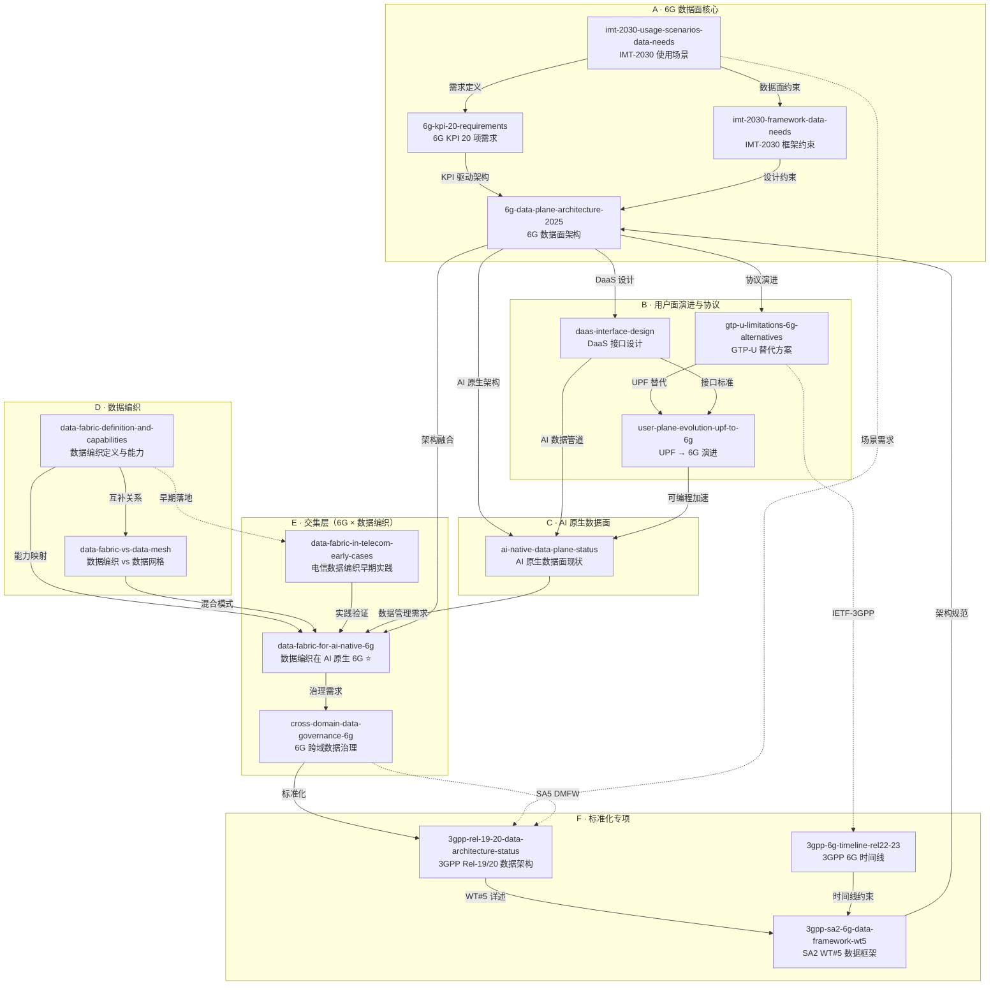

# 主题聚类与关系图

> 基于 16 张 reviewed 主题卡片的 frontmatter（tags, related, slug）和核心结论交叉聚类。
> 生成日期：2026-06-25

## 聚类方法

四维交叉聚类：能力维度 × 场景维度 × 技术维度 × 演进维度。每张卡片可属于多个聚类。

## 主题聚类图（Mermaid）

## 能力维度聚类

| 能力维度 | 涉及卡片 | 关键发现 |
|---------|---------|---------|
| **数据采集** | imt-2030-framework-data-needs, daas-interface-design, ai-native-data-plane-status, 3gpp-sa2-6g-data-framework-wt5 | 5G 数据收集碎片化（各 NF 独立接口）→ 6G 需统一数据采集框架；华为 DA + vivo DSAP 是两大提案 |
| **数据集成** | data-fabric-definition-and-capabilities, data-fabric-for-ai-native-6g, daas-interface-design | 数据编织的数据虚拟化 + 6G DaaS 的 Pub/Sub 编排互补；跨 RAN/Core/OSS/BSS 语义统一是核心挑战 |
| **数据治理** | cross-domain-data-governance-6g, data-fabric-vs-data-mesh, 3gpp-rel-19-20-data-architecture-status | SA2 WT#5 与 SA5 DMFW 职责交叉；联邦治理 vs 统一治理范式分歧；策略即代码（DT MARA）是实践前沿 |
| **数据消费** | ai-native-data-plane-status, 6g-kpi-20-requirements, imt-2030-usage-scenarios-data-needs | AI 模型训练/推理是最大消费者；感知数据/管理数据/通信数据四类消费模式差异显著 |
| **数据安全** | cross-domain-data-governance-6g, data-fabric-in-telecom-early-cases | ISAC 感知数据隐私、联邦学习、差分隐私、数据主权（DT 数据边界）；ETSI PDL GS 034 区块链治理 |

## 场景维度聚类

| 场景维度 | 涉及卡片 | 关键发现 |
|---------|---------|---------|
| **核心网** | 6g-data-plane-architecture-2025, daas-interface-design, user-plane-evolution-upf-to-6g, 3gpp-sa2-6g-data-framework-wt5 | DaaS DO/DA/DCP vs 增强 NWDAF/DCCF vs UP-first 三条路线；SA2 WT#5 KI#21 是标准化主战场 |
| **RAN** | ai-native-data-plane-status, gtp-u-limitations-6g-alternatives, user-plane-evolution-upf-to-6g | O-RAN dApp（E3 接口）+ AI-RAN Alliance；Samsung M-UP / EURECOM IUP 消除 N3；P4 可编程数据面 |
| **边缘/MEC** | user-plane-evolution-upf-to-6g, data-fabric-in-telecom-early-cases, ai-native-data-plane-status | NVIDIA dUPF 100 Gbps/25μs；边缘 AI 推理与数据管道协同；Google Cloud Telecom Data Fabric 边缘适配 |
| **终端/NTN** | imt-2030-usage-scenarios-data-needs, 6g-kpi-20-requirements | 泛在连接（UC）+ NTN 数据路径；UE 侧 DSAP 协议栈（vivo/ZJU 提案）；连接密度 10⁸ 挑战 |

## 技术维度聚类

| 技术维度 | 涉及卡片 | 关键发现 |
|---------|---------|---------|
| **AI/ML** | ai-native-data-plane-status, imt-2030-framework-data-needs, data-fabric-for-ai-native-6g | 三重 AI 路径——in-datapath ML (P4/Pegasus)、DaaS 数据管道 (DO/DA/DCP)、dApp 实时推理 (O-RAN) |
| **知识图谱** | data-fabric-definition-and-capabilities, cross-domain-data-governance-6g, data-fabric-for-ai-native-6g | CANDIL NGSI-LD 联邦 KG；ROBUST-6G KG-in-Fabric；Nokia 端到端语义层；电信 KG 构建成本高 |
| **虚拟化** | data-fabric-definition-and-capabilities, data-fabric-vs-data-mesh, data-fabric-in-telecom-early-cases | Denodo 数据虚拟化领导者；LG U+ Nudge-B 实践；6G 实时场景延迟影响待验证 |
| **自动化** | cross-domain-data-governance-6g, daas-interface-design, data-fabric-for-ai-native-6g | ETSI ZSM GS 029 数据管理代理；华为 DO 数据流引擎；DT MARA Policy-as-Code |
| **隐私** | cross-domain-data-governance-6g, data-fabric-for-ai-native-6g | 联邦学习（3GPP Rel-18/19 HFL/VFL）；ISAC 隐私风险；GAIA-X/IDSA 数据空间；Telco Data Space（Fraunhofer） |

## 演进维度聚类

| 演进阶段 | 涉及卡片 | 关键发现 |
|---------|---------|---------|
| **标准化中** | 3gpp-rel-19-20-data-architecture-status, 3gpp-6g-timeline-rel22-23, 3gpp-sa2-6g-data-framework-wt5, 6g-kpi-20-requirements | FS_6G_ARC 30%（2026.06）→ 2027.03 目标；Rel-21 ASN.1 2029.03；ETSI ZSM GS 029 2026.04 采纳 |
| **产品化中** | data-fabric-definition-and-capabilities, data-fabric-in-telecom-early-cases | Gartner 幻灭低谷 → 2-5 年成熟；Google TDF Private Preview 3 年未 GA；Denodo/Amdocs/Mycom 已有电信产品 |
| **试点阶段** | data-fabric-in-telecom-early-cases, gtp-u-limitations-6g-alternatives | DT ODE 22× 性能提升；SoftBank SRv6 MUP 首商用；LG U+ Nudge-B；Vodafone Italy Nucleus |
| **规模商用** | 暂无 | 6G 数据面 + 数据编织融合的规模商用预计 2030+ |

## 孤岛识别

以下主题与其他卡片的交叉链接最少，属于相对"孤岛"：

1. **data-fabric-vs-data-mesh** — 偏重企业 IT 架构方法论对比，与 6G 网络的直接映射需要通过 `data-fabric-for-ai-native-6g` 桥接
2. **6g-kpi-20-requirements** — 以量化指标为主，与软性架构/治理讨论的连接较弱，需要通过"KPI 驱动的数据面设计约束"建立关联

## 核心枢纽节点

以下卡片是聚类图中的枢纽（连接 ≥ 4 个其他卡片）：

1. **6g-data-plane-architecture-2025** — 连接上游需求（A1/A2/A4）、下游设计（B1/B2/C1）、标准化（F3）
2. **data-fabric-for-ai-native-6g** ⭐ — 桥接 6G 数据面（A3/C1）与数据编织（D1/D2）、治理（E2）和实践（E3）
3. **3gpp-sa2-6g-data-framework-wt5** — 连接标准化进程与所有架构/接口提案
