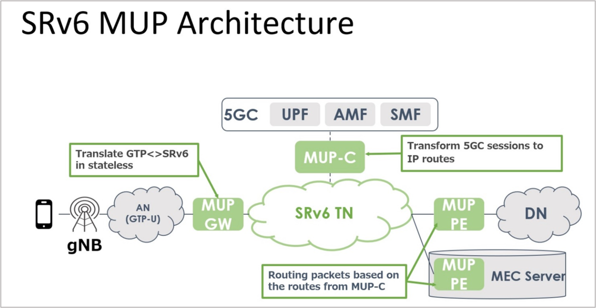
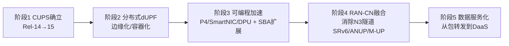
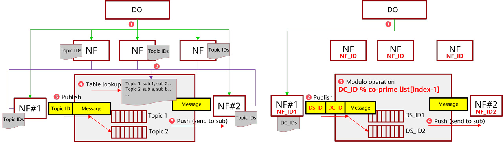
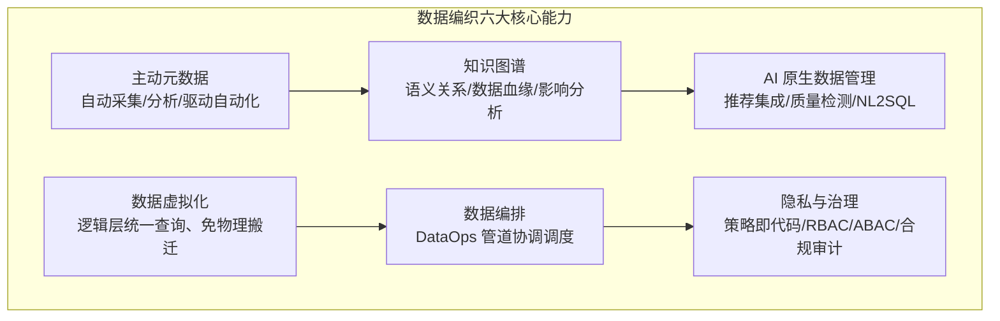
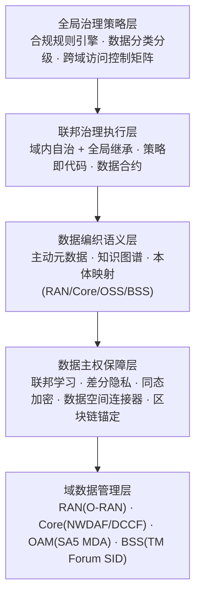
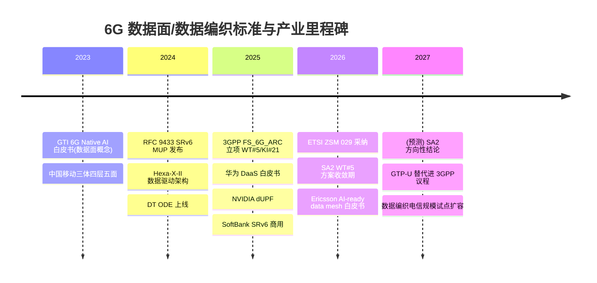
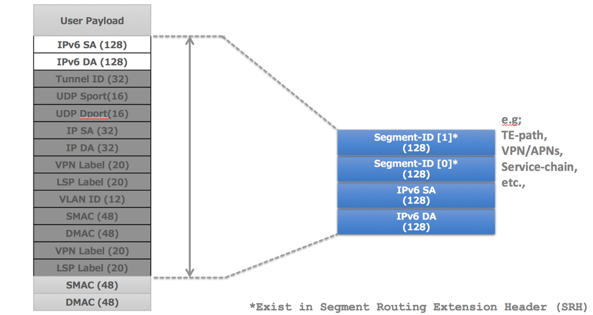
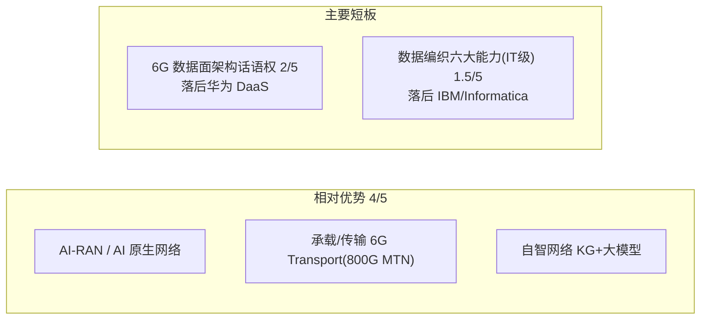

# 6G 数据面的数据编织技术洞察

> ⚠️ **本版已被取代（SUPERSEDED）**。请以 `reports/deep-insight-report-v4.md` 为准。v4 修正了本版的事实与一致性问题（RFC 9433 日期、中国移动"五面"构成、SoftBank 商用范围、Mesh-on-Fabric 信心分级等），并面向大数据背景读者加大数据编织与数据智能比重、机会点按"场景/技术/价值"三维展开。此处仅作过程存档。

> 版本 v3 | 生成 2026-07-09 | 视角：数据中台团队 / 战略专家组
> 说明：本版在 v2 基础上**大幅扩写"发展趋势判断"至与"行业环境与竞争现状"相当的体量，并为 5 条趋势每条配一张关键图（可直接用于 PPT）**，取代 v1/v2。技术判断后以 **[高/中/低]** 标注证据强度；引用以方括号简称标注，完整出处见附录 B；配图来源见附录 C。

---

## 需求和目标

移动网络每一代的跃迁，本质是"数据面"角色的一次重定义：4G 让数据面成为承载互联网流量的管道，5G 用 CUPS 把它与控制面解耦、推向边缘，而 6G 正在要求它完成一次更彻底的蜕变——**从"连接数据的转发管道"演变为"数据与智能的生产和服务平面"**。当感知（ISAC）、数字孪生、AI 原生这三类新业务把网络自身变成海量数据的生产者和消费者时，传统"包进包出"的用户面第一次显得不够用了。

问题因此浮现：6G 网络内部每天将产生 ZB 乃至更高量级的感知与 AI 数据，这些数据具有多对多的拓扑、亚毫秒的时效要求、以及跨越无线接入网（RAN）/核心网/传输/边缘/终端的强异构性；而当前以 GTP-U 隧道 + UPF 会话 + NWDAF 集中分析为核心的数据处理范式，是为"一对一连接数据"设计的，无法承载这一转变 [Samsung 2026] [Huawei 2025]。业界给出的答案，越来越指向一项在企业 IT 领域已经成熟的技术——**数据编织（Data Fabric）**：以主动元数据、知识图谱、AI 编排为核心的现代数据管理架构。把它改造并下沉到电信实时环境，正在成为补齐 6G 数据面"数据能力"的主流技术路径。

本报告回答四个层层递进的问题：

1. **为什么需要**——6G 数据面为何必须引入数据编织，传统范式在技术上卡在哪里；
2. **需要哪些技术**——数据编织的核心技术能力是什么，成熟度如何；
3. **技术上如何演进**——把数据编织搬到 6G 数据面要跨越哪些技术鸿沟，关键技术方向如何发展；
4. **对我司意味什么**——作为数据中台 / 战略专家组（年投入千万级、以建议权为主），如何借这一机会窗，把既有的"数据引擎"能力嵌入 6G 数据面业务。

> 目标定位说明：本报告服务于我司数据中台团队的战略决策。团队在自智网络体系中承担"数据引擎"角色（与 AI 大模型引擎、数字孪生引擎并列构成数智引擎），因此报告的落点不是"公司整体如何做 6G 数据面"，而是"数据引擎能力如何沿 6G 数据面向外延伸"。

---

## 行业环境与竞争现状

> 本板块是全报告的技术主体，按"6G 数据面 → 数据编织 → 二者交汇 → 标准与厂商格局"四个同维度视角展开，每个视角内部做技术深潜。

### 现状一 · 6G 数据面的技术现状与架构路线

#### 新数据洪流：驱动力的量级

6G 之所以要重构数据面，根本原因是三类新业务把网络从"数据管道"变成了"数据源"：

- **AI 原生网络**：6G 将 AI/ML 嵌入空口、RAN、核心网各层，产生训练数据、模型参数、梯度、推理结果等新数据类型。移动 AI 业务的上行流量占比已从传统业务的约 8% 升至 26%，数据从"下行为主"转向"上下行对称乃至上行为重" [NVIDIA 2025]。
- **通感一体（ISAC）**：6G 基站兼具雷达感知能力，产生 I/Q 原始信号、点云等感知数据。华为估算基站侧感知数据量可达 ZB 级/天、设备侧可达更高量级——这是一条完全独立于通信连接的高吞吐数据流 [Huawei 2025]。
- **数字孪生与网络自智**：网络数字孪生（NDT）需要对全网状态做实时镜像，要求跨域遥测数据以统一语义汇聚。

这些数据的共同特征是**多源多汇的任意拓扑、非连接性、实时性和强异构性**——而这恰恰是 5G 数据面的设计盲区。

#### 传统范式的技术瓶颈

5G 的数据处理由三块拼成，每一块在 6G 场景下都触及天花板：

**其一，GTP-U 隧道模型的扩展性瓶颈。** GTP-U（3GPP TS 29.281）自 3G 以来基本未变，每个 PDU 会话对应一条以 TEID 标识的隧道。它的问题是结构性的 [RFC 9433] [CNSM 2019]：

| 瓶颈维度 | 技术表现 | 量化 |
|---|---|---|
| 封装开销 | 外层 IP+UDP+GTP-U 头 | IPv4 36 字节 / IPv6 56 字节 |
| 状态扩展性 | 会话态随 UE×QoS 流膨胀 | 隧道模型 O(N²) vs 路由模型 O(N) |
| 转发表膨胀 | 每 UE 每 QoS 流一条隧道 | 百万 UE × 多流 = 千万级表项 |
| 传输网无感知 | 叠加隧道不感知底层拓扑 | 无法做 SLA 映射，仅靠静态配置 |
| 灵活性缺乏 | 平坦结构、无中间节点可编程 | 不支持动态路径、服务链 |

**其二，UPF 会话模型不适配非连接数据。** UPF 面向 "PDU 会话 → GTP-U 隧道 → QoS 流 → DRB" 的连接性数据链路优化，而 AI 梯度、感知点云是多对多、无会话归属的，强行套用会话模型会带来大量冗余信令。

**其三，NWDAF 集中式分析的三大局限** [Samsung 2026]：NWDAF 是一个**可选**网络功能（并非原生设计）；数据收集必须经控制面传输，**负载高且碎片化**（各网络功能各自暴露事件）；**缺乏跨域 AI 能力**（RAN 数据需经 OAM 间接获取）。这意味着 5G 的"数据智能"是打补丁式的，无法支撑 6G 的原生 AI。

#### 架构路线之争：独立数据面 vs 增强用户面

对"如何补齐数据能力"，业界已明确分为两条路线，这是当前最核心的架构分歧 [Huawei 2025] [Qualcomm 2024]：

- **独立数据面路线**（华为、中国移动、GTI、vivo 等中国阵营）：在控制面/用户面之外新增独立的"数据面"，专门处理非连接数据。华为 DaaS（Data as a Service）是最完整的方案，提出数据编排器（DO）、数据代理（DA）、数据通信代理（DCP）三组件；中国移动提出"三体四层五面"（控制/用户/数据/计算/安全五面）。论据是：6G 非连接数据量远超 CP/UP 承载能力，数据拓扑复杂，需专用协调机制。
- **增强用户面路线**（Qualcomm 为代表）：不新增功能面，精简控制面、把新服务（定位、数据收集、AI）作为 IP 服务运行在增强的用户面上，强调复用互联网生态、降低 TCO、实现"G 无关"。
- **居中路线**（Hexa-X-II / SNS JU / Ericsson）：承认需要数据面概念（尤其感知原始数据需独立通道），但更强调在演进的 5GC 上叠加 DataOps/MLOps 框架，而非新增独立功能面。

华为 DaaS 的工作机制可由下图直观呈现——数据编排器（DO）统一调度，数据代理（DA/DPF）在各节点执行采集与 AI 处理，数据通信代理（DCP）以发布/订阅方式实现多任务、多对多的异步数据分发：

这条路线之争在 3GPP SA2 的 6G 架构研究项 FS_6G_ARC 中集中体现——其中 **工作任务 WT#5"统一数据框架"（关键问题 KI#21）** 正式讨论"是否以及如何引入独立数据面"，截至 2026 年已积累约 90 篇贡献，预计 2027 年 3 月前给出方向性结论 [3GPP SA2]。这是 6G 数据面最直接的标准化入口，也是我司战略必须紧盯的窗口。

#### 承载协议重构：GTP-U 的替代路径

在架构之争之上，承载协议层的重构也在同步发生。GTP-U 的替代已从学术讨论走到商用验证：

**SRv6 移动用户面（RFC 9433）** 是当前成熟度最高的路径。其核心思想是"把会话信息转换为路由信息"——用 IPv6 地址（SID）编码移动会话状态，让用户面回到无状态的 IP 路由范式。它定义了 Traditional、Enhanced、Interworking、Drop-In 四种部署模式，兼顾激进替换与平滑过渡；配合 uSID 压缩（RFC 9800）可把多段压缩进单个 IPv6 目的地址，将封装开销降到不高于 GTP-U [RFC 9433]。SoftBank 已于 2025 年 12 月完成**全球首个 SRv6 MUP 5G 商用部署**，并在高速公路移动场景实测延迟改善超过 10ms [SoftBank 2025]；Deutsche Telekom 已在 IETF 正式提议 3GPP 在 6G 阶段研究以 SRv6 替换 GTP-U。其架构如下：

**分布式与可编程 UPF** 是另一条腿。NVIDIA 的分布式 UPF（dUPF）参考实现在 Grace CPU + BlueField-3 DPU 平台上，仅用 2 个 CPU 核心即实现 100 Gbps 线速转发、零丢包、25μs 延迟，把 PDR/QER/URR/FAR 全部卸载到硬件 [NVIDIA 2025]。学术侧的 P4 可编程数据面（如 HiP4-UPF、国防科大原型）已实现 100 Gbps、亚微秒延迟的 GTP-U/SRv6 硬件加速，但受限于交换芯片 TCAM 容量（约万级会话）。用户面演进因此呈现清晰的五阶段路径：

当前产业正处于阶段 3 向阶段 4 过渡期 [NVIDIA 2025] [Samsung 2026]。

#### AI 原生数据管道：数据面开始"长出智能"

6G 数据面的第三重演进，是 AI 能力直接嵌入数据路径，形成三条并行的技术路径 [Huawei 2025] [清华 Pegasus]：

- **数据面服务 AI（华为 DaaS 数据管道）**：DCP 采用基于中国剩余定理（CRT）的无状态转发——数据编排器把数据拓扑编码为一组模数嵌入包头，DCP 只需做模运算即可确定下游节点，无需维护订阅转发表。原型验证消息转发延迟约 2ms、吞吐 2.4 Gbps，较传统消息队列 RocketMQ 降低约 65% 延迟。有状态与无状态两种转发的差异如下图：

- **AI 赋能数据面（O-RAN dApp）**：O-RAN 提出与分布式单元（DU）共置的 dApp，通过 E3 接口直接访问用户面 I/Q 样本、CSI、SRS，实现亚毫秒（实验 <1ms）实时闭环控制，与 xApp/rApp 构成分层 AI 推理链。
- **在网机器学习（In-Network ML）**：清华 Pegasus 框架（SIGCOMM 2025）把深度学习算子翻译为数据面原语，支持 MLP/RNN/CNN 在交换芯片上线速推理，精度较此前提升最高 22.8%。局限在于只能跑轻量模型，大模型仍需卸载。

小结：6G 数据面的技术现状是"三线并进、尚未收敛"——架构上独立面与增强面之争、承载上 GTP-U 与 SRv6/dUPF 之争、智能上三条 AI 嵌入路径并行。这种不确定性本身，正是标准与话语权博弈的空间。

### 现状二 · 数据编织技术的成熟度与发展趋势

#### 定义：一种架构方法，而非一个产品

数据编织是"以主动元数据和 AI/ML 驱动、可跨分布式异构环境统一数据访问/集成/治理的现代数据管理设计"，Gartner 反复强调它**不是单一工具或技术**，而是一套可叠加在既有数据湖/数仓之上、"利旧不拆旧"的架构方法 [Gartner 2024]。IBM 将其归纳为三大基石：数据虚拟化（无需物理移动即可统一查询）、联邦主动元数据（语义知识图谱 + AI/ML 持续分析元数据）、机器学习引擎（推荐集成模式、自动化数据管理）[IBM]。

它与**数据网格（Data Mesh）**常被并提，但二者维度不同：数据编织是**技术/元数据驱动**的集成层，数据网格是**组织/文化驱动**的域自治运营模型；前者可作为后者的底层技术设施，业界（Nokia/Ericsson/AWS）普遍主张二者互补的 "Mesh-on-Fabric" 混合架构。

数据编织的六大核心技术能力构成如下：

#### 成熟度：走出幻灭低谷，被 GenAI 二次点燃

数据编织的成熟度可从 Gartner 数据管理技术成熟度曲线读出——2024 年它位于**幻灭低谷（Trough of Disillusionment）**，但保持"变革性（Transformational）"评级，预计 2–5 年到达生产成熟期；值得注意的是，同图中 Data Mesh 被标记为"到达成熟期前即过时（obsolete before plateau）"，而主动元数据、知识图谱等数据编织的支撑能力正处于爬升期：

这条曲线传递的关键信号是：数据编织不是概念泡沫破灭，而是经历了早期"拼凑式实施"的挫折后，正被 GenAI/Agentic AI 的刚需二次点燃——2025 年 Gartner 将"多模态数据编织（Multimodal Data Fabric）"列入数据与分析九大趋势，强调其对向量、非结构化数据的支撑；Forrester 在 2025 年 Q4 的 Wave 中评估了 14 家供应商，市场已从概念走向产品化竞争 [Gartner 2025] [Forrester 2025]。据 Fortune Business Insights，全球数据编织市场预计从 2025 年约 33.7 亿美元增至 2034 年约 164.6 亿美元，年复合增速约 22% [Fortune BI]。

#### 企业落地水平与批评

在企业 IT 侧，IBM（Watson Knowledge Catalog + Cloud Pak）、Informatica（IDMC CLAIRE）、Denodo（数据虚拟化）等已具备六大能力的产品级实现，但市场高度分散（据 2023 年数据，前 10 家仅占约 22% 收入）[Gartner 2024] [IBM]。批评声同样值得正视：数据仓库之父 Bill Inmon 指出数据编织混淆了"连接（connect）"与"集成（integrate）"，缺乏真正的数据转换，"把脏数据编织在一起只会放大问题"；也有分析预警数据编织项目因忽视组织就绪度而可能落入高失败率 [Inmon] [Procurement Insights]。**这提示：技术架构本身不解决数据质量与组织问题——这一教训对电信落地尤为重要。** [高]

### 现状三 · 数据编织向 6G 数据面的下沉

#### 技术鸿沟：企业 IT 与电信实时环境的量级差

把成熟于企业 IT 的数据编织搬进 6G 数据面，面对的是一道数量级的技术鸿沟 [Ericsson 2026] [Nokia]：企业数据编织处理的是 GB/s 级批量数据、可容忍秒级延迟，而 6G 数据面要求 TB/s 级流式数据、亚毫秒延迟。这意味着：

- **数据虚拟化的延迟不可接受**：企业级联邦查询的秒级响应，在 RAN 实时遥测场景中完全不可用；
- **协议栈必须原生**：企业数据编织跑在 REST/JDBC 之上，而电信要求与 3GPP 协议栈、GTP-U/SRv6 承载原生集成；
- **部署必须云原生化**：需要以容器网络功能（CNF）形态在分布式边缘弹性部署，而非集中式数据中心。

这道鸿沟决定了：电信数据编织不可能照搬 IBM/Informatica 的通用中台，而必须在"实时、协议栈原生、RAN 侧"做电信专属改造——这既是门槛，也是设备商相对 IT 厂商的差异化空间。[高]

#### 网络数据语义层：主动元数据 + 知识图谱

下沉的第一个技术支点，是为跨域网络数据建立**统一语义层**。主动元数据负责对 RAN 性能数据、核心网 CDR、BSS 客户数据自动分类、标注、追踪血缘；知识图谱负责表达它们之间的语义关系。Telefónica/UPM 的 CANDIL 项目用 ETSI NGSI-LD 标准实现了**联邦知识图谱**——每个域维护本地图谱，通过链接数据实现跨域语义发现；EU 的 ROBUST-6G 项目则把"知识图谱嵌入数据编织（KG-in-Fabric）"作为架构核心 [CANDIL] [ROBUST-6G]。难点在于电信本体极其复杂（3GPP YANG、O-RAN 数据模型、TM Forum SID 三套语义并存），自动本体构建工具尚不成熟 [中]。

#### 跨域数据治理与隐私计算

下沉的第二个技术支点是治理。6G 数据横跨 RAN、核心网、传输、边缘、终端、BSS、OSS 至少七个治理域，每个域的时效性与合规要求各异。业界形成了三大治理范式：**联邦治理**（Nokia/Ericsson，域自治 + 全局标准）、**数据空间治理**（IDSA/GAIA-X/6G-DALI，主权数据交换）、**策略即代码治理**（Deutsche Telekom MARA，运行时对 AI Agent 的数据访问做细粒度动态授权）[DT] [CANDIL]。其技术层次可归纳为：

隐私计算是主权保障层的核心：联邦学习（3GPP Rel-18/19 已标准化水平/垂直 FL）让数据不出域即可协作训练，差分隐私、安全多方计算、同态加密、区块链审计（ETSI PDL GS 034）各司其职 [ETSI ZSM]。风险在于治理本身有性能开销——Fraunhofer 实测显示策略执行会引入额外延迟，在实时 RAN 场景可能不可接受 [中]。

#### 电信早期实践

下沉已有先行者：Deutsche Telekom 的 One Data Ecosystem（ODE）报告了 22 倍性能提升，LG U+ 的 Nudge-B 数据编织已在生产上线，Vodafone Italy 的 Nucleus 试点启动 [data-fabric-in-telecom]。但也有警示信号：Google Cloud Telecom Data Fabric 自 2023 年发布以来已超过 3 年仍处 Private Preview、迟迟未 GA，其命运将影响整个电信数据编织的产业叙事。同时，这些 ROI 数据多来自供应商自述，缺乏独立审计，存在幸存者偏差 [中]。

### 现状四 · 标准与厂商竞争格局

#### 标准技术路线图

6G 数据面 × 数据编织的标准化呈"多组织并行、职责交叉、术语分裂"格局。最关键的几个入口：

- **ETSI ZSM GS 029《自智网络数据管理代理》** 是唯一明确把 Data Fabric 概念引入电信标准体系的工作项，由中国电信/中兴/CAICT/亚信主导，2026 年 4 月采纳，定义数据注册/发现、资产管理、认证、收集传输、工作流编排 [ETSI ZSM]。
- **3GPP SA2 WT#5 / KI#21 统一数据框架** 是数据面最直接的架构入口，目标 2027 年 3 月前给方向性结论 [3GPP SA2]。
- **3GPP SA5 数据管理框架（DMFW，TS 32.801）** 从 OAM 侧覆盖数据收集/处理/注册/发现/访问控制/销毁/质量。SA2 与 SA5 在数据管理/暴露上**职责重叠**，运营商已呼吁协调，预计 2027 年达成"SA2 管网络架构层、SA5 管 OAM 层"的分工 [3GPP SA5]。
- **O-RAN R005 AI/ML 工作流** 规范 RAN 侧数据供给与模型治理；**ITU-R M.2160** 定义 6G 总体框架与 AI 原生原则。

关键时间线如下：

#### 厂商技术能力格局

从"数据编织六大能力"的维度看厂商格局，可见一个结构性错位——IT 数据编织供应商全面领先，电信设备商普遍处于研究态，而中兴当前布局集中在数据编排与 AI 原生数据管理两项（下表为本报告综合研判）：

| 厂商 | 主动元数据 | 知识图谱 | 数据虚拟化 | 数据编排 | 隐私计算 | AI 原生数据管理 |
|---|:--:|:--:|:--:|:--:|:--:|:--:|
| 华为 | 研究 | 研究 | 部分 | **产品级** | 研究 | 研究 |
| 中兴 | — | 应用级(AN) | — | 研究 | 探索 | 研究 |
| 爱立信 | 部分 | — | — | 部分 | 研究 | 部分 |
| 诺基亚 | 部分 | 研究 | — | 部分 | 研究 | 部分 |
| 三星 | — | — | — | 研究 | — | 研究 |
| IBM | 产品级 | 产品级 | 产品级 | 产品级 | 产品级 | 产品级 |
| Informatica | 产品级 | 产品级 | 部分 | 产品级 | 产品级 | 产品级 |
| Denodo | 部分 | — | 产品级 | 产品级 | 部分 | 部分 |

关键差距在"电信适配"：IT 供应商缺乏亚毫秒延迟处理、3GPP 协议栈集成、CNF 原生部署能力——这是设备商唯一可守的护城河。地缘上则呈现**中欧美路线分化**：中国阵营（华为/中兴/中国移动/vivo）推动激进的独立数据面/DaaS，欧美厂商（Ericsson/Nokia/Qualcomm）偏好渐进增强（UPF+NWDAF 演进），2026–2027 年的标准博弈将决定最终方向 [高]。

---

## 发展趋势判断

> 本板块给出五条资深研判，每条均按"**判断 → 为什么有价值 → 技术上如何实现 → 证据与玩家动态 → 反方 → 对我司含义**"充分展开，并配一张关键图（可直接用于后续 PPT）。判断强度以 **[高/中/低]** 标注。

### 趋势一：AI 原生催生"统一数据框架"，数据编织成为 6G 数据面标配底座 [高]

**判断**：6G 网络对 AI 的原生依赖，将迫使今天碎片化、可选、集中式的数据采集机制（NWDAF）升级为一套**原生、跨域、实时、语义化的统一数据框架**；而这套框架的技术内核，正是数据编织。到 2027 年前后，"6G 是否需要统一数据框架"将不再是问题，问题只剩"用谁的架构、叫什么名字"。

**为什么有价值**：6G 的目标是零接触自智网络（Level 4/5）与 Agentic AI——让网络内的智能体自主感知、决策、执行。但智能体的能力上限由其"可获取的数据质量"决定：没有统一、可信、实时的数据底座，再强的模型也是"无米之炊"。当前 5G 的做法是 NWDAF 集中分析 + 各网元零散暴露事件，三星已明确指出其三大硬伤——NWDAF 是**可选**网络功能、数据收集经控制面传输**负载高且碎片化**、**缺乏跨域 AI 能力** [Samsung 2026]。这意味着 5G 的数据智能是"打补丁"，无法支撑 6G 的原生 AI。统一数据框架的价值就在于把"打补丁"变成"承重墙"，让数据成为可被全网 AI 复用的一等公民。

**技术上如何实现**：路径已逐步清晰——以**主动元数据**对全网遥测自动分类/标注/追踪血缘，以**知识图谱**表达 RAN/核心/传输/BSS 数据间的语义关系，以**发布/订阅 + 数据编排**替代 NWDAF 的请求-响应接口，让数据以多对多拓扑在域间流动。这恰是数据编织六大能力向网络域的直接映射。值得注意的是，6G 系统架构本身已把"数据（Data）"与"人工智能（AI）"并列为顶层技术框架之一（见下图 Nokia 6G 系统架构），这为统一数据框架提供了架构合法性：

**证据与玩家动态**：这一方向已被三套标准框架同时指向——ETSI ZSM 029 数据管理代理、3GPP SA2 WT#5 统一数据框架、O-RAN dApp 数据管道，功能重叠已不可忽视，预计 12–24 个月内出现首批跨标准组织协调 [3GPP SA2] [ETSI ZSM]。厂商侧，Ericsson 以 "AI-ready data mesh" 命名、Nokia 以 "Data Framework" 命名、AWS 以 "Intelligence Fabric" 命名、华为以 "DaaS" 命名——名称各异但技术实质高度收敛，印证判断的确定性 [Ericsson 2026] [AWS]。

**反方**：数据面引入 AI 使转发从确定性变为概率性，可解释性、鲁棒性（对抗攻击）与可信度尚未解决；且术语分裂本身可能拖慢标准收敛。

**对我司含义**：这是我司"数据引擎"能力最直接的外溢入口——自智网络中已验证的知识图谱/语义能力，正是统一数据框架的稀缺资产。

### 趋势二：2026–2027 是 6G 数据面标准化的关键收敛窗口 [高]

**判断**：6G 数据面的架构方向（独立数据面 / 增强用户面 / 混合）、承载协议、数据框架术语，都将在 **2026 至 2027 这两年内集中定调**。这是一个不可再来的"卡位窗口"——窗口关闭后，架构和术语固化，后进入者只能跟随。

**为什么有价值**：标准话语权是电信产业最高杠杆的资产。谁在窗口期把自己的架构、接口、术语写进 3GPP/ETSI 规范，谁就锁定了后续十年的产品定义权与专利护城河。对资源有限（千万级预算、以建议权为主）的我司数据中台而言，标准提案是"以最低成本换最高杠杆"的稀缺机会——一篇被采纳的提案的战略价值，远超同等投入的产品开发。

**技术上如何实现**：从 3GPP 官方发布的 Release 时间线可精确读出窗口边界——Rel-20 承载 6G 研究（FS_6G Study），SA Stage 2 于 2026 年内完成、Stage 3 冻结在 2027 年附近；Rel-21 将正式规范 6G RAN/Core，时间线已于 2026 年 6 月获批：

具体到数据面，FS_6G_ARC 的 WT#5（关键问题 KI#21）目标 2027 年 3 月前给出方向性结论，DaaS 独立面 / 增强 NWDAF / 混合三条路线的方案竞争在 SA2#170–#176 各次会议中已充分展开，2026 年是投票与迁移架构决策的收敛点 [3GPP SA2]。

**证据与玩家动态**：ETSI ZSM 029 已于 2026 年 4 月采纳（我司参与主导），是唯一显式引入 Data Fabric 的电信标准工作项；Deutsche Telekom 已在 IETF 正式提议在 6G 阶段研究 SRv6 替换 GTP-U——多条战线的时间表高度重合于 2026–2027 [ETSI ZSM] [SoftBank 2025]。

**反方**：3GPP 历史上常延期 12–18 个月，方向性结论未必等于最终规范；窗口可能"软性延后"，但不会消失。

**对我司含义**：这是全报告最强的行动号令——O3（ZSM 029 + SA2 WT#5 卡位）必须在未来 12 个月内落子，晚了就是补位跟随。

### 趋势三：GTP-U 走向日落，承载协议向 SRv6/dUPF 重构 [中]

**判断**：服役近二十年的 GTP-U 隧道，将在 6G 阶段被无状态的 IP 路由范式（SRv6 MUP）和硬件卸载的分布式转发（dUPF）逐步取代。这不是"是否发生"，而是"多快发生"的问题。

**为什么有价值**：GTP-U 的隧道模型是移动网 TCO 与灵活性的双重枷锁——会话态随 UE×QoS 流呈 O(N²) 膨胀，百万 UE 场景下转发表可达千万级；叠加隧道对底层传输网无感知，无法做 SLA 映射和端到端切片。把用户面拉回无状态 IP 路由，可一举消除状态爆炸、原生支持网络切片（SRv6 Flex-Algo）与确定性低延迟（TI-LFA <50ms 保护），并显著降低移动专用设备的采购与运维成本——SoftBank 明确称其"比传统移动网络更低成本、更易部署"。

**技术上如何实现**：SRv6 MUP（RFC 9433）的核心是"把会话信息转换为路由信息"——用 IPv6 SID 编码会话状态。其封装效率的关键在于 uSID 压缩：传统 GTP-U over IPv6 需叠加 Tunnel ID / UDP / 内外层 IP 等多重头部，而 SRv6 用 uSID 可将多段路由压缩进单个 IPv6 目的地址，把开销降到不高于 GTP-U。下图直观对比了传统隧道封装（左，层层叠加）与 SRv6 精简封装（右，Segment-ID 承载 TE-path/VPN/服务链）的差异：

另一条腿是 dUPF——NVIDIA 在 Grace CPU + BlueField-3 DPU 上实现仅 2 核 100 Gbps 线速、25μs 延迟、PDR/QER/URR/FAR 全硬件卸载 [NVIDIA 2025]；P4 可编程交换机可达 100 Gbps/亚微秒，但受 TCAM 容量限制（约万级会话）。

**证据与玩家动态**：SoftBank 已于 2025 年 12 月完成全球首个 SRv6 MUP 5G 商用部署，高速公路移动场景实测延迟改善 >10ms [SoftBank 2025]；Deutsche Telekom 已在 IETF 正式提议 3GPP 6G 研究 SRv6 替换 GTP-U，预计 2027 年进入正式议程 [RFC 9433]。生态由 Cisco/SoftBank/Arrcus/Broadcom 主导。

**反方**：运营商已在 5G UPF 上重金投入，迁移阻力巨大，GTP-U 与 SRv6 长期共存不可避免；3GPP 迄今未正式采纳 SRv6 为 N3/N9 替代，标准采纳存在不确定性。

**对我司含义**：这是承载线（O4）的机会窗，与我司 800G MTN 传输底座红利叠加，建议纳入公司 6G 路标（我司数据中台以建议为主）。

### 趋势四：数据编织电信化加速，Mesh-on-Fabric 成为主流架构范式 [中]

**判断**：成熟于企业 IT 的数据编织将加速下沉电信网络，并与数据网格融合为 **"Mesh-on-Fabric"** 混合架构——数据编织提供跨域技术集成与统一语义，数据网格提供域自治与"数据即产品"的运营模型。

**为什么有价值**：电信数据横跨 RAN/核心/传输/边缘/终端/BSS/OSS 至少七个域，既需要跨域统一（否则 AI 拿不到全局视图），又需要域自治（RAN 与 BSS 的时效性、合规性天差地别，无法一刀切集中）。Mesh-on-Fabric 恰好兼顾二者，是复杂多域场景的最优解。其直接价值可量化——运营商把多套割裂的数据存储库统一为共享数据层后，Nokia 报告可达约 **50% 成本节省**、显著降低宕机风险，并开放第三方生态：

**技术上如何实现**：底层为各域联邦化的分布式数据存储（如 6G-TWIN 的联邦 UDR），中层为元数据驱动的数据目录 + 知识图谱语义层（ETSI NGSI-LD / YANG / TM Forum SID 三套本体映射）+ 策略即代码治理，上层为特征存储 + 数据产品市场化 + AI Agent 意图接口。CANDIL 已用 NGSI-LD 实现联邦知识图谱原型，ROBUST-6G 把"知识图谱嵌入数据编织"作为架构核心 [CANDIL] [ROBUST-6G]。数据编织的成熟度也支撑这一判断——Gartner 2024 将其定位于"幻灭低谷 / 变革性 / 2–5 年成熟"，正被 GenAI 二次点燃，2025 年升级为"多模态数据编织"列入 D&A 九大趋势 [Gartner 2024] [Gartner 2025]。

**证据与玩家动态**：ETSI ZSM 029 发布降低了运营商决策门槛；Deutsche Telekom（One Data Ecosystem，报告 22× 提升）、LG U+（Nudge-B 已生产）、Vodafone Italy（Nucleus 试点）已形成先行者集群，预计 2027–2028 新增 2–3 家 Tier-1 运营商进入规模试点 [DT] [Ericsson 2026]。

**反方**：企业 IT 侧数据网格采纳率仍低、电信几乎零基准，Mesh-on-Fabric 可能超前于付费需求；先行者 ROI 数据多来自供应商自述、缺乏独立审计；Google Telecom Data Fabric 逾 3 年未 GA 是警示信号。

**对我司含义**：这是 O1/O6 的技术底盘——我司可先在自智网络内自用验证统一数据层，再横向接入运营商试点，避免超前重投。

### 趋势五：跨域数据治理从"外挂"变为"部署前置条件" [中]

**判断**：在数据主权法规全球碎片化、6G 多利益方生态（运营商 + 垂直行业 + 云 + 监管）下，数据治理将从事后审批的"外挂模块"，变为内嵌于数据流、伴随数据面一起部署的**前置条件**。没有治理，数据就不能流动、更不能变现。

**为什么有价值**：6G 的 AI 原生化要求 ZB 级数据跨域流动，传统"逐案人工审批"的治理模式在这一量级下彻底失效。把治理内嵌进数据流——让每一次数据访问都自动完成权限校验、分级检查、匿名化——是合规变现的前提，能把"合规"从成本负担转化为差异化卖点（尤其面向欧盟 GDPR、中国数据安全法等强监管市场）。

**技术上如何实现**：三大支柱——**策略即代码**（Deutsche Telekom MARA 对 AI Agent 数据访问做运行时细粒度动态授权）、**隐私计算**（联邦学习让数据不出域即可协作训练，辅以差分隐私/安全多方计算/同态加密）、**数据空间连接器**（IDSA/GAIA-X 主权数据交换 + 区块链审计出处，对应 ETSI PDL GS 034）。其中联邦学习是最成熟的落地技术（3GPP Rel-18/19 已标准化水平/垂直 FL）——各数据持有方仅上传梯度/激活、原始数据留在本地，中心服务器聚合出全局模型，下图以能源场景示意这一"数据不动、模型动"的机制：

**证据与玩家动态**：3GPP SA5 已启动数据管理框架（DMFW，TS 32.801），SA2 WT#5 也将访问控制/用户同意/隐私纳入研究范围，二者在治理上职责重叠、亟待协调；产业侧形成联邦治理（Nokia/Ericsson）、数据空间治理（IDSA/GAIA-X/6G-DALI）、策略即代码治理（DT MARA）三大范式并行 [3GPP SA5] [DT]。

**反方**：治理本身有性能开销——Fraunhofer 实测显示策略执行在实时 RAN 遥测场景可能引入不可接受的延迟；SA2/SA5 职责边界未定，可能带来标准碎片化。

**对我司含义**：把"数据不出域 + 联邦 + 策略即代码"沉淀为合规参考架构（策略 7），是响应运营商客户合规刚需、把合规做成卖点的低成本切入。

---

## 趋势判断总结：3 年看透、5 年看清

**3 年看透（2026–2028，高确定性）**：6G 数据面的标准方向将在 3GPP SA2 于 2027 年前定调（独立数据面或增强用户面二选一或混合）；GTP-U 替代讨论进入 3GPP 正式议程；ETSI ZSM 029 进入实施指南阶段并催化供应商适配；数据编织电信试点从 3 家先行者扩展到 5–6 家 Tier-1 运营商。**这三年是"卡位"窗口——术语未固化、职责未分、承载未定，正是提案影响定义的时机。**

**5 年看清（2029–2031，方向性）**：6G 数据面架构基本定型并随首批商用落地；数据编织在电信进入规模商用、Mesh-on-Fabric 混合架构成形；跨域联邦数据空间与 3GPP 治理框架初步对接；AI 原生数据管道从 PoC 走向 dApp 商用。届时格局大局已定，后进入者只能跟随。

一句话：**未来 3 年决定"话语权"，未来 5 年决定"市场位次"——对我司而言，最大的风险不是技术做不出，而是错过 3 年卡位窗口。**

---

## 公司现状和定位分析

我司在 6G 数据面 × 数据编织坐标系中的真实位置，可概括为"**强于网络智能与承载算力、弱于数据编织 IT 级能力与数据面架构话语权**"。[中]

**能力锚点**：数据中台在自智网络（AIR Net）体系中的既定角色是"**数据引擎**"——与 AI 大模型引擎、数字孪生引擎并列构成数智引擎三组件。数据引擎已在生产环境支撑跨域数据与知识图谱 + 大模型的故障诊断（Fault Agent），这是数据编织"知识图谱/语义/主动元数据"能力在电信生产场景的少数真实落地之一。**这给了数据中台一条清晰的演进主线：数据引擎（自智网络内）→ 6G 数据面数据服务化组件。**

**优势与短板**（自评 0–5）：

关键判断有三：其一，最优路径是**沿"数据引擎→6G 数据面"外延、借 AI-RAN/自智网络势能**，而非与 IBM/Informatica 正面拼通用数据编织中台 [高]；其二，最大短板是**数据面架构话语权落后华为**，而 ETSI ZSM 029（我司已主导）与 3GPP SA2 WT#5 是唯二可加码的标准入口 [中]；其三，最大空白机会是 **RAN 域与终端侧数据编织**——这两个区域在跨域能力矩阵中几乎全空白，且与我司"网+端"覆盖重叠，是"优势与空白重叠"的差异化窗口 [中]。

---

## 公司可参与的机会点分析和选择建议

按"数据中台可达性 × 与我司优势契合度"两维度，识别六个机会点并给出选择建议：

| 机会 | 描述 | 契合度 | 数据中台可达性 | 信心 | 建议 |
|---|---|:--:|:--:|:--:|---|
| **O2** | 自智网络"数据引擎"能力向 6G 数据面外溢 | ★★★★ | 可直接抓（预研） | 高 | **首选主攻** |
| **O3** | ETSI ZSM 029 + 3GPP SA2 WT#5 标准卡位 | ★★★ | 可直接抓（标准） | 中 | **首选主攻** |
| O1 | RAN 域数据编织（优势×空白重叠） | ★★★★ | 软件可抓/硬件需借力 | 中 | 中期押注（软件 PoC） |
| O4 | 承载侧 GTP-U 替代（SRv6/800G MTN 红利） | ★★★★ | 只能建议（承载线） | 中 | 建议纳入公司路标 |
| O6 | 国内运营商数据编织规模试点首发 | ★★★ | 建议+牵线 | 中 | 牵线+横向接入 |
| O5 | 终端侧轻量数据编织（全行业空白） | ★★ | 只能建议（终端线） | 低 | 长期埋点 |

**选择建议与断言**：把有限的千万级预算集中押在 **O2 + O3**——理由是二者可由专家组直接推动、增量成本低、且正卡在标准收敛窗口（趋势二）；O1 做软件侧小型 PoC 验证；O4/O5/O6 以"建议纳入公司路标 + 数据中台横向接入数据语义层"方式参与，不自担大额投入。**断言：数据中台在 6G 的最优战略不是"再造一个数据编织中台"，而是"把已在自智网络中验证的数据引擎，沿数据面标准与预研向外延伸，抢占语义/治理/编排的差异化条目"。** [中]

**冷水（反方）**：O1/O5 市场回报未明，我司自身也判断"RAN for AI"投资回报不确定，可能超前于付费需求；O3 是"补位"而非"领跑"（华为 DaaS 术语已先入为主）。因此策略应"需求驱动 + 时间盒 + 先自用验证"。

---

## 具体策略建议

> 类型：【D】= 数据中台/专家组可直接执行；【R】= 需上升为公司决策的建议。

| 序号 | 我司选择 | 具体策略 | 不做的风险 | 备注 |
|:--:|---|---|---|---|
| 1 | 【D】数据引擎战略叙事 | 起草"数据引擎→6G 数据面嵌入式演进"战略白皮书，面向决策层宣讲 | 数据引擎被固化在故障运维单场景、错过 6G 数据面窗口 | 90 天内完成，对内 |
| 2 | 【D】标准双入口卡位 | ETSI ZSM 029 贡献参考实现 + SA2 WT#5 提交数据编排/语义模型提案（≥2 篇） | 华为 DaaS 术语单极主导，我司标准被动跟随 | 对接 SA2#176 窗口 |
| 3 | 【D】KG/语义预研 | 把 AN 故障域的知识图谱能力抽象为通用"网络数据语义/数据服务"组件 | 数据编织语义能力停留单场景，无法泛化到 6G | 复用现有资产 |
| 4 | 【D+R】RAN 域数据编织 PoC | 以站点算力承载"RAN 实时数据代理 + 流式元数据标注"轻量 PoC | 错过 O-RAN dApp 接口定义窗口 | 软件侧自主，硬件借力无线线 |
| 5 | 【R】运营商标杆试点 | 联合中国移动/电信做国内首个显式 Data Fabric 部署 | 国内首发被友商抢占 | 专家组牵线、公司决策 |
| 6 | 【R】跨线虚拟团队 | 建议设"6G 数据面"跨产品线虚拟团队（数据+核心网+无线+标准部） | 数据引擎在内部被边缘化 | 组织建议 |
| 7 | 【D】合规即卖点参考架构 | 以"数据不出域+联邦+策略即代码"沉淀合规参考架构 | 数据主权法规碎片化时缺现成方案 | 中长期 |
| 8 | 【R】承载/终端机会纳入路标 | 建议将 SRv6/800G MTN 传输底座、终端侧轻量数据编织纳入公司 6G 路标 | 传输红利与"网+端"独占机会流失 | 建议为主 |

---

## 关键 AP 建议

| AP 内容 | 牵头单位 | 起止时间 | 备注 |
|---|---|---|---|
| 数据引擎→6G 数据面战略白皮书 v1 + 决策层宣讲 | 数据中台/战略专家组 | 2026-07 ~ 2026-09 | 【D】P0，最高优先 |
| SA2 WT#5 数据框架提案起草与联署（≥1 篇） | 标准部 + 数据中台 | 2026-07 ~ 2026-12 | 【D】P0，对接 SA2#176 |
| ETSI ZSM 029 数据管理代理参考实现贡献 | 标准部 + 数据中台 | 2026-07 ~ 2027-03 | 【D】P0，我司已主导 |
| 网络数据语义/KG 组件化预研立项 | 数据中台（SDI 抽调骨干） | 2026-08 ~ 2027-06 | 【D】P1，复用 AN 资产 |
| RAN 域数据编织轻量 PoC | 数据中台 + 无线研究院 | 2026-Q4 ~ 2027-Q4 | 【D+R】P1，对接 O-RAN 窗口 |
| 国内运营商 Data Fabric 标杆试点方案建议书 | 数据中台牵线 + 公司决策 | 2026-Q4 起 | 【R】P1 |
| "6G 数据面"跨线虚拟团队组建建议 | 战略专家组 → 公司 | 2026-07 起 | 【R】P1，对抗内部边缘化 |

---

## 总结

一句话主要观点：**6G 数据面正从"连接管道"跃迁为"数据/智能服务平面"，数据编织是这一跃迁不可回避的技术底座；标准与话语权将在 2026–2027 关键窗口收敛，我司数据中台应以"数据引擎外溢 + 标准卡位"低成本抢占语义/治理/编排的差异化位置，而非正面再造通用数据编织中台。** [中]

| 做什么 | 不做什么 | 遗留 / 待研讨 |
|---|---|---|
| 押 O2+O3：数据引擎外溢 + ZSM 029/SA2 标准卡位 | 不与 IBM/Informatica 拼通用数据编织中台 | 独立数据面 vs 增强用户面最终走向（待 SA2 2027 结论） |
| 把 AN 的 KG/语义能力抽象为可复用 6G 数据面组件 | 不自担 RAN 硬件/终端产品线大额投入（走建议） | RAN/终端数据编织的付费需求与 ROI 拐点 |
| 用标准成果为数据团队争取内部定位（对抗边缘化） | 不盲目追独立数据面命名之争（聚焦差异化条目） | Mesh-on-Fabric 在电信的可行性与基准 |
| 合规做成卖点（数据不出域+联邦+策略即代码） | 不超前于需求铺开重资产 PoC（需求驱动+时间盒） | SA2/SA5 治理职责边界、Google TDF 命运等监控信号 |

---

## 附录

### 附录 A · 主要术语

- **数据面（Data Plane）**：6G 中专门处理非连接数据（感知/AI/遥测）的采集、传输、存储与服务化的功能平面，超越 5G 用户面"包转发"范畴。
- **数据编织（Data Fabric）**：以主动元数据 + 知识图谱 + AI 编排为核心、跨异构环境统一数据访问/集成/治理的架构方法（非单一产品）。
- **数据网格（Data Mesh）**：以域自治、数据即产品为核心的组织/架构范式；与数据编织互补构成 Mesh-on-Fabric。
- **DaaS（Data as a Service）**：华为提出的 6G 数据面方案，含数据编排器 DO、数据代理 DA、数据通信代理 DCP。
- **SRv6 MUP（RFC 9433）**：以 IPv6 分段路由承载移动用户面、替代 GTP-U 的协议。
- **NWDAF**：5G 网络数据分析功能（控制面、可选、集中式）。
- **dUPF**：分布式 UPF；**dApp**：O-RAN 与 DU 共置、经 E3 接口做亚毫秒 AI 闭环的分布式应用。
- **主动元数据 / 知识图谱 / 数据虚拟化 / 策略即代码**：数据编织核心技术能力。

### 附录 B · 来源清单（分层）

标准官方 ★
- [RFC 9433] IETF. Segment Routing over IPv6 for the Mobile User Plane. 2024-07.
- [3GPP SA2] 3GPP. FS_6G_ARC / WT#5 统一数据框架（KI#21）, SA2#170/171 讨论文稿. 2025–2026.
- [3GPP SA5] 3GPP TS 32.801. Study on 6G Management and Orchestration（含 DMFW）. 2025–2026.
- [ETSI ZSM] ETSI GS ZSM 029 Data Management Agent for Autonomous Networks（2026-04 采纳）；GS ZSM 002/012；GS PDL 034.
- [ITU-R] ITU-R M.2160 IMT-2030 Framework. 2023-12；IMT-2030 技术需求. 2026-03.
- [O-RAN] O-RAN R005 AI/ML 工作流；nGRG Native AI Architecture. 2025.

学术 📄
- [清华 Pegasus] Pegasus: Scalable Deep Learning Inference on the Dataplane. SIGCOMM 2025.
- [EURECOM IUP] Integrated and Programmable User Plane. arXiv 2503.09430. 2025-03.
- [CANDIL] A Federated Data Fabric for Network Analytics. FGCS 2024-09.
- [ROBUST-6G] D2.2 Knowledge Graph within Data Fabric. 2025-01；[6G-TWIN] D2.1 数据治理. 2025-12；[6G-DALI] Federated Dataspace for 6G. 2026-02.
- [vivo/ZJU] Unified Data Collection Framework Based on the Data Plane for 6G（DSAP/DPRB）. FITEE 2025-03.
- [BoS] Brain-on-Switch. NSDI 2024；[HiP4-UPF] NSF 2024；[CNSM 2019] GTP-U/SRv6 Stateless Translation 评估.

厂商/运营商 🏢
- [Huawei 2025] Data Plane Design for AI-Native 6G Networks（DaaS DO/DA/DCP）. 2025-02.
- [Qualcomm 2024] 6G Foundry: Rethinking the Control Plane（用户面优先）. 2024-03.
- [Samsung 2026] AI in 6G Network: Service and System Aspect（NWDAF 三大局限）. 2026.
- [NVIDIA 2025] Accelerated and Distributed UPF for 6G（Grace+BF3, 100Gbps/25μs）. 2025-10.
- [SoftBank 2025] World's First SRv6 MUP Commercial 5G Service. 2025-12；SoftBank SRv6 MUP Architecture. 2022.
- [Ericsson 2026] Future-proof Data Management for AI Networks（AI-ready data mesh）. 2026；[Nokia] 6G System Architecture / Data Framework. 2024–2026.
- [DT] Deutsche Telekom One Data Ecosystem / MARA Blueprint. 2024–2026；[AWS] AI-native 6G: From Networks to Intelligence Fabrics. 2025-12.
- [IBM] What is a Data Fabric；[Google] Telecom Data Fabric（Private Preview）；[Amdocs] Network Data Fabric.
- [GTI] 6G Native AI Architecture and Technologies. 2023-01；[中国移动] 三体四层五面. IEEE ComMag 2023.
- 我司：TM Forum "ZTE's vision advances Autonomous Network innovation"（AIR Net/Fault Agent, 2025-05）；与中国移动 ITU-T SG15 首个 800G MTN；《自智网络白皮书 2025》（数智引擎三组件）.

分析机构 📊
- [Gartner 2024] Hype Cycle for Data Management 2024（Data Fabric 幻灭低谷/变革性）.
- [Gartner 2025] Top D&A Trends 2025（Multimodal Data Fabric）；Strategic Roadmap for Data Fabric.
- [Forrester 2025] Wave: Data Fabric Platforms Q4 2025（14 家）；Landscape Q2 2025（39 家）.
- [Fortune BI] Data Fabric Market 2025–2034（$3.37B→$16.46B, CAGR ~22%）；[NGMN] Network Architecture Evolution towards 6G. 2025-02；[TM Forum] IG1356 Data Architecture for AI-enabled Telecom.

媒体/博客 📰
- [Inmon] Bill Inmon, "Data Fabric and Reality". 2024-10；[Procurement Insights] Data Fabric 80% 失败率预警. 2025.

### 附录 C · 图片来源

- `assets/gartner-hype-cycle-2024.png`：Gartner, Hype Cycle for Data Management 2024（经 Denodo 公开发布，2024-07）。
- `assets/srv6-mup-softbank.png`：SoftBank, SRv6 MUP Architecture（segment-routing.net / SoftBank News, 2022）。
- `assets/huawei-daas-1.jpg`、`assets/huawei-daas-3.jpg`：Huawei, "Data Plane Design for AI-Native 6G Networks"（2025）。
- `assets/trend1-6g-data-arch.jpg`：Nokia, "6G System Architecture"（2025）——趋势一。
- `assets/trend2-3gpp-timeline.jpg`：3GPP, Release Timeline Rel-20/21（2026-03）——趋势二。
- `assets/trend3-srv6-vs-gtpu.png`：APNIC Blog, "Reducing the complexity of 5G networks using Segment Routing IPv6"——趋势三。
- `assets/trend4-nokia-sdl.jpg`：Nokia, "Shared Data Layer"——趋势四。
- `assets/trend5-federated-learning.png`：arXiv 2309.09086, "Split Federated Learning for 6G Enabled-Networks"——趋势五。

> 图片版权归原作者，本报告仅作内部研究引用。

