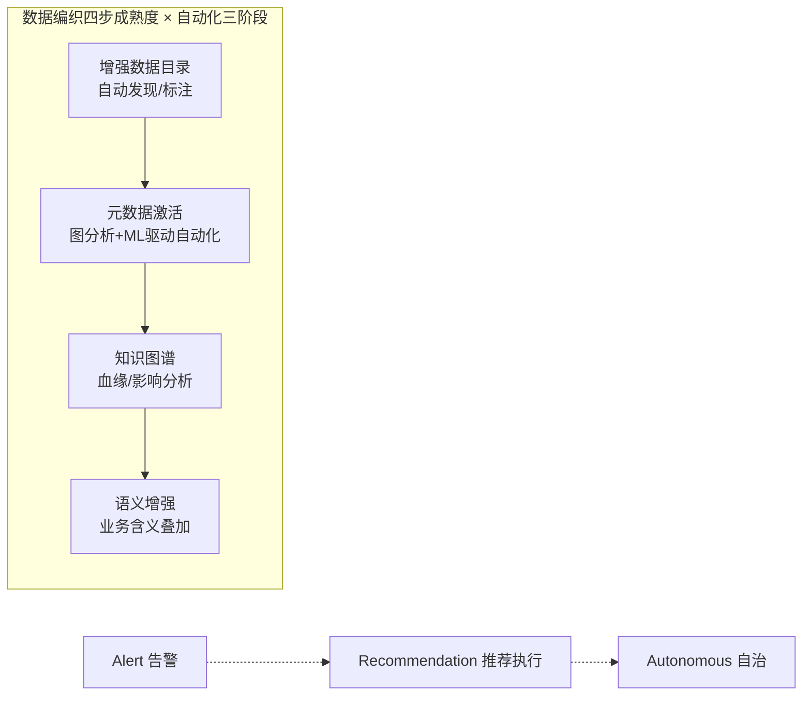
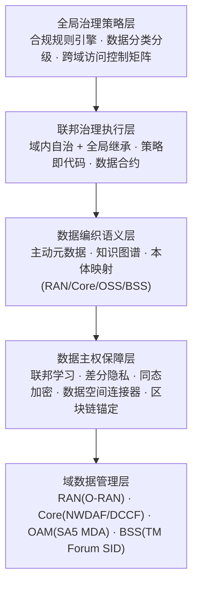
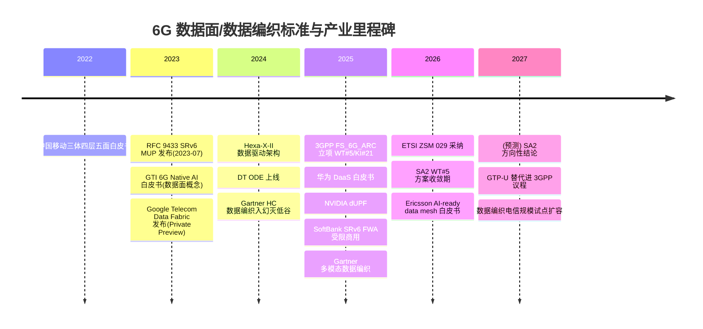
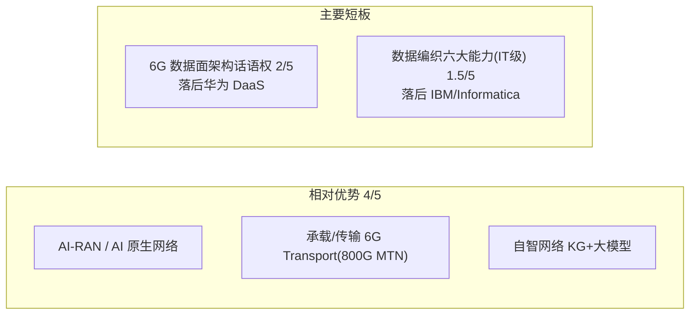

# 6G 数据面的数据编织技术洞察

> 版本 v4 | 生成 2026-07-15 | 视角：数据中台团队 / 战略专家组（大数据背景读者）
> 说明：本版在 v3 基础上做三类升级，取代 v3——
> **①** 按评审意见修正全部事实与一致性问题（RFC 9433 日期、中国移动"五面"构成、SoftBank 商用范围、隧道状态量级口径、单一来源论断标注、Mesh-on-Fabric 信心分级等）；
> **②** 面向**大数据专家（非通信背景）读者**重新配比：通信侧内容压缩为"背景"，**数据编织与数据智能**成为现状、趋势、机会的主体，并在关键处提供"大数据视角"的概念转译；
> **③** 机会点按 **场景 → 技术 → 价值** 三维展开。
> 技术判断后以 **[高/中/低]** 标注证据强度；引用以方括号简称标注，完整出处见附录 B；配图来源见附录 C。

---

## 需求和目标

移动网络每一代的跃迁，本质是"数据面"角色的一次重定义：4G 让数据面成为承载互联网流量的管道，5G 用 CUPS 把它与控制面解耦、推向边缘，而 6G 正在要求它完成一次更彻底的蜕变——**从"连接数据的转发管道"演变为"数据与智能的生产和服务平面"**。当感知（ISAC）、数字孪生、AI 原生这三类新业务把网络自身变成海量数据的生产者和消费者时，传统"包进包出"的用户面第一次显得不够用了。

问题因此浮现：据华为等厂商估算，6G 网络内部每天将产生 ZB 乃至更高量级的感知与 AI 数据（该量级为厂商单方估算，尚无独立验证 [中]）；这些数据具有多对多的拓扑、亚毫秒的时效要求、以及跨越无线接入网（RAN）/核心网/传输/边缘/终端的强异构性；而当前以 GTP-U 隧道 + UPF 会话 + NWDAF 集中分析为核心的数据处理范式，是为"一对一连接数据"设计的，无法承载这一转变 [Samsung 2026] [Huawei 2025]。业界给出的答案，越来越指向一项在企业 IT 领域已经成熟的技术——**数据编织（Data Fabric）**：以主动元数据、知识图谱、AI 编排为核心的现代数据管理架构。把它改造并下沉到电信实时环境，正在成为补齐 6G 数据面"数据能力"的主流技术路径。

> 📌 **大数据视角**：可以把 6G 数据面问题理解为一个熟悉的场景——一家企业（网络）突然从"只跑交易系统"变成"交易 + 实时数仓 + 特征平台 + AI Agent"全都要跑，但它现有的"数据基础设施"只有点对点管道（GTP-U 隧道）和一个可选的集中式分析库（NWDAF），没有数据目录、没有元数据、没有统一语义、没有编排调度。6G 数据面之争，本质是在争"这张网络的数据平台架构由谁定义"。

本报告回答四个层层递进的问题：

1. **为什么需要**——6G 数据面为何必须引入数据编织，传统范式在技术上卡在哪里；
2. **需要哪些技术**——数据编织与数据智能的核心技术能力是什么，成熟度如何；
3. **技术上如何演进**——把数据编织搬到 6G 数据面要跨越哪些技术鸿沟，关键技术方向如何发展；
4. **对我司意味什么**——作为数据中台 / 战略专家组（年投入千万级、以建议权为主），如何借这一机会窗，把既有的"数据引擎"能力嵌入 6G 数据面业务。

> 目标定位说明：本报告服务于我司数据中台团队的战略决策。团队在自智网络体系中承担"数据引擎"角色（与 AI 大模型引擎、数字孪生引擎并列构成数智引擎），因此报告的落点不是"公司整体如何做 6G 数据面"，而是"数据引擎能力如何沿 6G 数据面向外延伸"。读者以大数据/数据智能背景为主，通信侧内容按"够用的背景知识"配比，数据编织与数据智能按"决策所需的技术深度"配比。

---

## 行业环境与竞争现状

> 本板块按"6G 数据面（背景）→ 数据编织技术全景 → 数据智能新浪潮 → 二者交汇 → 标准与厂商格局"五个视角展开。视角一为通信侧背景（压缩），视角二、三、四为本报告技术主体。

### 现状一 · 6G 数据面：通信侧正在发生什么（背景）

#### 新数据洪流：驱动力的量级

6G 之所以要重构数据面，根本原因是三类新业务把网络从"数据管道"变成了"数据源"：

- **AI 原生网络**：6G 将 AI/ML 嵌入空口、RAN、核心网各层，产生训练数据、模型参数、梯度、推理结果等新数据类型。据 NVIDIA 数据，移动 AI 业务的上行流量占比已从传统业务的约 8% 升至 26%（单一来源数据 [中]），数据从"下行为主"转向"上下行对称乃至上行为重" [NVIDIA 2025]。
- **通感一体（ISAC）**：6G 基站兼具雷达感知能力，产生 I/Q 原始信号、点云等感知数据。华为估算基站侧感知数据量可达 ZB 级/天、设备侧可达更高量级（厂商估算 [中]）——这是一条完全独立于通信连接的高吞吐数据流 [Huawei 2025]。
- **数字孪生与网络自智**：网络数字孪生（NDT）需要对全网状态做实时镜像，要求跨域遥测数据以统一语义汇聚。

这些数据的共同特征是**多源多汇的任意拓扑、非连接性、实时性和强异构性**——而这恰恰是 5G 数据面的设计盲区。

#### 传统范式的技术瓶颈

5G 的数据处理由三块拼成，每一块在 6G 场景下都触及天花板：

**其一，GTP-U 隧道模型的扩展性瓶颈。** GTP-U（3GPP TS 29.281）自 3G 时代以来基本未变，每个 PDU 会话对应一条以 TEID 标识的隧道。它的问题是结构性的 [RFC 9433] [CNSM 2019]：

| 瓶颈维度 | 技术表现 | 量化 |
|---|---|---|
| 封装开销 | 外层 IP+UDP+GTP-U 头 | IPv4 36 字节 / IPv6 56 字节 |
| 状态扩展性 | 会话态随"UE 数 × QoS 流数"乘性膨胀；节点间全互联时隧道数随节点数呈平方级增长 | 对比无状态路由模型的线性聚合 |
| 转发表膨胀 | 每 UE 每 QoS 流一条隧道 | 百万 UE × 多流 = 千万级表项 |
| 传输网无感知 | 叠加隧道不感知底层拓扑 | 无法做 SLA 映射，仅靠静态配置 |
| 灵活性缺乏 | 平坦结构、无中间节点可编程 | 不支持动态路径、服务链 |

**其二，UPF 会话模型不适配非连接数据。** UPF 面向 "PDU 会话 → GTP-U 隧道 → QoS 流 → DRB" 的连接性数据链路优化，而 AI 梯度、感知点云是多对多、无会话归属的，强行套用会话模型会带来大量冗余信令。

**其三，NWDAF 集中式分析的三大局限** [Samsung 2026]：NWDAF 是一个**可选**网络功能（并非原生设计）；数据收集必须经控制面传输，**负载高且碎片化**（各网络功能各自暴露事件）；**缺乏跨域 AI 能力**（RAN 数据需经 OAM 间接获取）。这意味着 5G 的"数据智能"是打补丁式的，无法支撑 6G 的原生 AI。

> 📌 **大数据视角**：GTP-U ≈ 为每个用户手工拉一条点对点专线，没有"路由 + 目录"；NWDAF ≈ 一个可装可不装的集中式数仓 + 报表工具，各业务系统（网络功能）各自导数、口径不一、拿不到别的域的数据。用数据平台的语言说：**这张网没有 Catalog、没有统一元数据、没有 Pub/Sub 总线、没有编排器**——这正是数据编织六大能力的用武之地。

#### 架构路线之争与承载协议重构（背景速览）

对"如何补齐数据能力"，业界分为两条路线，这是当前最核心的架构分歧 [Huawei 2025] [Qualcomm 2024]：

- **独立数据面路线**（华为、中国移动、GTI、vivo 等中国阵营）：在控制面/用户面之外新增独立"数据面"。华为 DaaS（Data as a Service）是最完整方案，提出数据编排器（DO）、数据代理（DA）、数据通信代理（DCP）三组件；中国移动提出"三体四层五面"总体架构（五面为**控制面、用户面、数据面、智能面、安全面**——其中数据面、智能面、安全面为 6G 新增）[中国移动 2022]。
- **增强用户面路线**（Qualcomm 为代表）：不新增功能面，把新服务（定位、数据收集、AI）作为 IP 服务运行在增强用户面上，强调复用互联网生态、降低 TCO。
- **居中路线**（Hexa-X-II / Ericsson）：承认需要数据面概念，但更强调在演进的 5GC 上叠加 DataOps/MLOps 框架。

华为 DaaS 的工作机制可由下图直观呈现——数据编排器（DO）统一调度，数据代理（DA/DPF）在各节点执行采集与 AI 处理，数据通信代理（DCP）以发布/订阅方式实现多任务、多对多的异步数据分发：

> 📌 **大数据视角**：DO ≈ 编排器（Airflow/工作流引擎），DA ≈ 采集与本地处理代理（近似 Agent + 轻量算子），DCP ≈ 消息总线（Kafka 类 Pub/Sub），只是它们都被要求跑在"电信级"的延迟（毫秒以下）和吞吐（百 Gbps 级）指标上，并与 3GPP 协议栈原生集成。

这条路线之争在 3GPP SA2 的 6G 架构研究项 FS_6G_ARC 中集中体现——其中**工作任务 WT#5"统一数据框架"（关键问题 KI#21）**正式讨论"是否以及如何引入独立数据面"，截至 2026 年已积累约 90 篇贡献，预计 2027 年 3 月前给出方向性结论 [3GPP SA2]。

承载协议层的重构同步发生：**SRv6 移动用户面（RFC 9433，2023-07 发布）**用 IPv6 路由信息取代隧道状态，是 GTP-U 替代方案中成熟度最高的一条。SoftBank 于 2025 年 12 月在其 5G 商用网上以**固定无线接入（FWA）形态提供了全球首个 SRv6 MUP 受限商用服务**（Broadcom Jericho2 + Arrcus ArcOS + VMware Telco Cloud）；此前 2023 年 2 月的现场试验曾在高速公路移动场景实测出超过 10ms 的延迟改善 [SoftBank 2025]。Deutsche Telekom 已在 IETF 正式提议 3GPP 在 6G 阶段研究以 SRv6 替换 GTP-U。分布式 UPF（NVIDIA dUPF：2 个 CPU 核心实现 100 Gbps 线速、25μs 延迟 [NVIDIA 2025]）与 P4 可编程数据面构成另一条腿。承载细节对本报告读者是背景知识，趋势六将给出研判。

小结：通信侧的现状是"三线并进、尚未收敛"——架构上独立面与增强面之争、承载上 GTP-U 与 SRv6/dUPF 之争、智能上多条 AI 嵌入路径并行。**对大数据读者而言，关键结论只有一条：无论哪条路线胜出，"网络需要一个统一的数据管理与语义层"已是共识——分歧只在这个层放在哪里、叫什么名字、由谁定义。**

### 现状二 · 数据编织技术全景：能力、成熟度与批评

#### 定义：一种架构方法，而非一个产品

数据编织是"以主动元数据和 AI/ML 驱动、可跨分布式异构环境统一数据访问/集成/治理的现代数据管理设计"，Gartner 反复强调它**不是单一工具或技术**，而是一套可叠加在既有数据湖/数仓之上、"利旧不拆旧"的架构方法 [Gartner 2024]。IBM 将其归纳为三大基石：数据虚拟化（无需物理移动即可统一查询）、联邦主动元数据（语义知识图谱 + AI/ML 持续分析元数据）、机器学习引擎（推荐集成模式、自动化数据管理）[IBM]。

它与**数据网格（Data Mesh）**常被并提，但二者维度不同：数据编织是**技术/元数据驱动**的集成层，数据网格是**组织/文化驱动**的域自治运营模型（域团队对"数据即产品"负责）；前者可作为后者的底层技术设施，业界（Nokia/Ericsson/AWS）普遍主张二者互补的 "Mesh-on-Fabric" 混合架构。

#### 能力域全景（7+1）与成熟度分层

数据编织不是单点技术，而是一组能力域的协同。按 Gartner 2024 成熟度口径逐项拆开看，各能力成熟度差异显著——这决定了"哪些能力可以直接拿来用、哪些还要等"：

| 能力域 | 技术实现 | 成熟度（2024） | 大数据生态类比 |
|---|---|---|---|
| 1. 主动元数据 | 持续采集技术/运营/业务/社交四类元数据，AI 分析后**驱动自动化**（而非仅供人查阅） | 幻灭低谷 → 2-5 年 | DataHub/Atlas 的"被动目录"升级为"会触发动作的目录" |
| 2. 知识图谱 | 图结构表达数据资产语义关系、血缘、影响分析 | 早期主流 | 数据血缘图 + 业务语义层 |
| 3. AI/ML 增强 | 推荐集成路径、自动质量检测、异常发现、NL2SQL | 峰值 → 爬坡 | AI Copilot for Data |
| 4. 数据虚拟化 | 逻辑层统一查询，无需物理移动数据 | 成熟（Denodo 验证） | 联邦查询（Presto/Trino 式） |
| 5. 自动数据集成 | 基于元数据分析自动生成 ETL/ELT/CDC 管道 | 幻灭低谷 → 2-5 年 | 自动生成管道的 dbt/CDC |
| 6. 数据编排 | DataOps 管道协调、调度、可靠性保障 | 早期主流 | Airflow/Dagster |
| 7. 隐私与治理 | 策略即代码、RBAC/ABAC、数据分类、合规审计 | 成熟 | Ranger/OPA 策略引擎 |
| +8. 增强数据目录 | ML 自动发现、标注、语义关联数据资产 | 幻灭低谷 | 智能化数据目录 |

Gartner 同时给出**四步成熟度路径**（增强数据目录 → 元数据激活 → 知识图谱构建 → 语义增强）与**自动化三阶段**（Alert 告警推荐 → Recommendation 推荐并执行 → Autonomous 全自动执行）[Gartner 2024]。这两条路径合起来读，就是数据编织的演进主线：**从"帮人找数据"走向"替人管数据"，最终走向"为 AI 供数据"。**

#### 成熟度：走出幻灭低谷，被 GenAI 二次点燃

宏观成熟度上，2024 年 Gartner 数据管理成熟度曲线将数据编织置于**幻灭低谷（Trough of Disillusionment）**，但保持"变革性（Transformational）"评级，预计 2-5 年到达生产成熟期；同图中 Data Mesh 被标记为"到达成熟期前即过时（obsolete before plateau）"，而主动元数据、知识图谱等支撑能力正处于爬升期（曲线图见趋势二配图）。2025 年 Gartner 将"多模态数据编织（Multimodal Data Fabric）"列入数据与分析九大趋势，扩展至向量与非结构化数据；Forrester 2025 年 Q4 Wave 评估了 14 家供应商、Q2 Landscape 覆盖 39 家，市场已从概念走向产品化竞争 [Gartner 2025] [Forrester 2025]。据 Fortune Business Insights，全球数据编织市场预计从 2025 年约 33.7 亿美元增至 2034 年约 164.6 亿美元，年复合增速约 22% [Fortune BI]。

#### 企业落地水平与批评

企业 IT 侧，IBM（Watson Knowledge Catalog + Cloud Pak）、Informatica（IDMC CLAIRE）、Denodo（数据虚拟化）等已具备能力域的产品级实现，但市场高度分散（据 2023 年数据，前 10 家仅占约 22% 收入）[Gartner 2024] [IBM]。批评声同样值得正视：数据仓库之父 Bill Inmon 指出数据编织混淆了"连接（connect）"与"集成（integrate）"，缺乏真正的数据转换，"把脏数据编织在一起只会放大问题"；也有分析预警数据编织项目因忽视组织就绪度而可能落入高失败率 [Inmon] [Procurement Insights]。**这提示：技术架构本身不解决数据质量与组织问题——这一教训对电信落地尤为重要。** [高]

### 现状三 · 数据智能新浪潮：GenAI/Agentic AI 正在改写数据编织的需求方

数据编织的"二次点燃"不是自发的，而是被一个新需求方拉动的——**AI 本身成了最大的数据消费者**。这一变化对本报告读者最为切身，值得单列一个视角：

- **GenAI 需要主动元数据**：Gartner 研究明确指出"成功的 GenAI 产品需要数据编织交付主动元数据"——大模型应用（RAG、NL2SQL、Copilot）的质量上限由数据的语义丰富度与可信度决定 [Gartner 2025]。
- **Agentic AI 需要语义数据底座**：PwC 提出"语义数据编织"是 Agentic AI 运营的基础；当 AI 从"被人调用的模型"变成"自主感知-决策-执行的智能体"，它必须能**自主发现、理解、信任并订阅数据**——这恰好是主动元数据 + 知识图谱 + 数据合约的组合能力 [PwC]。
- **多模态数据爆发**：向量、图像、时序、点云等非结构化数据要求数据编织从"表格中心"升级为"多模态中心"（Gartner Multimodal Data Fabric，2025）[Gartner 2025]。
- **电信是 Agentic AI 最严苛的落地场**：6G 的目标是 Level 4/5 零接触自智网络——网络内的智能体自主运维全网。AWS 据此提出 "Intelligence Fabric / Fabric of Fabrics"：以网络语言模型（NLM）+ 分层智能编织支撑多 Agent 协作 [AWS]；Ericsson 白皮书把 AI-ready 数据底座列为自智网络 Level 5 的前置条件 [Ericsson 2026]。

**一句话：数据编织的需求方正在从 BI/分析师换成 AI Agent，而 6G 网络是这个新需求方规模最大、指标最严苛的栖息地。** 这也是"数据编织 × 6G"这个交集的真正引擎。[中]

### 现状四 · 数据编织与数据智能向 6G 数据面的下沉

#### 技术鸿沟：企业 IT 与电信实时环境的量级差

把成熟于企业 IT 的数据编织搬进 6G 数据面，面对的是一道数量级的技术鸿沟 [Ericsson 2026] [Nokia]：企业数据编织处理的是 GB/s 级批量数据、可容忍秒级延迟，而 6G 数据面要求 TB/s 级流式数据、亚毫秒延迟。这意味着：

- **数据虚拟化的延迟不可接受**：企业级联邦查询的秒级响应，在 RAN 实时遥测场景中完全不可用；
- **协议栈必须原生**：企业数据编织跑在 REST/JDBC 之上，而电信要求与 3GPP 协议栈、GTP-U/SRv6 承载原生集成；
- **部署必须云原生化**：需要以容器网络功能（CNF）形态在分布式边缘弹性部署，而非集中式数据中心。

这道鸿沟决定了：电信数据编织不可能照搬 IBM/Informatica 的通用中台，而必须在"实时、协议栈原生、RAN 侧"做电信专属改造——这既是门槛，也是设备商相对 IT 厂商的差异化空间。[高]

#### 六大能力向 6G 的逐项映射

数据编织每项能力在 6G 网络域都有明确的对应需求与在研方案——这张映射表是"下沉"的技术总纲 [Ericsson 2026] [CANDIL] [ROBUST-6G]：

| 数据编织能力 | 6G 网络对应需求 | 已有方案/原型 |
|---|---|---|
| 主动元数据 | 网络遥测自动分类、标注、路由 | Ericsson Telco DataOps 语义建模；ETSI ZSM 029 数据注册/发现 |
| 知识图谱 | 网络拓扑/数据资产/AI 模型间语义关系 | CANDIL NGSI-LD 联邦知识图谱；ROBUST-6G KG-in-Fabric |
| AI/ML 增强 | 智能数据管道编排、异常检测、特征工程 | Ericsson AI-ready pipeline；ETSI ZSM 012 管道编排 |
| 数据虚拟化 | 跨 RAN/Core/Transport 联邦查询 | Nokia 端到端数据层；6G-TWIN 分布式 UDR |
| 自动数据集成 | 多厂商多域数据源自动接入、schema 对齐 | Google TDF 预置电信适配器 |
| 数据编排 | 端到端 DataOps 管道协调 | 华为 DO 数据流引擎；ETSI ZSM 闭环自动化 |
| 隐私与治理 | 跨域数据主权、GDPR/数据安全法合规 | DT 数据边界 + EKM；ETSI ZSM 安全策略 |

综合 Ericsson、Nokia、6G-TWIN 等方案，"6G 数据编织"呈现**三层融合架构**：底层是各域联邦化的分布式数据基础设施（Pub/Sub 数据总线互联）；中层是统一数据管理平面（元数据目录 + 知识图谱语义层 + 策略即代码治理 + 联邦查询）；上层是 AI-ready 数据消费（特征存储 + 数据产品市场化 + AI Agent 意图接口）。

**数据编织与华为 DaaS 数据面的关系是"管理层与传输层互补"**：DaaS 解决"数据如何在网络中高效传输"（多对多拓扑、on-path 处理），数据编织解决"数据如何被发现、理解和信任"（语义、目录、治理）。在完整的 6G 数据架构中，DaaS 可作为数据编织的底层传输引擎，数据编织为 DaaS 提供语义上下文与治理策略——**二者之间的接口目前无任何标准化提案，是尚未被占领的架构空白**。[中]

#### 网络数据语义层：主动元数据 + 知识图谱

下沉的第一个技术支点，是为跨域网络数据建立**统一语义层**。主动元数据负责对 RAN 性能数据、核心网 CDR、BSS 客户数据自动分类、标注、追踪血缘；知识图谱负责表达它们之间的语义关系。Telefónica/UPM 的 CANDIL 项目用 ETSI NGSI-LD 标准实现了**联邦知识图谱**——每个域维护本地图谱，通过链接数据实现跨域语义发现；EU 的 ROBUST-6G 项目则把"知识图谱嵌入数据编织（KG-in-Fabric）"作为架构核心 [CANDIL] [ROBUST-6G]。难点在于电信本体极其复杂（3GPP YANG、O-RAN 数据模型、TM Forum SID 三套语义并存），自动本体构建工具尚不成熟 [中]。

#### 跨域数据治理与隐私计算

下沉的第二个技术支点是治理。6G 数据横跨 RAN、核心网、传输、边缘、终端、BSS、OSS 至少七个治理域，每个域的时效性与合规要求各异。业界形成了三大治理范式：**联邦治理**（Nokia/Ericsson，域自治 + 全局标准）、**数据空间治理**（IDSA/GAIA-X/6G-DALI，主权数据交换）、**策略即代码治理**（Deutsche Telekom MARA，运行时对 AI Agent 的数据访问做细粒度动态授权）[DT] [CANDIL]。其技术层次可归纳为：

隐私计算是主权保障层的核心：联邦学习（3GPP Rel-18/19 已标准化水平/垂直 FL）让数据不出域即可协作训练，差分隐私、安全多方计算、同态加密、区块链审计（ETSI PDL GS 034）各司其职 [ETSI ZSM]。风险在于治理本身有性能开销——Fraunhofer 实测显示策略执行会引入额外延迟，在实时 RAN 场景可能不可接受 [中]。

#### 电信早期实践

下沉已有先行者：Deutsche Telekom 的 One Data Ecosystem（ODE）报告了 22 倍性能提升，LG U+ 的 Nudge-B 数据编织已在生产上线（唯一显式以 Data Fabric 命名的运营商部署），Vodafone Italy 的 Nucleus 试点启动 [DT] [data-fabric-in-telecom]。但也有警示信号：Google Cloud Telecom Data Fabric 自 2023 年发布以来已超过 3 年仍处 Private Preview、迟迟未 GA，其命运将影响整个电信数据编织的产业叙事；且这些 ROI 数据多来自供应商自述，缺乏独立审计，存在幸存者偏差 [中]。TM Forum 2025 调查中，87 位电信高管仅 2 人认为本企业实现了数据完全民主化——行业整体仍在数据管理的早期阶段 [TM Forum]。

### 现状五 · 标准与厂商竞争格局

#### 标准技术路线图

6G 数据面 × 数据编织的标准化呈"多组织并行、职责交叉、术语分裂"格局。最关键的几个入口：

- **ETSI ZSM GS 029《自智网络数据管理代理》**是唯一明确把 Data Fabric 概念引入电信标准体系的工作项，由中国电信/中兴/CAICT/亚信主导，2026 年 4 月采纳，定义数据注册/发现、资产管理、认证、收集传输、工作流编排 [ETSI ZSM]。
- **3GPP SA2 WT#5 / KI#21 统一数据框架**是数据面最直接的架构入口，目标 2027 年 3 月前给方向性结论 [3GPP SA2]。
- **3GPP SA5 数据管理框架（DMFW，TS 32.801）**从 OAM 侧覆盖数据收集/处理/注册/发现/访问控制/销毁/质量。SA2 与 SA5 在数据管理/暴露上**职责重叠**，运营商已呼吁协调，预计 2027 年达成"SA2 管网络架构层、SA5 管 OAM 层"的分工 [3GPP SA5]。
- **O-RAN R005 AI/ML 工作流**规范 RAN 侧数据供给与模型治理；**ITU-R M.2160** 定义 6G 总体框架与 AI 原生原则。

关键时间线如下：

#### 厂商技术能力格局

从"数据编织能力域"的维度看厂商格局，可见一个结构性错位——IT 数据编织供应商全面领先，电信设备商普遍处于研究态，而中兴当前布局集中在数据编排与 AI 原生数据管理两项（下表为本报告综合研判）：

| 厂商 | 主动元数据 | 知识图谱 | 数据虚拟化 | 数据编排 | 隐私计算 | AI 原生数据管理 |
|---|:--:|:--:|:--:|:--:|:--:|:--:|
| 华为 | 研究 | 研究 | 部分 | **产品级** | 研究 | 研究 |
| 中兴 | — | 应用级(AN) | — | 研究 | 探索 | 研究 |
| 爱立信 | 部分 | — | — | 部分 | 研究 | 部分 |
| 诺基亚 | 部分 | 研究 | — | 部分 | 研究 | 部分 |
| 三星 | — | — | — | 研究 | — | 研究 |
| IBM | 产品级 | 产品级 | 产品级 | 产品级 | 产品级 | 产品级 |
| Informatica | 产品级 | 产品级 | 部分 | 产品级 | 产品级 | 产品级 |
| Denodo | 部分 | — | 产品级 | 产品级 | 部分 | 部分 |

关键差距在"电信适配"：IT 供应商缺乏亚毫秒延迟处理、3GPP 协议栈集成、CNF 原生部署能力——这是设备商唯一可守的护城河。地缘上则呈现**中欧美路线分化**：中国阵营（华为/中兴/中国移动/vivo）推动激进的独立数据面/DaaS，欧美厂商（Ericsson/Nokia/Qualcomm）偏好渐进增强（UPF+NWDAF 演进），2026–2027 年的标准博弈将决定最终方向 [高]。

---

## 发展趋势判断

> 本板块给出六条资深研判，每条均按"**判断 → 为什么有价值 → 技术上如何实现 → 证据与玩家动态 → 反方 → 对我司含义**"展开。判断强度以 **[高/中/低]** 标注。趋势一至五以数据编织与数据智能为主线（本报告重心），趋势六为通信承载侧背景研判。

### 趋势一：AI 原生催生"统一数据框架"，数据编织成为 6G 数据面标配底座 [高]

**判断**：6G 网络对 AI 的原生依赖，将迫使今天碎片化、可选、集中式的数据采集机制（NWDAF）升级为一套**原生、跨域、实时、语义化的统一数据框架**；而这套框架的技术内核，正是数据编织。到 2027 年前后，"6G 是否需要统一数据框架"将不再是问题，问题只剩"用谁的架构、叫什么名字"。

**为什么有价值**：6G 的目标是零接触自智网络（Level 4/5）与 Agentic AI——让网络内的智能体自主感知、决策、执行。但智能体的能力上限由其"可获取的数据质量"决定：没有统一、可信、实时的数据底座，再强的模型也是"无米之炊"。当前 5G 的做法是 NWDAF 集中分析 + 各网元零散暴露事件，三星已明确指出其三大硬伤——NWDAF 是**可选**网络功能、数据收集经控制面传输**负载高且碎片化**、**缺乏跨域 AI 能力** [Samsung 2026]。统一数据框架的价值就在于把"打补丁"变成"承重墙"，让数据成为可被全网 AI 复用的一等公民。

**技术上如何实现**：路径已逐步清晰——以**主动元数据**对全网遥测自动分类/标注/追踪血缘，以**知识图谱**表达 RAN/核心/传输/BSS 数据间的语义关系，以**发布/订阅 + 数据编排**替代 NWDAF 的请求-响应接口，让数据以多对多拓扑在域间流动。这恰是数据编织能力域向网络域的直接映射（见现状四映射表）。值得注意的是，6G 系统架构本身已把"数据（Data）"与"人工智能（AI）"并列为顶层技术框架之一（见下图 Nokia 6G 系统架构），这为统一数据框架提供了架构合法性：

**证据与玩家动态**：这一方向已被三套标准框架同时指向——ETSI ZSM 029 数据管理代理、3GPP SA2 WT#5 统一数据框架、O-RAN dApp 数据管道，功能重叠已不可忽视，预计 12–24 个月内出现首批跨标准组织协调 [3GPP SA2] [ETSI ZSM]。厂商侧，Ericsson 以 "AI-ready data mesh" 命名、Nokia 以 "Data Framework" 命名、AWS 以 "Intelligence Fabric" 命名、华为以 "DaaS" 命名——名称各异但技术实质高度收敛，印证判断的确定性 [Ericsson 2026] [AWS]。

**反方**：数据面引入 AI 使转发从确定性变为概率性，可解释性、鲁棒性（对抗攻击）与可信度尚未解决；且术语分裂本身可能拖慢标准收敛。

**对我司含义**：这是我司"数据引擎"能力最直接的外溢入口——自智网络中已验证的知识图谱/语义能力，正是统一数据框架的稀缺资产。

### 趋势二：数据编织自身正在范式跃迁——从"被动集成架构"到"多模态、Agentic 的数据智能平台" [中]

**判断**：数据编织不是一项"等着被 6G 采纳"的静态技术，它自身正被 GenAI/Agentic AI 重塑——**从服务人类分析师的被动数据集成层，跃迁为服务 AI 智能体的主动数据智能平台**。到 2028 年前后，"数据编织"与"AI 数据底座"两个概念将基本合流；不完成这次跃迁的数据编织产品将被淘汰。

**为什么有价值**：这条趋势决定了"我们要下沉到 6G 的数据编织，究竟是哪个版本的数据编织"。若按 2022 年的理解（目录 + 虚拟化 + 集成）建设，交付时即落后一代；按 2026 年的理解，数据编织的核心交付物是**让 AI Agent 能自主发现、理解、信任、订阅数据的语义底座**——这与 6G 自智网络的需求天然同构。对数据团队而言，它还回答了一个战略问题：**数据中台的下一站不是更大的中台，而是"AI 的数据操作系统"。**

**技术上如何实现**：三条技术线并进——**其一，元数据从被动到主动**：按 Gartner 自动化三阶段（Alert → Recommendation → Autonomous），元数据分析结果直接驱动管道生成、质量修复、访问授权，人只审批例外；**其二，从表格到多模态**：Gartner 2025 提出 Multimodal Data Fabric，把向量、时序、图像、点云纳入统一编织——恰好覆盖 6G 的感知数据（点云/I/Q）与 AI 数据（向量/梯度）类型；**其三，从查询接口到 Agent 接口**：数据消费方式从 SQL/API 变为"意图驱动的数据发现与订阅"（AI Agent 说明要什么，编织层自动组装数据产品），AWS 的 NLM + Intelligence Fabric、PwC 的语义数据编织均循此路径 [AWS] [PwC]。数据编织的宏观成熟度位置支撑该判断——正处幻灭低谷但保持"变革性"评级、2-5 年到达成熟期，且正被 GenAI 需求二次点燃：

**证据与玩家动态**：Gartner "成功的 GenAI 产品需要数据编织交付主动元数据"（2025）；Informatica CLAIRE、IBM watsonx.data 均已把 GenAI 助手嵌入数据管理产品；Forrester 2025 Wave 的评估维度已加入 "AI-ready data infrastructure"；电信侧 Ericsson AI-ready data mesh、AWS Intelligence Fabric、PwC 语义数据编织三方从不同角度收敛于"为 Agent 供数"[Gartner 2025] [Forrester 2025] [Ericsson 2026] [AWS] [PwC]。

**反方**：Agentic AI 本身尚处炒作早期，若其企业落地不及预期，数据编织的"智能化"叙事将降温；Bill Inmon 的批评依然成立——语义层再华丽也替代不了数据质量与真正的集成；多模态编织目前无成熟产品验证。

**对我司含义**：数据引擎（KG + 语义 + 大模型诊断）恰好站在这条跃迁的正确一侧——它天生是"为 AI 供数"的。应把数据引擎的演进目标从"运维数据中台"重新表述为"网络域 AI 智能体的数据底座"，与公司 Agentic AI/自智网络叙事对齐。

### 趋势三：2026–2027 是 6G 数据面标准化的关键收敛窗口 [高]

**判断**：6G 数据面的架构方向（独立数据面 / 增强用户面 / 混合）、承载协议、数据框架术语，都将在 **2026 至 2027 这两年内集中定调**。这是一个不可再来的"卡位窗口"——窗口关闭后，架构和术语固化，后进入者只能跟随。

**为什么有价值**：标准话语权是电信产业最高杠杆的资产。谁在窗口期把自己的架构、接口、术语写进 3GPP/ETSI 规范，谁就锁定了后续十年的产品定义权与专利护城河。对资源有限（千万级预算、以建议权为主）的我司数据中台而言，标准提案是"以最低成本换最高杠杆"的稀缺机会——一篇被采纳的提案的战略价值，远超同等投入的产品开发。**对数据团队特别要点破的是：这个窗口争的不是通信协议，而是"数据管理框架"的定义权——元数据模型、数据服务接口、语义本体，恰是数据团队的专业领地。**

**技术上如何实现**：从 3GPP 官方发布的 Release 时间线可精确读出窗口边界——Rel-20 承载 6G 研究（FS_6G Study），SA Stage 2 于 2026 年内完成、Stage 3 冻结在 2027 年附近；Rel-21 将正式规范 6G RAN/Core，时间线已于 2026 年 6 月获批：

具体到数据面，FS_6G_ARC 的 WT#5（关键问题 KI#21）目标 2027 年 3 月前给出方向性结论，DaaS 独立面 / 增强 NWDAF / 混合三条路线的方案竞争在 SA2#170–#176 各次会议中已充分展开，2026 年是投票与迁移架构决策的收敛点 [3GPP SA2]。

**证据与玩家动态**：ETSI ZSM 029 已于 2026 年 4 月采纳（我司参与主导），是唯一显式引入 Data Fabric 的电信标准工作项；Deutsche Telekom 已在 IETF 正式提议在 6G 阶段研究 SRv6 替换 GTP-U——多条战线的时间表高度重合于 2026–2027 [ETSI ZSM] [SoftBank 2025]。

**反方**：3GPP 历史上常延期 12–18 个月，方向性结论未必等于最终规范；窗口可能"软性延后"，但不会消失。

**对我司含义**：这是全报告最强的行动号令——O3（ZSM 029 + SA2 WT#5 卡位）必须在未来 12 个月内落子，晚了就是补位跟随。

### 趋势四：数据编织电信化加速进入规模试点期 [中]；Mesh-on-Fabric 是可能的架构终局 [低]

**判断**：成熟于企业 IT 的数据编织将加速下沉电信网络，2027–2028 年从 3 家先行者扩展到 5–6 家 Tier-1 运营商规模试点 [中]。更远期，它可能与数据网格融合为 **"Mesh-on-Fabric"** 混合架构——数据编织提供跨域技术集成与统一语义，数据网格提供域自治与"数据即产品"的运营模型；但该终局目前证据链最弱，电信领域尚无任何经验证的原型，按本工程证据分级应单独标注 **[低]**。

**为什么有价值**：电信数据横跨 RAN/核心/传输/边缘/终端/BSS/OSS 至少七个域，既需要跨域统一（否则 AI 拿不到全局视图），又需要域自治（RAN 与 BSS 的时效性、合规性天差地别，无法一刀切集中）。数据编织下沉的直接价值可量化——运营商把多套割裂的数据存储库统一为共享数据层后，Nokia 报告可达约 **50% 成本节省**（供应商口径 [中]）、显著降低宕机风险，并开放第三方生态：

**技术上如何实现**：底层为各域联邦化的分布式数据存储（如 6G-TWIN 的联邦 UDR），中层为元数据驱动的数据目录 + 知识图谱语义层（ETSI NGSI-LD / YANG / TM Forum SID 三套本体映射）+ 策略即代码治理，上层为特征存储 + 数据产品市场化 + AI Agent 意图接口。CANDIL 已用 NGSI-LD 实现联邦知识图谱原型，ROBUST-6G 把"知识图谱嵌入数据编织"作为架构核心 [CANDIL] [ROBUST-6G]。推荐落地路径是 **Fabric-first → Mesh-layered**：先建统一编织层解决"找得到、看得懂、管得住"，再在其上按域叠加数据产品运营 [高]。

**证据与玩家动态**：ETSI ZSM 029 发布降低了运营商决策门槛；Deutsche Telekom（One Data Ecosystem，报告 22× 提升）、LG U+（Nudge-B 已生产）、Vodafone Italy（Nucleus 试点）已形成先行者集群 [DT] [Ericsson 2026]。Mesh-on-Fabric 方向上，Gartner 预测 2028 年 80% AI-Ready 数据产品将产自 Fabric+Mesh 互补架构（方法论未公开 [低]），AWS "Fabric of Fabrics" 与 DT MARA 提供了概念验证思路。

**反方**：企业 IT 侧数据网格采纳率仍低（Gartner 2024 曲线已将 Data Mesh 标记为"成熟前过时"）、电信几乎零基准，Mesh-on-Fabric 可能超前于付费需求；先行者 ROI 数据多来自供应商自述、缺乏独立审计；Google Telecom Data Fabric 逾 3 年未 GA 是持续的警示信号。若 2028 年底仍无运营商试点 Mesh-on-Fabric，该终局判断应被推翻。

**对我司含义**：这是 O1/O6 的技术底盘——我司可先在自智网络内自用验证统一数据层（Fabric-first），再横向接入运营商试点，避免为未经验证的混合终局超前重投。

### 趋势五：跨域数据治理从"外挂"变为"部署前置条件" [中]

**判断**：在数据主权法规全球碎片化、6G 多利益方生态（运营商 + 垂直行业 + 云 + 监管）下，数据治理将从事后审批的"外挂模块"，变为内嵌于数据流、伴随数据面一起部署的**前置条件**。没有治理，数据就不能流动、更不能变现。

**为什么有价值**：6G 的 AI 原生化要求海量数据跨域流动，传统"逐案人工审批"的治理模式在这一量级下彻底失效。把治理内嵌进数据流——让每一次数据访问都自动完成权限校验、分级检查、匿名化——是合规变现的前提，能把"合规"从成本负担转化为差异化卖点（尤其面向欧盟 GDPR、中国数据安全法等强监管市场）。**对数据团队而言这条趋势尤其可操作：策略即代码、数据分类分级、隐私计算都是数据工程的成熟工具箱，电信只是一个新落场。**

**技术上如何实现**：三大支柱——**策略即代码**（Deutsche Telekom MARA 对 AI Agent 数据访问做运行时细粒度动态授权）、**隐私计算**（联邦学习让数据不出域即可协作训练，辅以差分隐私/安全多方计算/同态加密）、**数据空间连接器**（IDSA/GAIA-X 主权数据交换 + 区块链审计出处，对应 ETSI PDL GS 034）。其中联邦学习是最成熟的落地技术（3GPP Rel-18/19 已标准化水平/垂直 FL）——各数据持有方仅上传梯度/激活、原始数据留在本地，中心服务器聚合出全局模型，下图以能源场景示意这一"数据不动、模型动"的机制：

**证据与玩家动态**：3GPP SA5 已启动数据管理框架（DMFW，TS 32.801），SA2 WT#5 也将访问控制/用户同意/隐私纳入研究范围，二者在治理上职责重叠、亟待协调；产业侧形成联邦治理（Nokia/Ericsson）、数据空间治理（IDSA/GAIA-X/6G-DALI）、策略即代码治理（DT MARA）三大范式并行 [3GPP SA5] [DT]。

**反方**：治理本身有性能开销——Fraunhofer 实测显示策略执行在实时 RAN 遥测场景可能引入不可接受的延迟；SA2/SA5 职责边界未定，可能带来标准碎片化。

**对我司含义**：把"数据不出域 + 联邦 + 策略即代码"沉淀为合规参考架构（策略 7），是响应运营商客户合规刚需、把合规做成卖点的低成本切入。

### 趋势六（通信承载侧背景）：GTP-U 走向日落，承载协议向 SRv6/dUPF 重构 [中]

**判断**：服役二十余年的 GTP-U 隧道，将在 6G 阶段被无状态的 IP 路由范式（SRv6 MUP）和硬件卸载的分布式转发（dUPF）逐步取代。对数据团队而言，此趋势的意义在于：**未来网络数据的"物理管道"将原生感知路由与 SLA，数据编织层可借此实现端到端的数据传输策略映射**——这是本报告纳入该通信侧趋势的原因。

**为什么有价值**：GTP-U 的隧道模型是移动网 TCO 与灵活性的双重枷锁——会话态随"UE 数 × QoS 流数"乘性膨胀，百万 UE 场景下转发表可达千万级；叠加隧道对底层传输网无感知，无法做 SLA 映射和端到端切片。把用户面拉回无状态 IP 路由，可消除状态爆炸、原生支持网络切片（SRv6 Flex-Algo）与快速保护倒换（TI-LFA <50ms），并显著降低移动专用设备的采购与运维成本。

**技术上如何实现**：SRv6 MUP（RFC 9433，2023-07）的核心是"把会话信息转换为路由信息"——用 IPv6 SID 编码会话状态；配合 uSID 压缩（RFC 9800）可将多段路由压缩进单个 IPv6 目的地址，把封装开销降到不高于 GTP-U。下图直观对比了传统隧道封装（左，层层叠加）与 SRv6 精简封装（右，Segment-ID 承载 TE-path/VPN/服务链）的差异：

另一条腿是 dUPF——NVIDIA 在 Grace CPU + BlueField-3 DPU 上实现仅 2 核 100 Gbps 线速、25μs 延迟、规则全硬件卸载 [NVIDIA 2025]；P4 可编程交换机可达 100 Gbps/亚微秒，但受 TCAM 容量限制（约万级会话）。

**证据与玩家动态**：SoftBank 于 2025 年 12 月以 FWA 形态提供全球首个 SRv6 MUP 受限商用服务（2023 年 2 月现场试验曾实测高速公路场景延迟改善 >10ms）[SoftBank 2025]；Deutsche Telekom 已在 IETF 正式提议 3GPP 6G 研究 SRv6 替换 GTP-U，预计 2027 年进入正式议程 [RFC 9433]。生态由 Cisco/SoftBank/Arrcus/Broadcom 主导。

**反方**：运营商已在 5G UPF 上重金投入，迁移阻力巨大，GTP-U 与 SRv6 长期共存不可避免；3GPP 迄今未正式采纳 SRv6 为 N3/N9 替代；当前唯一商用限于 FWA 受限场景，高密度移动性场景未经验证。

**对我司含义**：这是承载线（O4）的机会窗，与我司 800G MTN 传输底座红利叠加，建议纳入公司 6G 路标（我司数据中台以建议为主，不自担投入）。

---

## 趋势判断总结：3 年看透、5 年看清

**3 年看透（2026–2028，高确定性）**：6G 数据面的标准方向将在 3GPP SA2 于 2027 年前定调（独立数据面或增强用户面二选一或混合）；ETSI ZSM 029 进入实施指南阶段并催化供应商适配；数据编织电信试点从 3 家先行者扩展到 5–6 家 Tier-1 运营商；数据编织产品全面"AI 化"（主动元数据自动化 + 多模态 + Agent 接口成为标配）；GTP-U 替代讨论进入 3GPP 正式议程。**这三年是"卡位"窗口——术语未固化、职责未分、承载未定，正是提案影响定义的时机。**

**5 年看清（2029–2031，方向性）**：6G 数据面架构基本定型并随首批商用落地；数据编织在电信进入规模商用，"数据编织"与"AI 数据底座"概念合流；跨域联邦数据空间与 3GPP 治理框架初步对接；Mesh-on-Fabric 混合架构是否成形届时可验证（当前 [低]）。届时格局大局已定，后进入者只能跟随。

一句话：**未来 3 年决定"话语权"，未来 5 年决定"市场位次"——对我司而言，最大的风险不是技术做不出，而是错过 3 年卡位窗口。**

---

## 公司现状和定位分析

我司在 6G 数据面 × 数据编织坐标系中的真实位置，可概括为"**强于网络智能与承载算力、弱于数据编织 IT 级能力与数据面架构话语权**"。[中]

**能力锚点**：数据中台在自智网络（AIR Net）体系中的既定角色是"**数据引擎**"——与 AI 大模型引擎、数字孪生引擎并列构成数智引擎三组件。数据引擎已在生产环境支撑跨域数据与知识图谱 + 大模型的故障诊断（Fault Agent），这是数据编织"知识图谱/语义/主动元数据"能力在电信生产场景的少数真实落地之一。**这给了数据中台一条清晰的演进主线：数据引擎（自智网络内）→ 6G 数据面数据服务化组件。**

**数据编织能力逐项对照**（依据本工程厂商能力矩阵与公开证据自评）：

| 数据编织能力 | 我司当前位置 | 依据 | 与领先者差距 |
|---|---|---|---|
| 主动元数据 | 🟡 弱：网络运维元数据有实践，无产品级主动元数据引擎 | uSmartNet 数据治理 vs IBM WKC 产品级 | 大 |
| 知识图谱 | 🟢→🟡 **相对亮点**：Fault Agent 已用 KG+大模型做跨域故障诊断（生产环境） | TM Forum 案例（2025-05） | 中（应用级已落地，语义层未标准化） |
| 数据虚拟化 | 🔴 空白：无公开数据虚拟化层产品 | 对比 Denodo/华为 DCP | 大 |
| 数据编排 | 🔬 研究：uSmartNet 跨域协同 + SA2 WT#5 提案 | 厂商矩阵脚注 | 中（华为 DO 体系更完整） |
| 联邦学习/隐私 | 🟡 探索：NWDAF 结合 FL 有探索 | 3GPP Rel-18/19 FL | 中 |
| 语义互操作 | 🔴→🟡 早期：无统一 6G 数据语义模型贡献 | M3 矩阵全域 🟡/🔴 | 大（全行业空白，机会大） |

**综合自评（0–5）**：AI 原生网络/AI-RAN 4 分、承载/传输 4 分、自智网络 KG+大模型 4 分——三项接近行业领先；核心网数据智能（NWDAF）3 分、跨域数据治理标准 3 分（ZSM 029 有位）；**6G 数据面架构话语权 2 分（对标华为 4 分）、数据编织 IT 级能力 1.5 分（对标 IBM/Informatica 5 分）**——两项为主要短板；终端侧数据能力 1 分，但全行业同为空白，属机会区而非差距区。

关键判断有三：其一，最优路径是**沿"数据引擎→6G 数据面"外延、借 AI-RAN/自智网络势能**，而非与 IBM/Informatica 正面拼通用数据编织中台 [高]；其二，最大短板是**数据面架构话语权落后华为**，而 ETSI ZSM 029（我司已主导）与 3GPP SA2 WT#5 是唯二可加码的标准入口 [中]；其三，最大空白机会是 **RAN 域与终端侧数据编织**——这两个区域在本工程"数据编织能力 × 6G 场景"交集矩阵中几乎全为研究空白，且与我司"网+端"覆盖重叠，是"优势与空白重叠"的差异化窗口 [中]。

---

## 公司可参与的机会点分析和选择建议

> 每个机会点按 **场景（在哪里用）→ 技术（用什么做）→ 价值（为什么值得）** 三维展开，并保留可达性/信心/时间窗标注。排序按"数据中台可达性 × 契合度"。

### 机会全景

| 机会 | 描述 | 契合度 | 数据中台可达性 | 信心 | 建议 |
|---|---|:--:|:--:|:--:|---|
| **O2** | 自智网络"数据引擎"能力向 6G 数据面外溢 | ★★★★ | 可直接抓（预研） | 高 | **首选主攻** |
| **O3** | ETSI ZSM 029 + 3GPP SA2 WT#5 标准卡位 | ★★★ | 可直接抓（标准） | 中 | **首选主攻** |
| O1 | RAN 域数据编织（优势×空白重叠） | ★★★★ | 软件可抓/硬件需借力 | 中 | 中期押注（软件 PoC） |
| O6 | 国内运营商数据编织规模试点首发 | ★★★ | 建议+牵线 | 中 | 牵线+横向接入 |
| O4 | 承载侧 GTP-U 替代（SRv6/800G MTN 红利） | ★★★★ | 只能建议（承载线） | 中 | 建议纳入公司路标 |
| O5 | 终端侧轻量数据编织（全行业空白） | ★★ | 只能建议（终端线） | 低 | 长期埋点 |

### O2 · 数据引擎能力向 6G 数据面外溢 ★首选（信心：高 | 短期启动）

- **场景**：从当前"自智网络 L4 跨域故障诊断"（Fault Agent，生产环境）出发，延伸到三个 6G 场景——①网络域 AI Agent 的数据底座（智能体自主发现/订阅网络数据）；②6G 统一数据框架的语义服务组件（为 DaaS 类数据面提供数据目录与语义上下文）；③网络数字孪生的统一数据供给。
- **技术**：把 Fault Agent 已验证的**知识图谱 + 大模型 + 跨域数据接入**能力抽象为可复用的"网络数据语义/数据服务"组件：网络本体建模（对齐 NGSI-LD/YANG/TM Forum SID）、主动元数据引擎（遥测自动分类/血缘）、意图驱动的数据服务 API（面向 Agent 而非仅面向人）。技术栈与趋势二的"Agentic 数据智能平台"方向完全同构——**这是把大数据团队的看家本领（元数据/KG/语义）用到增量最大的新场景**。
- **价值**：①复用存量资产、增量成本最低、6 个月内可出叙事与原型；②自智网络 L4+ 是运营商当前真实付费点，数据引擎有存量收入支撑，向 6G 延伸风险低；③抢占"统一数据框架语义条目"的技术事实标准——语义层是六大能力中全行业最空白、又最贴近数据团队专业的一项；④对内价值：把数据中台从"运维支撑"重新定位为"6G 数据面组件供给方"，对抗内部边缘化（风险 T9）。

### O3 · ETSI ZSM 029 + 3GPP SA2 WT#5 标准双入口卡位 ★首选（信心：中 | 短期启动、2027.03 前见效）

- **场景**：①ETSI ZSM 029《数据管理代理》——我司已参与主导，进入规范细化与实施指南阶段；②3GPP SA2 WT#5 统一数据框架——方案评估期，2027 年 3 月前出方向性结论。两个入口的功能范围（数据注册/发现、资产管理、收集传输、工作流编排）与数据中台能力高度重合。
- **技术**：向 ZSM 029 贡献**参考实现**（Fault Agent 的数据管理代理化改造即是现成素材）；向 SA2 WT#5 提交**数据编排与语义模型提案**（≥2 篇），主打"数据服务接口 + 元数据模型 + 本体映射"这些华为 DaaS 叙事中相对薄弱、又是数据团队专业主场的条目。
- **价值**：①标准提案是千万级预算下杠杆最高的投入——一篇被采纳的提案锁定十年产品定义权；②避免华为 DaaS 术语单极主导，为我司后续数据面产品预留接口位；③窗口刚性：2027.03 方向性结论后，架构条目基本封闭（趋势三）；④标准身位本身就是数据中台对内争取定位的最硬筹码。
- **反方提示**：华为 DaaS 术语先入为主，我司是"补位"而非"领跑"——因此应聚焦差异化条目（语义/编排/治理），不纠缠"独立数据面"命名之争。

### O1 · RAN 域数据编织：优势与空白重叠区（信心：中 | 中期 12–18 月）

- **场景**：RAN 实时遥测的数据供给——O-RAN dApp（与 DU 共置、E3 接口）需要亚毫秒级的 I/Q、CSI 数据管道；本工程交集矩阵显示 RAN 域的主动元数据与数据虚拟化均为"性能鸿沟 + 研究空白"双红区，而 RAN 恰是我司主场（AIR/AIREngine/GigaMIMO 站点算力）。
- **技术**：不做 IT 级通用虚拟化（延迟不可行），而做**电信专属的流式数据编织**：以站点算力承载"RAN 实时数据代理 + 流式元数据标注"轻量 PoC——数据在产生点就被打上语义标签并进入编织层目录，供 dApp/边缘 AI 订阅。软件侧数据中台自主，硬件依托无线产品线（D+R 双轨）。
- **价值**：①"优势×空白重叠"是全报告最干净的差异化窗口——IT 供应商进不来（无 RAN 触点），多数设备商没往这想（仍聚焦核心网）；②O-RAN dApp/E3 接口 2027 年前后定版，先建原型者可影响接口定义；③向内输出"RAN 数据也能被编织"的技术标杆，反哺 O2 的统一语义叙事。
- **反方提示**："RAN for AI"付费需求未明，我司自身也判断其回报不确定——必须需求驱动 + 时间盒，PoC 不成即止损。

### O6 · 国内运营商数据编织规模试点首发绑定（信心：中 | 中期）

- **场景**：趋势四预计 2027–2028 新增 2–3 家 Tier-1 运营商进入数据编织规模试点；DT ODE（22× 性能提升）、LG U+ Nudge-B 已树立海外标杆，**国内尚无运营商显式部署 Data Fabric——首发位空缺**。我司与中国移动/中国电信关系深（800G MTN、ZSM 029 均为联合成果）。
- **技术**：以 AN + Common Core 数据智能为底，输出"电信数据编织参考架构"（Fabric-first：统一元数据目录 + 网络知识图谱 + 策略即代码治理），数据中台提供语义层与治理层组件，产品线提供承载与集成。
- **价值**：①国内首个显式 Data Fabric 部署的品牌与标准案例价值（可类比 Nokia 统一数据层宣称的约 50% 成本节省，但需以独立审计口径自证 ROI）；②为 ZSM 029 实施指南提供中国运营商实证，反哺 O3；③数据中台借试点横向接入运营商数据组织，打开对外服务空间。
- **反方提示**：行业 ROI 数据普遍来自供应商宣传（幸存者偏差）；试点必须内置独立可审计的价值度量，否则重蹈"为编织而编织"的失败率覆辙。

### O4 · 承载侧 GTP-U 替代与 6G 传输标准红利（信心：中 | 中期 | 只能建议）

- **场景**：趋势六所述承载协议重构——SRv6 MUP 商用起步（SoftBank FWA）、DT 推动 3GPP 立项，叠加我司与中国移动的首个 800G MTN 6G 传输国际标准。
- **技术**：把 SPN/800G MTN + SRv6 能力打包为"6G 数据面传输底座"叙事，与核心网数据框架联动；数据中台的角色是在其上定义**数据传输策略与 SLA 的语义映射**（编织层告诉承载层"这类数据需要什么管道"）。
- **价值**：①传输红利与数据面叙事叠加，强化公司整体 6G 位势；②为数据编织的端到端 SLA 能力预留承载接口。属承载产品线战场，数据中台以建议纳入公司路标为主，不自担投入。

### O5 · 终端侧轻量数据编织：全行业空白的长期埋点（信心：低 | 长期 24+ 月 | 只能建议）

- **场景**：本工程交集矩阵显示终端/NTN 是数据编织能力的全面空白区（6 项能力 4 项无任何研究）；而我司是少数同时拥有网络与消费者终端业务的厂商，端边云协同是既定战略。
- **技术**：终端侧轻量元数据/数据代理原型（受算力/电池约束，仅目录与代理模式可行），先服务自家 AI 终端（AI 眼镜/空间计算）的数据管理，再图标准化。
- **价值**：①"网+端"双触点是独占性资产，一旦终端数据编织需求成立，我司无对位竞争者；②但市场成熟度最低、需求未验证，只做低成本埋点，跟随市场信号加减仓。

### 选择建议与断言

把有限的千万级预算集中押在 **O2 + O3**——理由是二者可由专家组直接推动、增量成本低、且正卡在标准收敛窗口（趋势三）；O1 做软件侧小型 PoC 验证；O4/O5/O6 以"建议纳入公司路标 + 数据中台横向接入数据语义层"方式参与，不自担大额投入。**断言：数据中台在 6G 的最优战略不是"再造一个数据编织中台"，而是"把已在自智网络中验证的数据引擎，沿数据面标准与预研向外延伸，抢占语义/治理/编排的差异化条目"。** [中]

**冷水（反方）**：O1/O5 市场回报未明，可能超前于付费需求；O3 是"补位"而非"领跑"（华为 DaaS 术语已先入为主）；O6 的 ROI 需自证。因此策略应"需求驱动 + 时间盒 + 先自用验证"。

---

## 具体策略建议

> 类型：【D】= 数据中台/专家组可直接执行；【R】= 需上升为公司决策的建议。

| 序号 | 我司选择 | 具体策略 | 不做的风险 | 备注 |
|:--:|---|---|---|---|
| 1 | 【D】数据引擎战略叙事 | 起草"数据引擎→6G 数据面嵌入式演进"战略白皮书，面向决策层宣讲；叙事对齐趋势二（AI 的数据操作系统） | 数据引擎被固化在故障运维单场景、错过 6G 数据面窗口 | 90 天内完成，对内 |
| 2 | 【D】标准双入口卡位 | ETSI ZSM 029 贡献参考实现 + SA2 WT#5 提交数据编排/语义模型提案（≥2 篇） | 华为 DaaS 术语单极主导，我司标准被动跟随 | 对接 SA2#176 窗口 |
| 3 | 【D】KG/语义预研 | 把 AN 故障域的知识图谱能力抽象为通用"网络数据语义/数据服务"组件（含 Agent 意图接口） | 数据编织语义能力停留单场景，无法泛化到 6G | 复用现有资产 |
| 4 | 【D+R】RAN 域数据编织 PoC | 以站点算力承载"RAN 实时数据代理 + 流式元数据标注"轻量 PoC | 错过 O-RAN dApp 接口定义窗口 | 软件侧自主，硬件借力无线线 |
| 5 | 【R】运营商标杆试点 | 联合中国移动/电信做国内首个显式 Data Fabric 部署（内置独立可审计 ROI 度量） | 国内首发被友商抢占 | 专家组牵线、公司决策 |
| 6 | 【R】跨线虚拟团队 | 建议设"6G 数据面"跨产品线虚拟团队（数据+核心网+无线+标准部） | 数据引擎在内部被边缘化 | 组织建议 |
| 7 | 【D】合规即卖点参考架构 | 以"数据不出域+联邦+策略即代码"沉淀合规参考架构 | 数据主权法规碎片化时缺现成方案 | 中长期，对应 AP7 |
| 8 | 【R】承载/终端机会纳入路标 | 建议将 SRv6/800G MTN 传输底座、终端侧轻量数据编织纳入公司 6G 路标 | 传输红利与"网+端"独占机会流失 | 建议为主 |

---

## 关键 AP 建议

| AP 内容 | 牵头单位 | 起止时间 | 备注 |
|---|---|---|---|
| 数据引擎→6G 数据面战略白皮书 v1 + 决策层宣讲 | 数据中台/战略专家组 | 2026-07 ~ 2026-09 | 【D】P0，最高优先 |
| SA2 WT#5 数据框架提案起草与联署（≥1 篇） | 标准部 + 数据中台 | 2026-07 ~ 2026-12 | 【D】P0，对接 SA2#176 |
| ETSI ZSM 029 数据管理代理参考实现贡献 | 标准部 + 数据中台 | 2026-07 ~ 2027-03 | 【D】P0，我司已主导 |
| 网络数据语义/KG 组件化预研立项（含 Agent 意图接口） | 数据中台（SDI 抽调骨干） | 2026-08 ~ 2027-06 | 【D】P1，复用 AN 资产 |
| RAN 域数据编织轻量 PoC | 数据中台 + 无线研究院 | 2026-Q4 ~ 2027-Q4 | 【D+R】P1，对接 O-RAN 窗口 |
| 国内运营商 Data Fabric 标杆试点方案建议书 | 数据中台牵线 + 公司决策 | 2026-Q4 起 | 【R】P1 |
| "6G 数据面"跨线虚拟团队组建建议 | 战略专家组 → 公司 | 2026-07 起 | 【R】P1，对抗内部边缘化 |
| 合规参考架构 v1（数据不出域+联邦+策略即代码） | 数据中台 | 2026-Q4 ~ 2027-Q2 | 【D】P2，对应策略 7 |

---

## 总结

一句话主要观点：**6G 数据面正从"连接管道"跃迁为"数据/智能服务平面"，数据编织——且是被 GenAI/Agentic AI 重塑后的"数据智能平台"形态——是这一跃迁不可回避的技术底座；标准与话语权将在 2026–2027 关键窗口收敛，我司数据中台应以"数据引擎外溢 + 标准卡位"低成本抢占语义/治理/编排的差异化位置，而非正面再造通用数据编织中台。** [中]

| 做什么 | 不做什么 | 遗留 / 待研讨 |
|---|---|---|
| 押 O2+O3：数据引擎外溢 + ZSM 029/SA2 标准卡位 | 不与 IBM/Informatica 拼通用数据编织中台 | 独立数据面 vs 增强用户面最终走向（待 SA2 2027 结论） |
| 把 AN 的 KG/语义能力抽象为可复用 6G 数据面组件（对齐 Agentic 数据底座方向） | 不自担 RAN 硬件/终端产品线大额投入（走建议） | RAN/终端数据编织的付费需求与 ROI 拐点 |
| 用标准成果为数据团队争取内部定位（对抗边缘化） | 不盲目追独立数据面命名之争（聚焦差异化条目） | Mesh-on-Fabric 终局是否成立（[低]，2028 验证点） |
| 合规做成卖点（数据不出域+联邦+策略即代码） | 不超前于需求铺开重资产 PoC（需求驱动+时间盒） | SA2/SA5 治理职责边界、Google TDF 命运等监控信号 |

---

## 附录

### 附录 A · 主要术语

- **数据面（Data Plane）**：6G 中专门处理非连接数据（感知/AI/遥测）的采集、传输、存储与服务化的功能平面，超越 5G 用户面"包转发"范畴。
- **数据编织（Data Fabric）**：以主动元数据 + 知识图谱 + AI 编排为核心、跨异构环境统一数据访问/集成/治理的架构方法（非单一产品）。
- **数据网格（Data Mesh）**：以域自治、数据即产品为核心的组织/架构范式；与数据编织互补构成 Mesh-on-Fabric。
- **主动元数据（Active Metadata）**：持续采集并被 AI 分析的元数据，其输出直接驱动数据管理自动化（区别于仅供人查阅的被动目录）。
- **多模态数据编织（Multimodal Data Fabric）**：Gartner 2025 提出，把向量、时序、图像等非结构化数据纳入统一编织。
- **DaaS（Data as a Service）**：华为提出的 6G 数据面方案，含数据编排器 DO、数据代理 DA、数据通信代理 DCP。
- **SRv6 MUP（RFC 9433，2023-07）**：以 IPv6 分段路由承载移动用户面、替代 GTP-U 的协议。
- **NWDAF**：5G 网络数据分析功能（控制面、可选、集中式）。
- **dUPF**：分布式 UPF；**dApp**：O-RAN 与 DU 共置、经 E3 接口做亚毫秒 AI 闭环的分布式应用。
- **NGSI-LD**：ETSI 的链接数据上下文信息模型标准，CANDIL 用其实现联邦知识图谱。

### 附录 A2 · 电信 ↔ 大数据概念速查（面向数据背景读者）

| 电信概念 | 最接近的大数据类比 | 关键差异 |
|---|---|---|
| GTP-U 隧道 | 手工点对点数据管道（无目录无路由） | 电信级：会话绑定、硬件转发 |
| UPF | 流量网关/转发引擎 | 会话模型，不适配多对多数据 |
| NWDAF | 集中式数仓 + 报表（可选装） | 经控制面取数、无跨域 |
| 华为 DO / DA / DCP | 编排器（Airflow）/ 采集代理 / 消息总线（Kafka） | 亚毫秒延迟 + 3GPP 协议栈原生 |
| O-RAN dApp（E3） | 部署在数据源旁的实时推理算子 | <1ms 闭环、访问物理层数据 |
| ETSI ZSM 029 数据管理代理 | 数据目录 + 数据接入 + 编排的标准化规范 | 面向自智网络闭环 |
| 网络知识图谱 / NGSI-LD | 数据血缘图 + 业务语义层（DataHub/Atlas 进阶） | 电信本体三套并存（YANG/O-RAN/SID） |
| 联邦学习（3GPP FL） | 隐私计算/联邦建模平台 | 已写入 3GPP Rel-18/19 标准 |

### 附录 B · 来源清单（分层）

标准官方 ★
- [RFC 9433] IETF. Segment Routing over IPv6 for the Mobile User Plane. **2023-07**.
- [RFC 9800] IETF. Compressed SRv6 Segment List Encoding (uSID). 2025.
- [3GPP SA2] 3GPP. FS_6G_ARC / WT#5 统一数据框架（KI#21），SA2#170–#176 系列会议讨论文稿. 2025–2026.
- [3GPP SA5] 3GPP TS 32.801. Study on 6G Management and Orchestration（含 DMFW）. 2025–2026.
- [ETSI ZSM] ETSI GS ZSM 029 Data Management Agent for Autonomous Networks（2026-04 采纳）；GS ZSM 002/012；GS PDL 034.
- [ITU-R] ITU-R M.2160 IMT-2030 Framework. 2023-12；IMT-2030 技术需求. 2026-03.
- [O-RAN] O-RAN R005 AI/ML 工作流；nGRG Native AI Architecture. 2025.

学术 📄
- [清华 Pegasus] Pegasus: Scalable Deep Learning Inference on the Dataplane. SIGCOMM 2025.
- [EURECOM IUP] Integrated and Programmable User Plane. arXiv 2503.09430. 2025-03.
- [CANDIL] A Federated Data Fabric for Network Analytics. FGCS 2024-09.
- [ROBUST-6G] D2.2 Knowledge Graph within Data Fabric. 2025-01；[6G-TWIN] D2.1 数据治理. 2025-12；[6G-DALI] Federated Dataspace for 6G. 2026-02.
- [vivo/ZJU] Unified Data Collection Framework Based on the Data Plane for 6G（DSAP/DPRB）. FITEE 2025-03.
- [BoS] Brain-on-Switch. NSDI 2024；[HiP4-UPF] NSF 2024；[CNSM 2019] GTP-U/SRv6 Stateless Translation 评估.

厂商/运营商 🏢
- [Huawei 2025] Data Plane Design for AI-Native 6G Networks（DaaS DO/DA/DCP）. 2025-02.
- [Qualcomm 2024] 6G Foundry: Rethinking the Control Plane（用户面优先）. 2024-03.
- [Samsung 2026] AI in 6G Network: Service and System Aspect（NWDAF 三大局限）. 2026.
- [NVIDIA 2025] Accelerated and Distributed UPF for 6G（Grace+BF3, 100Gbps/25μs）. 2025-10.
- [SoftBank 2025] World's First Services that Utilize SRv6 MUP on 5G Commercial Network（FWA 受限服务）. 2025-12-18；SRv6 MUP 现场试验（高速公路场景）. 2023-02；SoftBank SRv6 MUP Architecture. 2022.
- [Ericsson 2026] Future-proof Data Management for AI Networks（AI-ready data mesh）. 2026；[Nokia] 6G System Architecture / Data Framework / Shared Data Layer. 2024–2026.
- [DT] Deutsche Telekom One Data Ecosystem / MARA Blueprint. 2024–2026；[AWS] AI-native 6G: From Networks to Intelligence Fabrics（NLM + Fabric of Fabrics）. 2025-12.
- [IBM] What is a Data Fabric；[Google] Telecom Data Fabric（Private Preview）；[Amdocs] Network Data Fabric.
- [GTI] 6G Native AI Architecture and Technologies. 2023-01；[中国移动 2022]《中国移动 6G 网络架构技术白皮书》（三体四层五面：控制/用户/数据/智能/安全）. 2022-06；三体四层五面解读. IEEE ComMag 2023.
- 我司：TM Forum "ZTE's vision advances Autonomous Network innovation"（AIR Net/Fault Agent, 2025-05）；与中国移动 ITU-T SG15 首个 800G MTN；《自智网络白皮书 2025》（数智引擎三组件）.

分析机构 📊
- [Gartner 2024] Hype Cycle for Data Management 2024（Data Fabric 幻灭低谷/变革性）；Top D&A Trends 2024.
- [Gartner 2025] Top D&A Trends 2025（Multimodal Data Fabric）；Strategic Roadmap for Data Fabric；"成功的 GenAI 产品需要 Data Fabric 交付主动元数据".
- [Forrester 2025] Wave: Data Fabric Platforms Q4 2025（14 家）；Landscape Q2 2025（39 家）.
- [Fortune BI] Data Fabric Market 2025–2034（$3.37B→$16.46B, CAGR ~22%）；[PwC] Global Telecom Outlook 2025–2029（语义数据编织支撑 Agentic AI）；[NGMN] Network Architecture Evolution towards 6G. 2025-02；[TM Forum] IG1356 Data Architecture for AI-enabled Telecom；2025 数据民主化调查（2/87）.

媒体/博客 📰
- [Inmon] Bill Inmon, "Data Fabric and Reality". 2024-10；[Procurement Insights] Data Fabric 80% 失败率预警. 2025.

### 附录 C · 图片来源

- `assets/gartner-hype-cycle-2024.png`：Gartner, Hype Cycle for Data Management 2024（经 Denodo 公开发布，2024-07）——趋势二。
- `assets/huawei-daas-1.jpg`：Huawei, "Data Plane Design for AI-Native 6G Networks"（2025），DaaS 多任务机制——现状一。
- `assets/huawei-daas-2.jpg`：同上，DCP 无状态转发的中国剩余定理（CRT）机制详解——备用图（本版正文未引用，供 PPT 深讲使用）。
- `assets/huawei-daas-3.jpg`：同上，DCP 有状态 vs 无状态转发对比——备用图（v3 曾用于正文）。
- `assets/trend1-6g-data-arch.jpg`：Nokia, "6G System Architecture"（2025）——趋势一。
- `assets/trend2-3gpp-timeline.jpg`：3GPP, Release Timeline Rel-20/21（2026-03）——趋势三。
- `assets/trend3-srv6-vs-gtpu.png`：APNIC Blog, "Reducing the complexity of 5G networks using Segment Routing IPv6"——趋势六。
- `assets/trend4-nokia-sdl.jpg`：Nokia, "Shared Data Layer"——趋势四。
- `assets/trend5-federated-learning.png`：arXiv 2309.09086, "Split Federated Learning for 6G Enabled-Networks"——趋势五。
- `assets/srv6-mup-softbank.png`：SoftBank, SRv6 MUP Architecture（segment-routing.net / SoftBank News, 2022）——备用图（v3 曾用于正文）。

> 图片版权归原作者，本报告仅作内部研究引用。
