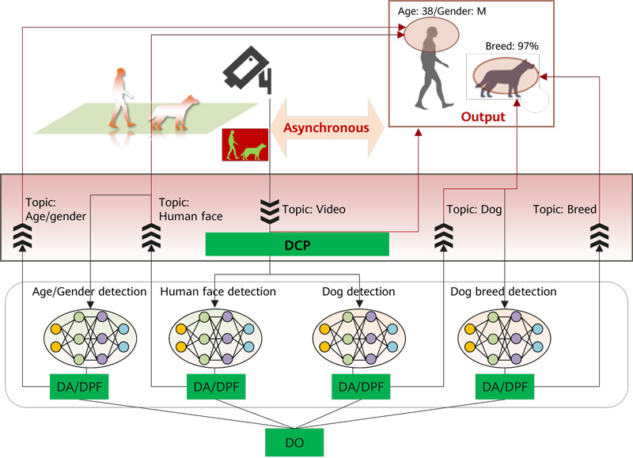
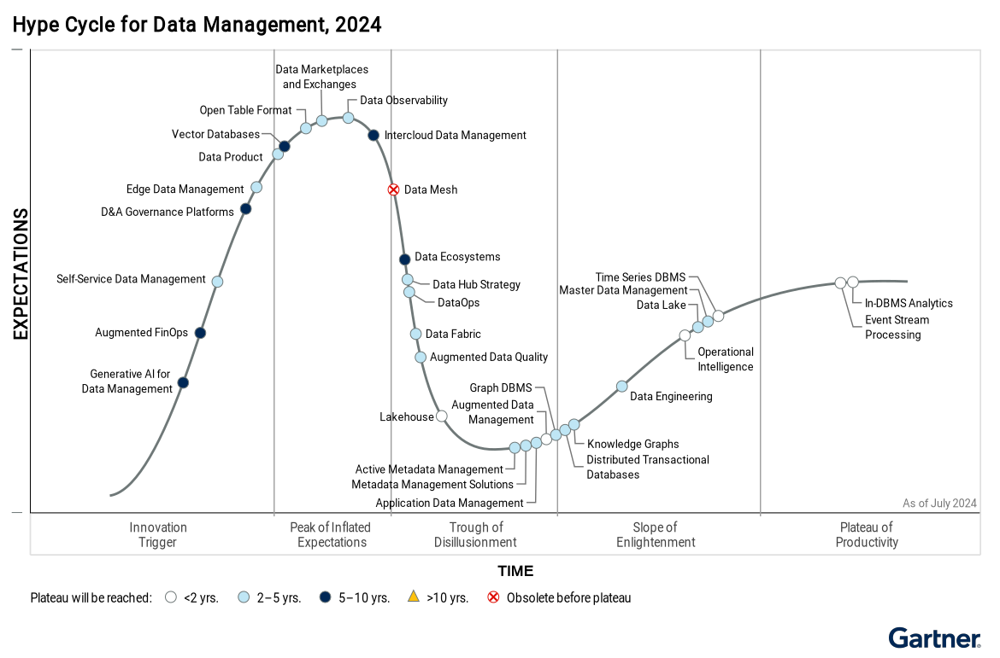
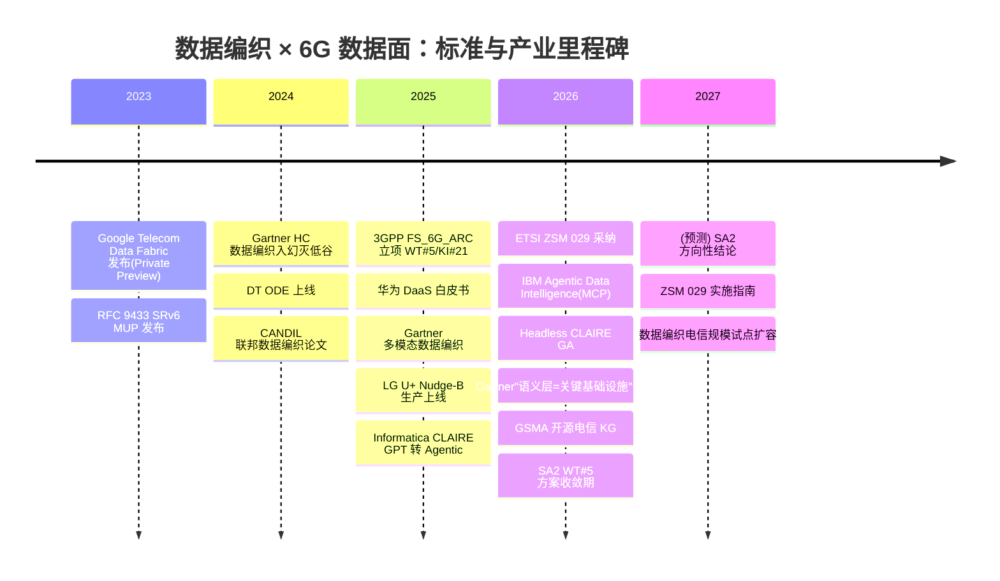
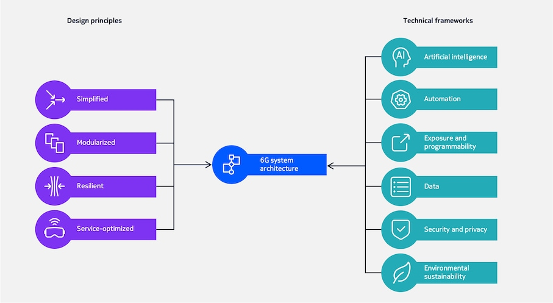
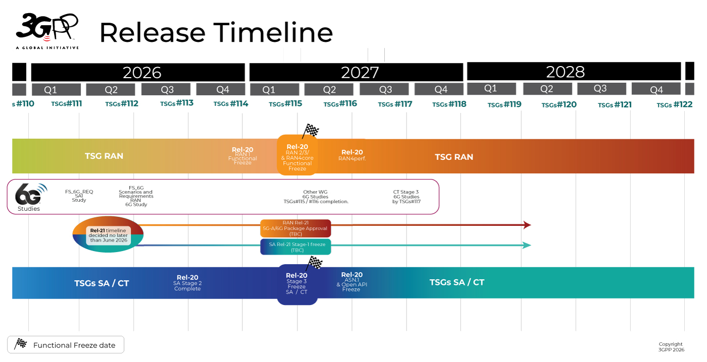
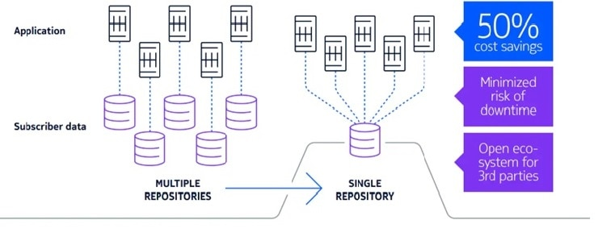
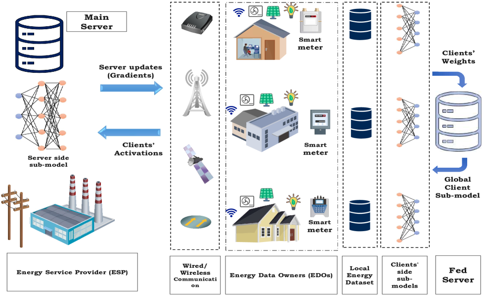

# 数据编织服务 6G 数据面：价值、鸿沟与技术演进议程

> 版本 v5 | 生成 2026-07-21 | 视角：数据中台团队 / 战略专家组（大数据背景读者）
> 说明：本版在 v4 基础上完成一次**主线重构**，取代 v4——
> **①** 报告主角从"6G 数据面"换为"**数据编织**"：数据面降为需求方/服务对象（那是 RAN/核心网产品线的战场），全文回答"数据编织服务数据面的价值是什么、要有效服务还缺哪些技术"——即数据平台团队的技术如何绑定公司经营主航道；
> **②** 新增重点方向"**AI 对数据编织的加持**"（现状三 + 趋势二），基于 2026-07 增量调研（Gartner 2026 预测、Informatica/IBM Agentic 产品化、电信侧 Agentic-NWDAF 原型、LLM 自动构建电信知识图谱），证据已沉淀至 wiki 主题卡 `ai-augmentation-of-data-fabric`；
> **③** 修正 v4 遗留的论证问题：分离"传输之弊"与"管理之缺"两条论据、明确数据编织的必要性**与独立数据面之争的结果无关**（路线无关）、修正"管道蜕变"表述为"平面叠加"、新增运营商第一性价值论证（收入/成本/战略位置三分）；
> **④** 承载侧内容（GTP-U/SRv6）压缩为需求侧背景一段，不再单列趋势。
> 技术判断后以 **[高/中/低]** 标注证据强度；引用以方括号简称标注，完整出处见附录 B；配图来源见附录 C。

---

## 需求和目标

### 一句话主线

**6G 数据面正在把电信网络变成公司经营主航道上最大的新数据场景；数据编织是让这个场景产生商业价值的必要技术；但今天的数据编织还不能直接服务数据面——补齐这段技术差距，是数据平台团队在 6G 周期的立身之本。**

### 先把两个"数据面"分开

本报告说的"6G 数据面"，**不是**网络工程语境里与控制面相对的"转发面/用户面"（那个面在 4G/5G 里承载连接数据、在 6G 里将继续作为管道存在），而是 6G 阶段业界提议**新增**的一个功能面：专门处理**非连接数据**——感知（ISAC）点云与 I/Q 信号、AI 训练数据/模型参数/梯度、跨域遥测——的采集、传输、处理与服务化 [Huawei 2025] [中国移动 2022]。因此 6G 的变化不是"管道蜕变成服务平面"，而是"**在管道之外叠加一个数据与智能服务平面**"：6G 网络（注意主语是网络整体，不是某个面）从"纯连接服务提供者"扩展为"连接 + 数据 + 智能服务提供者"。

### 数据面对运营商的第一性价值：为什么这个场景值得供应链为它备货

新场景要成立，先要回答运营商为什么买单。从第一性原理拆，三类新数据对应三种价值，证据强度各异：

- **通感 = 资产复用（新收入）**。运营商的本底资产是全国性站址、频谱与无线基础设施。ISAC 让同一张网以低边际成本兼职"传感器网络"，产出物理世界数字化数据（华为估算基站侧感知数据量可达 ZB 级/天，厂商单方估算 [中]）[Huawei 2025]——面向低空经济、交通、安防等的 sensing-as-a-service 是潜在新收入，本质是"一网两用"。**付费需求尚未经市场验证 [低]**。
- **孪生与自智 = 用数据换 OPEX（降成本）**。网络是运营商最大的成本中心之一；数字孪生与 L4/5 自智网络用数据和算力替代人工运维与试错。这是三者中**唯一有当期真实付费**的价值：自智网络 L4+ 是运营商现实采购项，Jio 采纳 ODA 现代数据架构后报告 OPEX 降低 30%、NOC 操作员减少 65%（TM Forum 案例 [中]）[TM Forum]。
- **AI 原生 = 价值链卡位（战略位置）**。移动互联网时代运营商被 OTT 管道化的教训在前；AI 时代若网络只卖连接，AI 的数据与算力红利将再次绕开运营商。AI 原生数据（训练/推理/梯度流，GenAI 业务上行流量占比已升至 26%，单一来源 [中] [NVIDIA 2025]）的意义是让运营商在 AI 价值链中持有"数据供给与分发基础设施"的位置。价值最大、最难量化 [中]。

**三种价值有一个共同前提：数据必须从"网络副产品"变成"可发现、可信任、可交付、可合规流动的资产"。**这正是数据管理问题，而非传输问题。

### 原料与成品：数据面为什么离不开数据编织

6G 数据面（无论最终以何种架构形态落地）解决的是数据的**运输**：多对多拓扑、亚毫秒时延、TB/s 级吞吐。但只有运输，数据面就是"一条更贵的管道"——里面流的是无目录、无语义、无质量保障、无治理的**原料数据**。运营商已经为管道付过一次钱，不会为第二条管道付钱；会付钱的是管道尽头的**成品**：可直接喂给 AI 的特征与语料、可出售给第三方的合规感知数据产品、可支撑孪生保真度的统一语义遥测。**数据面解决数据的运输，数据编织解决数据的成品化**——以主动元数据、知识图谱、AI 编排为核心的现代数据管理架构 [Gartner 2024]，负责让数据"被找到、被理解、被信任、被合规地使用"。

这里必须点破一个论证要点（v4 未分离）：**"需要数据编织"与"需要独立数据面"是两个独立命题。**GTP-U 隧道状态爆炸、UPF 会话模型不适配非连接数据，论证的是承载与传输层需要重构（独立数据面 / 增强用户面 / SRv6 等路线之争由此而来，3GPP SA2 预计 2027-03 前给方向性结论 [3GPP SA2]）；而"没有目录、没有统一元数据、没有语义层、没有治理"（NWDAF 可选、经控制面取数、无跨域能力的三大局限 [Samsung 2026]）论证的才是数据编织。**无论传输层路线之争谁赢——华为 DaaS 独立面、Qualcomm 增强用户面、还是 Hexa-X-II 的 DataOps 叠加——统一的数据管理与语义层都是必选项** [Huawei 2025] [Qualcomm 2024] [Ericsson 2026]。数据编织是路线无关（route-agnostic）的确定性需求，这让本报告的结论不必押注在一个 2027 年才揭晓的标准结果上。[高]

> 📌 **大数据视角**：把 6G 网络想象成一家突然要同时跑"交易系统 + 实时数仓 + 特征平台 + AI Agent"的企业，它的数据基础设施却只有点对点管道（GTP-U 隧道）和一个可选装的集中报表库（NWDAF）——没有 Catalog、没有统一元数据、没有 Pub/Sub 总线、没有编排器、没有策略引擎。数据面之争是在争"管道怎么铺"；数据编织要回答的是"这家企业的数据平台由谁来建"。后者是数据团队的主场。

### 本报告回答四个问题

1. **需求侧**——6G 数据面对数据管理提出了什么规格的需求（作为背景压缩呈现）；
2. **价值论证**——数据编织能为数据面提供什么价值，AI 的加持如何改变数据编织本身；
3. **技术议程**——今天的数据编织离"能服务数据面"还差什么，需要哪些技术发展与演进（全文重心，即数据平台团队的立项清单）；
4. **主航道绑定**——作为在自智网络中承担"数据引擎"角色的数据中台（年投入千万级、以建议权为主），如何把数据平台技术绑定到公司经营主航道。

> 目标定位说明：本报告服务于我司数据中台团队的战略决策。团队在自智网络体系中承担"数据引擎"角色（与 AI 大模型引擎、数字孪生引擎并列构成数智引擎）。报告的落点不是"公司整体如何做 6G 数据面"——那是无线/核心网/承载产品线的仗——而是"**数据编织/数据智能技术如何成为主航道产品在 6G 竞标中的数据能力底座，以及数据中台如何供给这个底座**"。

---

## 行业环境与竞争现状

> 本板块按**供需结构**展开：现状一为需求侧（6G 数据面，背景压缩）；现状二、三为供给侧（数据编织能力全景 + AI 对数据编织的加持）；现状四为供需鸿沟与技术演进议程（全章枢纽）；现状五为标准与厂商格局。

### 现状一 · 需求侧：6G 数据面的"需求规格书"（背景）

对数据平台读者，通信侧现状可以压缩成一张需求规格书——6G 数据面要求数据管理层伺服的数据长这样：

| 维度 | 5G 用户面数据（存量） | 6G 数据面新数据（增量） | 证据 |
|---|---|---|---|
| 数据类型 | IP 包流（连接数据） | 感知点云/I/Q、AI 训练数据/梯度/模型参数、跨域遥测、孪生状态 | [Huawei 2025] [Samsung 2026] |
| 量级 | EB 级/月（全网） | 基站侧感知数据 ZB 级/天（厂商估算 [中]） | [Huawei 2025] |
| 拓扑 | 一对一（UE↔DN 会话） | 多源多汇任意拓扑、发布/订阅 | [Huawei 2025] |
| 时效 | 会话级 QoS | 亚毫秒（RAN 实时闭环）至准实时（跨域分析） | [ROBUST-6G] [CANDIL] |
| 治理域 | 单域为主 | 跨 RAN/核心/传输/边缘/终端/BSS/OSS 至少七域，主权与合规各异 | [DT] [ETSI ZSM] |
| 管理基础 | GTP-U 隧道 + 可选 NWDAF：无目录、无统一元数据、无跨域语义、控制面取数负载高 | 需要原生、跨域、实时、语义化的统一数据框架 | [Samsung 2026] [3GPP SA2] |

需求侧有两处不确定性，作为背景交代即可：**其一，架构路线未决**——独立数据面（华为 DaaS 的 DO/DA/DCP 三组件、中国移动"五面"架构）与增强用户面（Qualcomm）、居中路线（Hexa-X-II/Ericsson）之争，3GPP SA2 WT#5（KI#21，已积累约 90 篇贡献）预计 2027-03 前出方向性结论 [3GPP SA2] [Huawei 2025] [Qualcomm 2024]；**其二，承载协议重构**——SRv6 MUP（RFC 9433，SoftBank 2025-12 以 FWA 形态受限商用）与分布式 UPF（NVIDIA dUPF 2 核 100 Gbps/25μs）正在挑战 GTP-U [SoftBank 2025] [NVIDIA 2025]。对数据平台团队，这两处不确定性的含义只有一句话：**底层管道会变得更快、更可编程、可感知 SLA——这扩大而非缩小了管理层的作用空间，且如上节所论，数据编织的必要性不依赖任何一条路线胜出。**

华为 DaaS 是需求侧最完整的传输层提案，其机制可作为"数据编织要对接的管道"的具象参照——数据编排器（DO）调度、数据代理（DA/DPF）节点处理、数据通信代理（DCP）发布/订阅分发：

> 📌 **大数据视角**：DO ≈ 工作流引擎（Airflow 类），DA ≈ 采集与本地处理代理，DCP ≈ 消息总线（Kafka 类）——但都被要求跑在电信级时延与吞吐上，并与 3GPP 协议栈原生集成。值得注意的是：DaaS 白皮书聚焦"数据如何高效传输"，**目录、语义、血缘、治理在其叙事中着墨很少**——这正是数据编织的补位空间，也是本报告的机会所在。

### 现状二 · 供给侧（一）：数据编织能力全景、成熟度与批评

数据编织是"以主动元数据和 AI/ML 驱动、可跨分布式异构环境统一数据访问/集成/治理的现代数据管理设计"，Gartner 强调它不是单一产品，而是可叠加在既有湖仓之上、利旧不拆旧的架构方法 [Gartner 2024]；IBM 归纳其三大基石为数据虚拟化、联邦主动元数据（语义知识图谱 + AI/ML 持续分析）、机器学习引擎 [IBM]。它与数据网格（Data Mesh）维度不同：编织是技术/元数据驱动的集成层，网格是组织驱动的域自治运营模型，业界主张互补（Mesh-on-Fabric，证据分级 [低]，见趋势四）。

能力域全景（7+1）与成熟度分层——这张表决定了"哪些能力能直接搬去电信、哪些还要等"：

| 能力域 | 技术实现 | 成熟度（2024） | 大数据生态类比 |
|---|---|---|---|
| 1. 主动元数据 | 持续采集四类元数据，AI 分析后**驱动自动化**（非仅供人查阅） | 幻灭低谷 → 2-5 年 | "会触发动作"的 DataHub/Atlas |
| 2. 知识图谱 | 图结构表达资产语义、血缘、影响分析 | 早期主流 | 血缘图 + 业务语义层 |
| 3. AI/ML 增强 | 推荐集成路径、自动质量检测、NL2SQL | 峰值 → 爬坡 | AI Copilot for Data |
| 4. 数据虚拟化 | 逻辑层统一查询、数据不动 | 成熟（Denodo 验证） | 联邦查询（Trino 式） |
| 5. 自动数据集成 | 元数据驱动自动生成 ETL/ELT/CDC | 幻灭低谷 → 2-5 年 | 自动生成管道的 dbt/CDC |
| 6. 数据编排 | DataOps 管道协调、调度 | 早期主流 | Airflow/Dagster |
| 7. 隐私与治理 | 策略即代码、RBAC/ABAC、分类分级 | 成熟 | Ranger/OPA |
| +8. 增强数据目录 | ML 自动发现、标注、语义关联 | 幻灭低谷 | 智能化数据目录 |

宏观位置：2024 年 Gartner 数据管理成熟度曲线将数据编织置于**幻灭低谷**但保持"变革性"评级、预计 2-5 年到达成熟期；同图中 Data Mesh 被标记为"到达成熟期前即过时"[Gartner 2024]。2025 年 Gartner 将"多模态数据编织"列入 D&A 九大趋势（扩展至向量与非结构化数据）；Forrester 2025 Q4 Wave 评估 14 家供应商、Q2 Landscape 覆盖 39 家；市场规模预计从 2025 年约 33.7 亿美元增至 2034 年约 164.6 亿美元（CAGR 约 22%）[Gartner 2025] [Forrester 2025] [Fortune BI]。

批评必须如实呈现——它们恰恰界定了数据编织的能力边界：数据仓库之父 Bill Inmon 指出数据编织混淆"连接"与"集成"、缺乏真正的数据转换，"把脏数据编织在一起只会放大问题"；有分析预警忽视组织就绪度将导致高失败率 [Inmon] [Procurement Insights]。**技术架构不解决数据质量与组织问题——这一教训搬到电信落地时同样成立。** [高]

### 现状三 · 供给侧（二）：AI 对数据编织的加持——本报告重点方向

数据编织与 AI 的关系是**双向**的：编织为 AI 供数（AI-ready data），AI 反过来正在重构编织的实现方式。前者是需求拉动，后者是供给革命——两个方向都有 2025-2026 年的硬证据，分述如下。[中高]

#### 需求方向：AI 把数据编织从"可选架构"推成"AI 落地的前置条件"

- Gartner 对 1,203 名数据管理负责人的调查（2024-07 执行）显示：**63% 的组织没有或不确定是否有支撑 AI 的数据管理实践**；并预测到 2026 年，**60% 缺乏 AI-ready 数据支撑的 AI 项目将被放弃**——瓶颈不在模型而在供数 [Gartner AI-ready]。
- Gartner 预测到 2028 年 **80% 的 GenAI 业务应用将构建在既有数据管理平台之上**，RAG 的精度依赖目录/元数据提供的语义与可溯源性 [Gartner 2025-06]。
- 量化闭环证据：IEEE CAI 2026 研究显示，仅在检索前做 LLM 元数据富化（检索算法、嵌入模型不变），RAG 精度即从 73.3% 提升到 82.5%（+9.2pp）（经 Atlan 转述 [仅一源/中]）[Atlan]——**编织层的语义投入可直接、可测地转化为 AI 输出质量**。
- 电信是这个需求最严苛的落地场：6G 目标是 L4/5 零接触自智网络，AWS 提出 Intelligence Fabric/NLM、PwC 提出"语义数据编织是 Agentic AI 运营的基础"、Ericsson 把 AI-ready 数据底座列为自智 L5 前置条件 [AWS] [PwC] [Ericsson 2026]。

#### 供给方向：AI 正在改写数据编织每一层的实现方式（四条路径）

**路径一：LLM 自动构建元数据与知识图谱——语义层成本数量级下降。** 数据编织历史上最大的成本项是本体设计与元数据人工维护；电信场景尤甚（3GPP YANG、O-RAN 数据模型、TM Forum SID 三套本体并存，自动构建工具长期不成熟）。这个断点正在被 LLM 打开：GSMA 已用 GPT-4.1 从 O-RAN 规范全自动抽取 **25,103 节点/98,679 关系**的知识图谱并开源；Khalifa 大学发布 3GPP Rel-19 规范知识图谱（21,540 节点/31,718 边），均纳入 GSMA Open Telco Assets 计划 [GSMA KG] [KU-DFI KG]。**电信语义层正从人力密集型工程变为可自动化管道**——这对"谁能低成本建成网络语义层"的竞争格局是结构性变量。[中高]

**路径二：Agentic 数据管理——编织能力的执行主体从人变为 Agent。**Gartner 在 2026 年 D&A 峰会给出机制性论证："每次数据复用会产生约 100 个新元数据点"，元数据以人力不可及的速度爆炸，因此 **AI Agent 接管连接、编排与治理是不可避免的**；未来建设的对象"不再是数据管道，而是理解数据如何被使用的智能体" [Gartner 2026-Summit]。产品化已经发生：Informatica 将 CLAIRE 升级为多智能体架构（监督者 Agent 编排发现/集成/质量/治理专职 Agent，Headless CLAIRE 于 2026 年春 GA）；IBM 在 watsonx.data intelligence 推出 Agentic Data Intelligence（2026-04），以**托管 MCP Server** 把目录/血缘/治理策略暴露为 AI Agent 可调用的工具 [Informatica 2026] [IBM 2026]。注意当前自治程度仍以"推荐 + 人审批"为主，Gartner 同时告诫先在低风险管道验证治理 Agent 的上下文理解力 [Gartner 2026]。

**路径三：治理的 AI 化——从策略文档到机器可验证的数据合约。**Gartner 2026 预测：组织将使用自主 AI Agent 把政策与技术标准转译为**机器可验证的数据合约**，自动化合规与治理策略执行 [Gartner 2026]。这与电信跨域治理（七域、多法域）的痛点精确对位——人工逐案审批在 6G 数据量级下彻底失效，AI 生成/执行数据合约是目前唯一看得见的规模化出路。[中]

**路径四：意图接口——数据消费方式从查询变为意图。**电信侧已有原型链路：EURECOM 的 Agentic-NWDAF（ICC 2026）用 LLM Agent 把自然语言意图翻译为 NWDAF 服务调用，以 MCP 为接口协议，用 100 条源自 3GPP 规范的意图基准验证了准确性；IntAgent 进一步把意图工具引擎内置到 NWDAF 分析引擎，用实时网络分析驱动 Agent 推理 [EURECOM 2026] [IntAgent 2026]。同时 IBM/Informatica 的 Agent 接口也统一收敛到 MCP——**"Agent-数据平台"接口协议正在事实标准化**，这为 6G"智能体自主发现/订阅网络数据"给出了具体技术形态。[中]

> 📌 **本节的战略含义（一句话）**：我们要下沉到 6G 的数据编织，不是 2022 年那个"目录 + 虚拟化 + 集成"的版本，而是**被 AI 重写过实现方式的版本**——语义层由 LLM 自动构建、能力由 Agent 执行、治理以数据合约固化、消费以意图驱动。按旧版本规划，交付即落后一代；而新版本的核心技术（LLM+KG、Agent、语义建模）恰是数据平台团队而非通信协议团队的看家本领。

### 现状四 · 供需鸿沟与技术演进议程（全章枢纽）

#### 鸿沟的量级

把现状二、三的供给能力对到现状一的需求规格上，横亘着一道数量级鸿沟：企业数据编织面向 GB/s 级批量数据、秒~分钟级延迟设计；6G 数据面要求 TB/s 级流式数据、亚毫秒延迟——**3 至 6 个数量级的差距，且当前无已知方案完整弥合**（本工程矛盾记录 CT-1）[Ericsson 2026] [Nokia]。本工程"数据编织能力 × 6G 场景"交集矩阵（M3）进一步显示：RAN 域的数据虚拟化与主动元数据是"性能鸿沟 + 研究空白"双红区；终端/NTN 六项能力中四项为研究空白；成熟度最高的是边缘场景（受 MEC 产业试点拉动）[M3 矩阵]。

早期实践证明"下沉可行但远未完成"：Deutsche Telekom One Data Ecosystem 报告 22× 性能提升、LG U+ Nudge-B 生产上线（唯一显式以 Data Fabric 命名的运营商部署）、Vodafone Italy Nucleus 报告 8× 洞察提升/45% 成本节约——但这些数字全部来自供应商/合作方口径、缺独立审计 [中]；Google Cloud Telecom Data Fabric 发布逾 3 年仍处 Private Preview；TM Forum 2025 调查中 87 位电信高管仅 2 人认为本企业实现了数据完全民主化 [DT] [data-fabric-in-telecom] [TM Forum]。**已落地的案例集中在 BSS/OSS 与管理面（准实时侧）；越靠近 RAN 实时面，空白越大**——这个梯度正是技术议程的排序依据。

#### 技术演进议程：数据编织有效服务数据面所需的六项技术（部门立项清单）

每项都是"现有编织做不到 → 电信数据面必需 → 全行业尚无完整方案"的结构。AI 加持（现状三的四条路径）不是第七项，而是**贯穿六项的实现手段**，在各项中标注。

| # | 演进方向 | 现状差距 | 对应数据面需求 | AI 加持点 | 证据基础 |
|---|---|---|---|---|---|
| 1 | **流式/实时编织**：元数据标注、血缘、质量检测在数据流上在线完成，而非批处理 | 企业编织秒~分钟级；M3 显示 RAN 域主动元数据/虚拟化双红区 | RAN 遥测供给 AI 训练/推理、O-RAN dApp（<1ms 闭环） | 轻量模型在数据产生点做在线语义标注 | CT-1；[M3 矩阵] [ROBUST-6G] |
| 2 | **电信协议原生连接器**：对接 NWDAF/DCCF、ETSI ZSM 029 数据管理代理、DaaS DCP 类总线的标准化接口 | 编织跑在 REST/JDBC 上；**编织层与数据面之间的接口零标准化提案**（本工程已识别空白） | 一切场景的前提——管理层与传输层的"合体面" | Agent 经 MCP 调用编织能力的模式可直接移植（IBM/EURECOM 已验证） | [ETSI ZSM] [3GPP SA2] [IBM 2026] [EURECOM 2026] |
| 3 | **多模态电信元数据模型与语义层**：点云/I/Q/梯度/向量的语义描述 + YANG/O-RAN/SID 三套本体映射 | 编织以表格为中心；电信本体三套并存无人打通；Gartner 多模态编织无成熟产品 | 感知数据服务化、孪生供数、AI 数据资产化 | **LLM 自动抽取本体/构建 KG（GSMA 已开源实证）——成本数量级下降** | [Gartner 2025] [CANDIL] [GSMA KG] |
| 4 | **边缘原生形态**：目录/元数据引擎/策略引擎的 CNF 化、轻量化、联邦化部署 | 编织产品假设集中式数据中心 | 分布式数据面拓扑（边缘/站点/终端） | Agent 化组件天然适合分布式部署 | [Nokia] [6G-TWIN] [M3 矩阵] |
| 5 | **线速治理与机器可验证数据合约**：策略即代码在不引入不可接受延迟前提下执行 | 治理是事后/旁路的；Fraunhofer 实测策略执行在实时 RAN 场景引入不可接受延迟 [中] | 跨域合规流动、感知数据变现的前置条件 | **AI Agent 把法规/标准转译为数据合约并自动执行（Gartner 2026 预测方向）** | [DT] [ETSI ZSM] [Gartner 2026] |
| 6 | **Agentic 供数接口**：意图驱动的数据发现与订阅，服务自智网络 L4/5 智能体 | 编织接口面向人（SQL/BI/API） | 网络域 AI Agent 自主发现、理解、信任、订阅数据 | **MCP + LLM 意图翻译（Agentic-NWDAF/IntAgent 电信侧原型已验证）** | [EURECOM 2026] [IntAgent 2026] [AWS] [PwC] |

三点解读：**其一**，第 2 项（接口）是杠杆最高的一项——"数据编织与 DaaS 类数据面之间的接口目前无任何标准化提案"，这个空白谁先占住，谁就定义管理层与传输层的分界（对应机会 O3）；**其二**，第 6 项把 6G 前瞻与部门存量业务（自智网络数据引擎）连成一条线——它不是空中楼阁，而是数据引擎现有能力的直接延长线（对应机会 O2）；**其三**，第 1 项技术难度最大、也最诚实：数据编织在亚毫秒实时路径上的价值受物理约束，务实的架构是**分层伺服**——实时面用专用流式管道 + 在线标注（编织的"前哨"），准实时/管理面用完整编织能力（编织的"主场"）。把边界写清楚，恰是对"编织包打天下"式过度承诺的防御。[高]

#### 数据编织服务数据面的四个场景与价值（正面回答"价值到底是什么"）

| 场景 | 数据编织做什么 | 价值（对运营商/对主航道产品） | 证据 |
|---|---|---|---|
| ① AI 训练/推理的跨域数据供给 | 统一目录 + 语义对齐 + 血缘，实现"一次采集、多次使用"（恰为 SA2 WT#5 设计原则） | 降低找数/接数/清数成本；元数据富化可量化提升模型输出质量（RAG +9.2pp 类比证据） | [3GPP SA2] [Atlan] |
| ② 感知数据服务化 | 对点云/I/Q 做分级、脱敏、授权、审计、计费元数据 | 感知数据变现的**合规前置条件**——没有治理，sensing-as-a-service 无法出售 | [DT] [ETSI ZSM] |
| ③ 网络数字孪生供数 | 跨域遥测的统一语义与实时血缘 | 孪生保真度的上限由供数质量决定；Telenet 图数据库案例（60 万节点）已示范跨域影响分析价值 | [6G-TWIN] [data-fabric-in-telecom] |
| ④ 跨域/跨主体合规流动 | 联邦学习 + 策略即代码 + 数据空间连接器 + 数据合约 | 强监管市场（欧盟 GDPR/中国数据安全法）的准入门票；把合规从成本变卖点 | [DT] [ETSI ZSM] [Gartner 2026] |

一句话价值定位：**数据编织不解决"数据跑得快"（那是数据面传输层的事），解决的是"数据被找到、被理解、被信任、被合规地使用"——它是把数据面从"更贵的管道"变成"数据与智能工厂"的那一层。**

### 现状五 · 标准与厂商竞争格局

#### 标准入口

标准化呈"多组织并行、职责交叉、术语分裂"格局（Ericsson 叫 AI-ready data mesh、Nokia 叫 Data Framework、AWS 叫 Intelligence Fabric、华为叫 DaaS、3GPP 叫统一数据框架——功能实质高度收敛 [矛盾 28]）。对数据平台团队最关键的入口：

- **ETSI ZSM GS 029《自智网络数据管理代理》**：唯一显式把 Data Fabric 概念引入电信标准体系的工作项，由中国电信/中兴/CAICT/亚信主导，2026-04 采纳，定义数据注册/发现、资产管理、认证、收集传输、工作流编排 [ETSI ZSM]——**我司已在牌桌上**。
- **3GPP SA2 WT#5 / KI#21 统一数据框架**：数据面最直接的架构入口，2027-03 前方向性结论 [3GPP SA2]。
- **3GPP SA5 DMFW（TS 32.801）**：OAM 侧数据管理，与 SA2 职责重叠、运营商已呼吁协调 [3GPP SA5]。
- **O-RAN R005 AI/ML 工作流**：RAN 侧数据供给规范。

#### 厂商格局：鸿沟两侧各有半张牌

| 厂商 | 主动元数据 | 知识图谱 | 数据虚拟化 | 数据编排 | 隐私计算 | AI 原生数据管理 |
|---|:--:|:--:|:--:|:--:|:--:|:--:|
| IBM | 产品级 | 产品级 | 产品级 | 产品级 | 产品级 | **产品级（Agentic+MCP）** |
| Informatica | 产品级 | 产品级 | 部分 | 产品级 | 产品级 | **产品级（多智能体 GA）** |
| Denodo | 部分 | — | 产品级 | 产品级 | 部分 | 部分 |
| 华为 | 研究 | 研究 | 部分 | **产品级** | 研究 | 研究 |
| 中兴 | — | 应用级(AN) | — | 研究 | 探索 | 研究 |
| 爱立信 | 部分 | — | — | 部分 | 研究 | 部分 |
| 诺基亚 | 部分 | 研究 | — | 部分 | 研究 | 部分 |

（本报告综合研判，基于 M1 厂商矩阵与 2026-07 增量调研更新 AI 原生数据管理列）

结构性解读：**IT 供应商握着"编织 + AI 加持"的整套软件能力，但没有电信触点**——不具备亚毫秒处理、3GPP 协议栈集成、CNF 边缘部署能力，也进不了 RAN；**设备商握着电信触点，但编织能力普遍处于研究态**。鸿沟两侧各有半张牌，没人有整张——**"电信适配后的数据编织"是尚未被占领的中间地带**，这正是设备商体系内的数据平台团队（既懂编织技术、又背靠电信触点）的结构性机位。[高]

---

## 发展趋势判断

> 六条研判，主语统一为**数据编织**。每条按"判断 → 为什么对数据平台团队有价值 → 技术上如何实现 → 证据与玩家动态 → 反方 → 对我司含义"展开，判断强度以 [高/中/低] 标注。

### 趋势一：6G 统一数据框架成为数据编织最大的新落场 [高]

**判断**：6G 对 AI 的原生依赖，将迫使碎片化、可选、集中式的数据采集机制（NWDAF）升级为原生、跨域、实时、语义化的统一数据框架；这套框架的技术内核正是数据编织。到 2027 年前后，"6G 要不要统一数据框架"不再是问题，问题只剩"用谁的架构、叫什么名字"——**对数据编织而言，这是一个由标准强制创造出来的新市场**。

**为什么有价值**：自智网络 L4/5 与网络内 Agentic AI 的能力上限由可获取的数据质量决定；NWDAF 三大硬伤（可选、控制面取数负载高且碎片化、缺跨域 AI 能力）已被三星明确指出 [Samsung 2026]。统一数据框架把数据从"打补丁"变成"承重墙"——而其功能清单（注册/发现、语义、编排、治理）与数据编织能力域几乎一一对应（现状四映射）。6G 系统架构已把"数据"与 AI 并列为顶层技术框架（下图 Nokia 六大框架），给了这个市场架构合法性：

**技术上如何实现**：主动元数据做全网遥测自动分类/血缘，知识图谱表达跨域语义，发布/订阅 + 编排替代请求-响应取数——即现状四议程第 1/2/3 项的组合。

**证据与玩家动态**：ETSI ZSM 029、3GPP SA2 WT#5、O-RAN 数据管道三套框架功能重叠已不可忽视，预计 12-24 个月内出现首批跨标准组织协调 [forecast 预判 2]；厂商侧四种命名（mesh/framework/fabric/DaaS）技术实质收敛，印证方向确定性 [Ericsson 2026] [AWS] [Huawei 2025]。

**反方**：术语分裂可能拖慢标准收敛；若 NWDAF+DCCF 增强被证明够用，独立框架叙事将弱化（本工程设定的推翻条件）。

**对我司含义**：这是数据引擎能力外溢的最直接入口——统一数据框架的"语义/编排/治理"条目正是数据团队的专业主场（对应 O2/O3）。

### 趋势二：AI 加持使数据编织范式跃迁——从被动集成架构到 Agentic 数据智能平台 [中高]

**判断**：数据编织不是一项"等着被 6G 采纳"的静态技术，它自身正被 AI 重写——**语义层由 LLM 自动构建、能力由多智能体执行、治理固化为机器可验证的数据合约、消费接口从查询变为意图**。到 2028 年前后，"数据编织"与"AI 数据底座"概念基本合流；不完成跃迁的编织产品将被淘汰。（较 v4 同名趋势，本版证据强度由 [中] 上调至 [中高]——2026 年上半年 Informatica/IBM 产品 GA 与 Gartner 2026 预测提供了新增硬证据。）

**为什么有价值**：这条趋势回答"我们要建设的是哪个版本的数据编织"。三个数字点破紧迫性：63% 组织缺 AI-ready 数据实践、60% AI 项目将因此被弃 [Gartner AI-ready]、每次数据复用产生约 100 个新元数据点使人工管理不可持续 [Gartner 2026-Summit]。对数据团队还有一层身份意义：**数据中台的下一站不是更大的中台，而是"AI 的数据操作系统"**——而它的核心构件（LLM+KG、语义建模、Agent 编排）都是大数据/AI 团队的技术栈，不是通信协议栈。

**技术上如何实现**：四条路径（现状三详述）——LLM 自动构建元数据/KG（电信侧 GSMA 已开源 O-RAN/3GPP 规范知识图谱实证）、Agentic 数据管理（监督者 Agent + 专职 Agent + MCP 工具化）、AI 生成与执行数据合约、意图驱动供数接口（Agentic-NWDAF 已在电信场景验证链路）[GSMA KG] [Informatica 2026] [IBM 2026] [Gartner 2026] [EURECOM 2026]。

**证据与玩家动态**：Gartner "成功的 GenAI 产品需要数据编织交付主动元数据"（2025）、"通用语义层 2030 年成为与数据平台/网安并列的关键基础设施"（2026-03）[Gartner 2025] [Gartner 2026]；Informatica Headless CLAIRE 多智能体层 2026 春 GA、IBM Agentic Data Intelligence 2026-04 上线托管 MCP Server；Forrester 2025 Wave 已把 AI-ready 基础设施纳入评估维度 [Informatica 2026] [IBM 2026] [Forrester 2025]。

**反方**：Agentic 数据管理产品 GA 不满一年、独立客户 ROI 数据几乎为零；LLM 对电信协议实体的抽取精度缺公开基准（通用企业实体 85-92% 的数字不可直接外推 [中]）；Bill Inmon 的批评依然成立——语义层再智能也替代不了数据质量与真正的集成；全自治数据管理的错误成本在电信网络场景被放大，Gartner 自己也告诫先在低风险管道试验 [Gartner 2026]。

**对我司含义**：数据引擎（KG + 语义 + 大模型诊断）恰好站在跃迁的正确一侧——它天生是"为 AI 供数 + 用 AI 管数"的。应把数据引擎的演进目标从"运维数据中台"重述为"网络域 AI 智能体的数据底座"，并立即启动两项低成本验证：LLM 自动构建网络本体（借力 GSMA 开源 KG 冷启动）、数据引擎能力的 MCP 工具化。

### 趋势三：2026–2027 是数据管理条目定义权的收敛窗口 [高]

**判断**：6G 数据框架的架构方向、接口与术语将在 2026-2027 两年内集中定调。**这个窗口争的不是通信协议，而是"数据管理框架"的定义权——元数据模型、数据服务接口、语义本体，恰是数据团队的专业领地。**窗口关闭后条目固化，后进入者只能跟随。

**为什么有价值**：标准话语权是电信业最高杠杆的资产；对千万级预算、以建议权为主的数据中台，标准提案是"最低成本换最高杠杆"的稀缺路径——一篇被采纳提案的战略价值远超同等投入的产品开发。

**技术上如何实现**：窗口边界可从 3GPP 官方 Release 时间线精确读出——Rel-20 承载 6G 研究、SA Stage 2 于 2026 年内完成，Rel-21 正式规范 6G（时间线 2026-06 获批）；SA2 WT#5 目标 2027-03 前方向性结论 [3GPP SA2]：

**证据与玩家动态**：ETSI ZSM 029 已于 2026-04 采纳（我司参与主导）；SA2#170-#176 方案竞争充分展开、KI#21 约 90 篇贡献；SA2/SA5 职责重叠预计 2027 年协调分工 [ETSI ZSM] [3GPP SA2] [forecast 预判 1/7]。

**反方**：3GPP 历史上常延期 12-18 个月；方向性结论≠最终规范。窗口可能软性延后，但不会消失。

**对我司含义**：全报告最强行动号令——O3（ZSM 029 参考实现 + SA2 WT#5 语义/编排提案）必须 12 个月内落子；差异化打法是聚焦华为 DaaS 叙事中薄弱、又是数据团队主场的条目（语义模型、数据服务接口、编排、治理），不纠缠"独立数据面"命名之争。

### 趋势四：数据编织电信化进入规模试点期 [中]；Mesh-on-Fabric 是可能而未证的终局 [低]

**判断**：数据编织将从 3 家先行者（DT/LG U+/Vodafone Italy）扩展到 2027-2028 年 5-6 家 Tier-1 运营商规模试点 [中]；更远期可能与数据网格融合为 Mesh-on-Fabric 混合架构，但电信领域尚无任何经验证原型，单独标注 [低]。

**为什么有价值**：电信数据横跨至少七个治理域，既要跨域统一（否则 AI 拿不到全局视图）又要域自治（RAN 与 BSS 的时效/合规天差地别）。统一数据层的直接价值有厂商口径可参照——Nokia 报告统一共享数据层可达约 50% 成本节省（供应商口径 [中]）：

**技术上如何实现**：推荐路径 **Fabric-first → Mesh-layered**——先建统一编织层解决"找得到、看得懂、管得住"，再按域叠加数据产品运营 [高]。原型基础：CANDIL 用 ETSI NGSI-LD 实现联邦知识图谱、ROBUST-6G 把 KG-in-Fabric 作为架构核心、6G-TWIN 以联邦数据编织支撑网络数字孪生 [CANDIL] [ROBUST-6G] [6G-TWIN]。

**证据与玩家动态**：ZSM 029 发布降低运营商决策门槛 [forecast 预判 3/6]；DT ODE（22×）、LG U+ Nudge-B（生产）、Vodafone Nucleus（8×/45%）形成先行者集群，另有 Airtel/KPN/Telenet/Jio 等等效架构实践 [data-fabric-in-telecom]。Gartner 预测 2028 年 80% AI-Ready 数据产品产自 Fabric+Mesh 互补架构（方法论未公开 [低]）。

**反方**：先行者 ROI 全部为供应商口径、无独立审计（幸存者偏差）；Google TDF 逾 3 年未 GA 是持续警示；国内运营商显式部署为零（信息缺口）。若 2028 年底仍无运营商试点 Mesh-on-Fabric，该终局判断应被推翻。

**对我司含义**：先在自智网络内自用验证统一数据层（Fabric-first），再横向接入运营商试点（O6）；不为未经验证的混合终局超前重投。

### 趋势五：跨域数据治理从"外挂"变为"部署前置条件"，且治理本身正在 AI 化 [中]

**判断**：在数据主权法规碎片化与 6G 多利益方生态下，治理将内嵌于数据流、伴随数据面一起部署——没有治理，数据不能流动、更不能变现。且治理的实现方式正在 AI 化：从人工策略文档走向 **AI Agent 生成并执行的机器可验证数据合约**。

**为什么有价值**：6G 数据量级下逐案人工审批彻底失效；把治理内嵌进数据流是感知数据变现（现状四场景②）的前置条件，能把合规从成本转为差异化卖点（欧盟 GDPR/中国数据安全法市场）。对数据团队尤其可操作：策略即代码、分类分级、隐私计算都是数据工程的成熟工具箱，电信只是新落场。

**技术上如何实现**：三大支柱——策略即代码（DT MARA 对 AI Agent 数据访问做运行时动态授权）、隐私计算（联邦学习已入 3GPP Rel-18/19 标准，配差分隐私/MPC/同态加密）、数据空间连接器（IDSA/GAIA-X + ETSI PDL 审计）[DT] [ETSI ZSM]。AI 化增量：治理 Agent 把法规文本转译为数据合约（Gartner 2026 预测方向）[Gartner 2026]。联邦学习"数据不动、模型动"的机制如下图：

**证据与玩家动态**：3GPP SA5 DMFW 启动、SA2 WT#5 将访问控制/用户同意纳入研究（职责重叠待协调）；联邦治理（Nokia/Ericsson）、数据空间治理（IDSA/GAIA-X/6G-DALI）、策略即代码（DT MARA）三范式并行 [3GPP SA5] [DT] [6G-DALI]。

**反方**：治理有性能开销——Fraunhofer 实测策略执行在实时 RAN 场景可能引入不可接受延迟 [中]（正是现状四议程第 5 项要解的题）；治理 Agent 对法规上下文的理解可靠性未经电信场景验证。

**对我司含义**：把"数据不出域 + 联邦 + 策略即代码 + AI 数据合约"沉淀为合规参考架构（策略 7），是响应运营商合规刚需的低成本切入。

### 趋势六：语义层基础设施化——网络语义层成为可自动化建造的公共底座 [中]

**判断**：语义层（本体、知识图谱、业务语义）正在从"数据编织的一个组件"升格为**独立的基础设施类别**——Gartner 预测到 2030 年通用语义层将与数据平台、网络安全并列为关键基础设施 [Gartner 2026]；与此同时，LLM 使语义层的建造成本数量级下降（GSMA 开源电信 KG 为电信侧实证）。两股力量叠加意味着：**网络语义层将在 6G 周期内从"稀缺人工资产"变为"可自动化建造、先建者定义标准的公共底座"。**

**为什么有价值**：语义互操作是 M3 矩阵中全行业最均匀空白的能力行（四场景全为 🟡/🔴）——空白意味着无既得利益者，先建者的语义模型即事实标准。而语义层恰是数据编织六大能力中**最贴近数据团队专业、离通信协议最远**的一项：本体建模、KG 构建、语义检索是大数据/AI 工程师的日常。这条趋势为数据平台团队提供了 6G 战场上"技术最对口、竞争最稀疏"的阵地。

**技术上如何实现**：以 LLM 抽取管道自动化建造（规范文档→实体/关系抽取→schema 约束→图谱装载），对齐 NGSI-LD/YANG/TM Forum SID 三套本体做映射层；GSMA O-RAN KG（25,103 节点，GPT-4.1 抽取）与 KU-DFI 3GPP Rel-19 KG（21,540 节点）提供了开源冷启动素材 [GSMA KG] [KU-DFI KG]；CANDIL 的联邦知识图谱提供跨域架构模式 [CANDIL]。

**证据与玩家动态**：Gartner 2026 预测（语义层=关键基础设施）；GSMA Open Telco Assets 开源计划成型；电信 KG-RAG 研究活跃（arXiv 2503.24245 等）；我司 Fault Agent 是 KG+大模型在电信生产环境的少数落地之一 [TM Forum ZTE]。

**反方**：LLM 抽取的电信协议实体精度缺公开基准；"规范知识图谱"（静态文档语义）与"网络运行时语义"（实时遥测语义）是两个难度级，后者自动化程度远未验证；语义层的维护成本（标准演进、版本漂移）可能被低估。

**对我司含义**：把 Fault Agent 的 KG 能力 + LLM 抽取管道组合成"网络语义层自动构建"预研（对应策略 3 的升级版），并把语义模型作为 O3 标准提案的核心差异化条目——这是"优势（KG 生产落地）× 空白（语义互操作全行业早期）× 趋势（语义层基础设施化）"三线交汇点。

---

## 趋势判断总结：3 年看透、5 年看清

**3 年看透（2026–2028，高确定性）**：6G 统一数据框架方向在 SA2 于 2027 年前定调，ETSI ZSM 029 进入实施指南阶段；数据编织产品全面 AI 化（Agentic 数据管理、LLM 语义构建、MCP 接口成为标配）；电信试点从 3 家扩至 5-6 家 Tier-1；治理从外挂转前置。**这三年是数据管理条目的"卡位"窗口——术语未固化、接口未定义、语义层无人占领，正是数据平台团队以提案和原型影响定义的时机。**

**5 年看清（2029–2031，方向性）**：6G 数据面架构随首批商用落地；"数据编织"与"AI 数据底座"概念合流；通用语义层向基础设施地位演进（Gartner 2030 预测的验证期）；Mesh-on-Fabric 是否成形届时可验证（当前 [低]）。届时格局大局已定。

一句话：**未来 3 年决定数据平台团队在 6G 数据版图中的"话语权"，未来 5 年决定"市场位次"——最大的风险不是技术做不出，而是错过 3 年卡位窗口、数据引擎被固化在运维单场景。**

---

## 公司现状和定位分析

我司在"数据编织 × 6G 数据面"坐标系中的真实位置：**强于网络智能（KG+大模型生产落地）与电信触点（网/边/端全栈），弱于数据编织 IT 级产品能力与数据框架标准话语权。** [中]

**主航道绑定的论证（本章新增核心）**：公司经营主航道是无线/核心网/承载设备与运营商市场。6G 周期一个可观察的位移是：**设备竞标的差异化正从"连接性能"移向"数据与智能能力"**——自智网络等级（运营商当前真实付费点）、AI 原生能力、感知服务化都在成为设备卖点，而它们全部依赖数据底座（趋势一/二证据链）。由此得出数据中台的定位公式：**数据编织不是部门要单独售卖的 IT 产品（那是 IBM/Informatica 的赛道），而是让主航道产品在 6G 竞标中具备数据能力差异化的横向公共组件——数据中台是主航道的"数据能力供应商"。**这个定位同时回答两个内部问题：为什么不与 IT 巨头正面竞争（赛道不同：他们无电信触点，见现状五"半张牌"格局）；为什么这笔钱该数据中台花而非各产品线自建（横向能力分线自建必然碎片化——支撑策略 6 的跨线虚拟团队建议）。

**能力锚点**：数据中台在自智网络（AIR Net）体系中的既定角色是"数据引擎"（数智引擎三组件之一），已在生产环境支撑 KG+大模型的跨域故障诊断（Fault Agent，TM Forum 2025-05 案例）——这是数据编织"知识图谱/语义"能力在电信生产场景的少数真实落地之一 [TM Forum ZTE]。演进主线清晰：**数据引擎（自智网络内）→ 6G 数据面的数据语义/数据服务组件。**

**对照现状四技术议程的逐项自评**（依据 M1 厂商矩阵与公开证据）：

| 技术议程项 | 我司当前位置 | 依据 | 差距/机会 |
|---|---|---|---|
| 1 流式/实时编织 | 🔴 空白（全行业亦近空白） | M3 RAN 行双红区 | 机会区，需借力无线线站点算力 |
| 2 协议原生连接器 | 🟡 有位：ZSM 029 主导方之一 + SA2 提案 | [ETSI ZSM] [vendor 矩阵] | **标准入口在手，需转化为接口定义权** |
| 3 多模态语义层 | 🟢→🟡 相对亮点：Fault Agent KG 生产落地；无标准化语义模型 | [TM Forum ZTE] | 借 LLM 抽取管道放大（趋势六） |
| 4 边缘原生形态 | 🟡 有载体：MEC/站点算力资产 | capability-map | 软件形态待研 |
| 5 线速治理/数据合约 | 🟡 探索：NWDAF+FL 有探索，无策略引擎产品 | 3GPP Rel-18/19 FL | 中期补 |
| 6 Agentic 供数接口 | 🟡 邻近：Fault Agent 即网络域 Agent 用数的雏形，无 MCP 化/意图接口 | [TM Forum ZTE] | **数据引擎最短延长线** |

**综合自评（0-5，承接 v4 口径）**：AI 原生网络/AI-RAN 4、承载/传输 4、自智网络 KG+大模型 4——三项接近行业领先；核心网数据智能 3、跨域治理标准 3；**6G 数据框架话语权 2（对标华为 4）、数据编织 IT 级能力 1.5（对标 IBM/Informatica 5）**——两项主要短板；终端侧数据能力 1，但全行业同为空白，属机会区。

关键判断有三：其一，最优路径是**沿"数据引擎 → 6G 数据框架组件"外延、借自智网络与 AI-RAN 势能**，不与 IT 巨头拼通用中台 [高]；其二，AI 加持（趋势二/六）对我司是**放大器而非威胁**——LLM 自动构建语义层降低了我司补语义短板的成本，而 IT 巨头的 Agentic 产品进不了电信实时域 [中]；其三，最干净的差异化窗口仍是"优势 × 空白重叠"区——RAN 域流式编织与网络语义层 [中]。

---

## 公司可参与的机会点分析和选择建议

> 每个机会按 **场景（在哪里用）→ 技术(用什么做)→ 价值（为什么值得）** 三维展开，排序按"数据中台可达性 × 契合度"。相对 v4 的调整：O2/O3 注入 AI 加持要素（LLM 语义构建、MCP/意图接口），O4 承载机会压缩为建议项。

### 机会全景

| 机会 | 描述 | 契合度 | 数据中台可达性 | 信心 | 建议 |
|---|---|:--:|:--:|:--:|---|
| **O2** | 数据引擎 → 6G 数据框架组件外溢（含 Agentic 供数接口、LLM 语义层） | ★★★★ | 可直接抓（预研） | 高 | **首选主攻** |
| **O3** | ETSI ZSM 029 + 3GPP SA2 WT#5 标准卡位（主打语义/编排/接口条目） | ★★★ | 可直接抓（标准） | 中 | **首选主攻** |
| O1 | RAN 域流式数据编织 PoC（优势×空白重叠） | ★★★★ | 软件可抓/硬件借力 | 中 | 中期押注 |
| O6 | 国内运营商数据编织规模试点首发 | ★★★ | 建议+牵线 | 中 | 牵线+横向接入 |
| O4 | 承载侧传输底座与编织层 SLA 映射 | ★★★ | 只能建议（承载线） | 中 | 建议纳入路标 |
| O5 | 终端侧轻量数据编织（全行业空白） | ★★ | 只能建议（终端线） | 低 | 长期埋点 |

### O2 · 数据引擎向 6G 数据框架组件外溢 ★首选（信心：高 | 短期启动）

- **场景**：从自智网络 L4 跨域故障诊断（Fault Agent，生产环境）出发，延伸到三个 6G 场景——①网络域 AI Agent 的数据底座（智能体自主发现/订阅网络数据）；②统一数据框架的语义服务组件（为 DaaS 类数据面提供目录与语义上下文）；③网络数字孪生的统一供数。
- **技术**：把 Fault Agent 已验证的 KG + 大模型 + 跨域接入能力抽象为可复用组件，并注入 AI 加持的两个新构件：**LLM 网络语义层自动构建管道**（借 GSMA 开源电信 KG 冷启动，对齐 NGSI-LD/YANG/SID）[GSMA KG]；**数据引擎能力的 MCP 工具化 + 意图驱动供数接口**（技术形态对标 Agentic-NWDAF/IBM 托管 MCP Server）[EURECOM 2026] [IBM 2026]。对应技术议程第 3/6 项。
- **价值**：①复用存量资产、增量成本最低、6 个月内可出叙事与原型；②自智 L4+ 是运营商当前真实付费点，向 6G 延伸风险低；③抢占网络语义层的技术事实标准（趋势六：全行业最空白、最贴近数据团队专业的条目）；④对内把数据中台从"运维支撑"重定位为"主航道数据能力供应商"。

### O3 · ETSI ZSM 029 + 3GPP SA2 WT#5 标准双入口卡位 ★首选（信心：中 | 短期启动、2027-03 前见效）

- **场景**：①ZSM 029《数据管理代理》——我司参与主导，进入规范细化与实施指南阶段；②SA2 WT#5 统一数据框架——方案评估期。两个入口的功能范围与数据中台能力高度重合。
- **技术**：向 ZSM 029 贡献**参考实现**（Fault Agent 的数据管理代理化改造是现成素材）；向 SA2 WT#5 提交 ≥2 篇提案，主打"数据服务接口 + 元数据模型 + 语义本体映射"——即技术议程第 2 项那个**零标准化提案的编织层-数据面接口空白**，兼华为 DaaS 叙事薄弱处与数据团队主场。
- **价值**：①千万级预算下杠杆最高的投入；②避免华为 DaaS 术语单极主导、为后续产品预留接口位；③窗口刚性（2027-03 后架构条目基本封闭，趋势三）；④标准身位是数据中台对内争取定位的最硬筹码。
- **反方提示**：我司是"补位"而非"领跑"——聚焦差异化条目，不纠缠独立数据面命名之争。

### O1 · RAN 域流式数据编织：优势与空白重叠区（信心：中 | 中期 12-18 月）

- **场景**：RAN 实时遥测供数——O-RAN dApp（E3 接口，规范预计 2027 年初版）需亚毫秒级 I/Q、CSI 数据管道；M3 矩阵显示 RAN 域主动元数据/虚拟化为双红区，而 RAN 恰是我司主场（AIR/AIREngine/GigaMIMO 站点算力）。
- **技术**：不做 IT 级通用虚拟化（延迟不可行，见现状四"分层伺服"边界），做**电信专属流式编织前哨**：站点算力承载"RAN 实时数据代理 + 流式元数据在线标注"轻量 PoC——数据在产生点即打语义标签、进入编织层目录，供 dApp/边缘 AI 订阅。对应技术议程第 1 项。软件侧数据中台自主，硬件借力无线线。
- **价值**：①IT 供应商进不来（无 RAN 触点）、多数设备商没往这想的最干净差异化窗口；②先建原型者可影响 O-RAN 接口定义；③向内输出"RAN 数据也能被编织"的标杆，反哺 O2 语义叙事。
- **反方提示**："RAN for AI"付费需求未明——需求驱动 + 时间盒，PoC 不成即止损。

### O6 · 国内运营商数据编织规模试点首发绑定（信心：中 | 中期）

- **场景**：趋势四预计 2027-2028 新增 2-3 家 Tier-1 规模试点；海外标杆已立（DT/LG U+），**国内尚无运营商显式部署 Data Fabric——首发位空缺**。我司与中国移动/电信关系深（800G MTN、ZSM 029 均为联合成果）。
- **技术**：输出"电信数据编织参考架构"（Fabric-first：统一元数据目录 + 网络知识图谱 + 策略即代码治理），数据中台供语义层与治理层组件，产品线供承载与集成。
- **价值**：①国内首个显式 Data Fabric 部署的品牌与案例价值（须内置独立可审计 ROI 度量，避免供应商口径覆辙）；②为 ZSM 029 实施指南提供中国实证，反哺 O3；③数据中台借试点横向接入运营商数据组织。

### O4 · 承载侧传输底座与编织层 SLA 映射（信心：中 | 中期 | 只能建议）

- **场景与技术**：承载协议重构（SRv6 MUP 受限商用起步、GTP-U 替代预计 2027 进 3GPP 议程）叠加我司 800G MTN 标准红利，属承载产品线战场。数据中台的角色仅一项：在其上定义**数据传输策略与 SLA 的语义映射**——编织层告诉承载层"这类数据需要什么管道"。
- **价值**：为编织的端到端 SLA 能力预留承载接口；以建议纳入公司 6G 路标为主，数据中台不自担投入。

### O5 · 终端侧轻量数据编织：全行业空白的长期埋点（信心：低 | 长期 24+ 月 | 只能建议）

- **场景与技术**：M3 矩阵显示终端/NTN 四项能力为研究空白；我司是少数"网+端"双触点厂商。终端侧仅目录与轻量代理模式可行（算力/电池约束），先服务自家 AI 终端的数据管理。
- **价值**：需求一旦成立即无对位竞争者；但市场成熟度最低，只做低成本埋点、跟随信号加减仓。

### 选择建议与断言

千万级预算集中押 **O2 + O3**（专家组可直接推动、增量成本低、正卡标准窗口）；O1 做软件侧时间盒 PoC；O4/O5/O6 以"建议纳入路标 + 数据中台横向接入语义层"参与。**断言：数据中台在 6G 的最优战略，不是再造一个通用数据编织中台，而是把已在自智网络验证的数据引擎，沿"AI 加持后的数据编织"方向升级（LLM 语义构建 + Agentic 供数 + 数据合约治理），并借标准窗口把语义/编排/接口条目写进 6G 数据框架——让数据平台技术成为主航道设备在 6G 竞标中的数据能力底座。** [中]

**冷水（反方）**：O1/O5 可能超前于付费需求；O3 是补位而非领跑；O6 的 ROI 需自证；Agentic 数据管理自身尚无独立客户验证——因此全部策略遵循"需求驱动 + 时间盒 + 先自用验证"。

---

## 具体策略建议

> 类型：【D】= 数据中台/专家组可直接执行；【R】= 需上升为公司决策的建议。

| 序号 | 我司选择 | 具体策略 | 不做的风险 | 备注 |
|:--:|---|---|---|---|
| 1 | 【D】数据引擎战略叙事 | 起草"数据引擎 → 6G 数据框架组件"战略白皮书（主线即本报告：编织服务数据面的价值 + 六项技术议程 + AI 加持），面向决策层宣讲 | 数据引擎固化在故障运维单场景、错过窗口 | 90 天内完成，对内 |
| 2 | 【D】标准双入口卡位 | ZSM 029 贡献参考实现 + SA2 WT#5 提交语义模型/数据服务接口提案（≥2 篇），主攻"编织层-数据面接口"空白条目 | 华为 DaaS 术语单极主导、接口定义权旁落 | 对接 SA2#176 窗口 |
| 3 | 【D】网络语义层自动构建预研 | Fault Agent KG 能力 + LLM 抽取管道组合：以 GSMA 开源电信 KG 冷启动，构建对齐 NGSI-LD/YANG/SID 的网络本体与语义服务组件 | 语义层被先建者定义事实标准（趋势六窗口） | 复用现有资产 + 开源素材，成本低 |
| 4 | 【D】Agentic 供数接口预研 | 数据引擎能力 MCP 工具化 + 意图驱动数据发现/订阅原型（对标 Agentic-NWDAF/IBM 托管 MCP Server 形态） | 数据引擎接口停留在"面向人"，错过 Agent 生态 | 与策略 3 同项目组推进 |
| 5 | 【D+R】RAN 域流式编织 PoC | 站点算力承载"RAN 实时数据代理 + 流式元数据在线标注"轻量 PoC，时间盒管理 | 错过 O-RAN dApp 接口定义窗口 | 软件自主，硬件借力无线线 |
| 6 | 【R】跨线虚拟团队 | 建议设"6G 数据框架"跨产品线虚拟团队（数据+核心网+无线+标准部）——横向数据能力分线自建必碎片化 | 数据引擎内部边缘化、各线重复建设 | 组织建议 |
| 7 | 【D】合规即卖点参考架构 | 沉淀"数据不出域 + 联邦 + 策略即代码 + AI 数据合约"合规参考架构 | 数据主权法规碎片化时缺现成方案 | 中长期 |
| 8 | 【R】试点与路标建议 | 联合中国移动/电信争取国内首个显式 Data Fabric 试点（内置独立 ROI 度量）；建议将承载 SLA 映射、终端轻量编织纳入公司 6G 路标 | 国内首发被友商抢占；"网+端"独占机会流失 | 专家组牵线、公司决策 |

---

## 关键 AP 建议

| AP 内容 | 牵头单位 | 起止时间 | 备注 |
|---|---|---|---|
| "数据引擎 → 6G 数据框架组件"战略白皮书 v1 + 决策层宣讲 | 数据中台/战略专家组 | 2026-08 ~ 2026-10 | 【D】P0，最高优先 |
| SA2 WT#5 语义模型/数据服务接口提案起草与联署（≥1 篇） | 标准部 + 数据中台 | 2026-08 ~ 2026-12 | 【D】P0，对接 SA2#176 |
| ETSI ZSM 029 数据管理代理参考实现贡献 | 标准部 + 数据中台 | 2026-08 ~ 2027-03 | 【D】P0，我司已主导 |
| 网络语义层自动构建预研立项（LLM 抽取管道 + GSMA 开源 KG 冷启动） | 数据中台 | 2026-09 ~ 2027-06 | 【D】P1，对应策略 3 |
| 数据引擎 MCP 工具化 + 意图供数接口原型 | 数据中台 | 2026-09 ~ 2027-06 | 【D】P1，对应策略 4，与上一项同组 |
| RAN 域流式编织轻量 PoC | 数据中台 + 无线研究院 | 2026-Q4 ~ 2027-Q4 | 【D+R】P1，时间盒，对接 O-RAN 窗口 |
| 国内运营商 Data Fabric 标杆试点方案建议书 | 数据中台牵线 + 公司决策 | 2026-Q4 起 | 【R】P1 |
| "6G 数据框架"跨线虚拟团队组建建议 | 战略专家组 → 公司 | 2026-08 起 | 【R】P1 |
| 合规参考架构 v1（含 AI 数据合约方向） | 数据中台 | 2026-Q4 ~ 2027-Q2 | 【D】P2，对应策略 7 |

---

## 总结

一句话主要观点：**6G 数据面为公司主航道创造了"网络即数据工厂"的新场景，但数据面只解决运输、不解决成品化——数据编织（且是被 AI 重写过的版本：LLM 建语义、Agent 管数据、合约固治理、意图做接口）是把管道变成数据与智能工厂的必要底座；今天的编织离电信实时环境还差六项技术，这份差距清单就是数据中台未来三年的立项清单与在主航道中的立身之本；标准与语义条目将在 2026-2027 窗口收敛，应以"数据引擎外溢 + 标准卡位 + 语义层自动构建"低成本抢占，而非正面再造通用中台。** [中]

| 做什么 | 不做什么 | 遗留 / 待研讨 |
|---|---|---|
| 押 O2+O3：数据引擎外溢（含 MCP/意图接口、LLM 语义层）+ ZSM 029/SA2 卡位 | 不与 IBM/Informatica 拼通用数据编织中台（赛道不同：他们无电信触点） | 独立数据面 vs 增强用户面走向（待 SA2 2027 结论，但不影响编织必要性） |
| 把六项技术议程转为立项清单，主攻语义层（议程 3）与接口（议程 2/6） | 不承诺编织覆盖亚毫秒实时路径（分层伺服，实时面只做流式前哨） | LLM 对电信协议实体抽取精度基准（待建） |
| 用标准成果与主航道绑定叙事为数据团队争取内部定位 | 不自担 RAN 硬件/终端/承载产品线投入（走建议） | Agentic 数据管理独立客户 ROI（2027 观察点） |
| 合规做成卖点（联邦 + 策略即代码 + AI 数据合约） | 不超前于需求铺开重资产 PoC（需求驱动 + 时间盒） | Mesh-on-Fabric 终局（[低]，2028 验证点）；Google TDF 命运等监控信号 |

---

## 附录

### 附录 A · 主要术语

- **数据面（6G 语境）**：6G 中专门处理非连接数据（感知/AI/遥测）的采集、传输、存储与服务化的新增功能面；区别于网络工程语境中与控制面相对的"转发面/用户面"。
- **数据编织（Data Fabric）**：以主动元数据 + 知识图谱 + AI 编排为核心、跨异构环境统一数据访问/集成/治理的架构方法（非单一产品）。
- **主动元数据（Active Metadata）**：持续采集并被 AI 分析的元数据，其输出直接驱动数据管理自动化。
- **Agentic 数据管理**：由多智能体（监督者 Agent 编排专职 Agent）自主执行数据发现/集成/质量/治理任务的数据管理范式，人只审批例外。
- **MCP（Model Context Protocol）**：AI Agent 调用外部工具/数据的开放协议，正在成为"Agent-数据平台"接口的事实标准（IBM/Informatica/电信学术原型均采用）。
- **数据合约（机器可验证）**：由 AI Agent 将政策/技术标准转译成的、可在运行时自动校验执行的数据使用契约（Gartner 2026 预测方向）。
- **通用语义层（Universal Semantic Layer）**：Gartner 预测 2030 年将与数据平台、网络安全并列的关键基础设施类别。
- **DaaS（Data as a Service）**：华为提出的 6G 数据面方案，含数据编排器 DO、数据代理 DA、数据通信代理 DCP。
- **NWDAF**：5G 网络数据分析功能（控制面、可选、集中式）。
- **NGSI-LD**：ETSI 链接数据上下文信息模型标准，CANDIL 用其实现联邦知识图谱。
- **数据网格（Data Mesh）/ Mesh-on-Fabric**：域自治、数据即产品的组织范式；与编织互补的混合架构（电信侧未经验证 [低]）。

### 附录 A2 · 电信 ↔ 大数据概念速查（面向数据背景读者）

| 电信概念 | 最接近的大数据类比 | 关键差异 |
|---|---|---|
| GTP-U 隧道 | 手工点对点数据管道（无目录无路由） | 会话绑定、硬件转发 |
| UPF | 流量网关/转发引擎 | 会话模型，不适配多对多数据 |
| NWDAF | 可选装的集中式数仓 + 报表 | 经控制面取数、无跨域 |
| 华为 DO / DA / DCP | 编排器（Airflow）/ 采集代理 / 消息总线（Kafka） | 亚毫秒延迟 + 3GPP 协议栈原生 |
| O-RAN dApp（E3） | 部署在数据源旁的实时推理算子 | <1ms 闭环、访问物理层数据 |
| ETSI ZSM 029 数据管理代理 | 数据目录 + 接入 + 编排的标准化规范 | 面向自智网络闭环 |
| 网络知识图谱 / NGSI-LD | 血缘图 + 业务语义层（DataHub/Atlas 进阶） | 电信本体三套并存（YANG/O-RAN/SID） |
| Agentic-NWDAF / IntAgent | LLM Agent + MCP 调用数据平台工具 | 意图对象是 3GPP 网络分析服务 |
| 联邦学习（3GPP FL） | 隐私计算/联邦建模平台 | 已写入 3GPP Rel-18/19 标准 |

### 附录 B · 来源清单（分层）

标准官方 ★
- [3GPP SA2] 3GPP. FS_6G_ARC / WT#5 统一数据框架（KI#21），SA2#170–#176 系列会议讨论文稿. 2025–2026.
- [3GPP SA5] 3GPP TS 32.801. Study on 6G Management and Orchestration（含 DMFW）. 2025–2026.
- [ETSI ZSM] ETSI GS ZSM 029 Data Management Agent for Autonomous Networks（2026-04 采纳）；GS ZSM 002/012；GS PDL 034.
- [O-RAN] O-RAN R005 AI/ML 工作流. 2025.
- [RFC 9433] IETF. Segment Routing over IPv6 for the Mobile User Plane. 2023-07.

学术 📄
- [CANDIL] A Federated Data Fabric for Network Analytics. FGCS 2024-09.
- [ROBUST-6G] D2.2 Knowledge Graph within Data Fabric. 2025-01；[6G-TWIN] NDT Reference Architecture with Data Fabric. 2026；[6G-DALI] Federated Dataspace for 6G. arXiv 2026-02.
- [EURECOM 2026] Agentic-NWDAF: Enabling Intent-driven Agentic Intelligence for Autonomous 6G Network Analytics. ICC 2026（MCP 架构、100 条 3GPP 意图基准）.
- [IntAgent 2026] IntAgent: NWDAF-Based Intent LLM Agent. arXiv 2601.13114. 2026-01.
- [LLM-6G Survey] LLM-Powered Agentic AI for 5G/6G Networks: Tutorial and Survey. arXiv 2607.16066. 2026-07.
- [GSMA KG] GSMA O-RAN Spec Knowledge Graph（GPT-4.1 抽取，25,103 节点/98,679 关系，开源）. Hugging Face.
- [KU-DFI KG] 3GPP Rel-19 Telecom Knowledge Graph（21,540 节点/31,718 边，GSMA Open Telco Assets）. Hugging Face 2026.
- [KG-RAG Telecom] Enhancing LLMs for Telecommunications using KG and RAG. arXiv 2503.24245.

厂商/运营商 🏢
- [Huawei 2025] Data Plane Design for AI-Native 6G Networks（DaaS DO/DA/DCP）. 2025-02.
- [Qualcomm 2024] 6G Foundry: Rethinking the Control Plane（用户面优先）. 2024-03.
- [Samsung 2026] AI in 6G Network: Service and System Aspect（NWDAF 三大局限）. 2026.
- [NVIDIA 2025] Accelerated and Distributed UPF for 6G（Grace+BF3, 100Gbps/25μs）；GenAI 上行流量 26%. 2025.
- [SoftBank 2025] World's First Services that Utilize SRv6 MUP on 5G Commercial Network（FWA 受限服务）. 2025-12-18.
- [Ericsson 2026] Future-proof Data Management for AI Networks（AI-ready data mesh）. 2026.
- [Nokia] 6G System Architecture / Data Framework / Shared Data Layer. 2024–2026.
- [DT] Deutsche Telekom One Data Ecosystem（22×）/ MARA Blueprint. 2024–2026.
- [AWS] AI-native 6G: From Networks to Intelligence Fabrics（NLM + Fabric of Fabrics）. 2025-12.
- [IBM] What is a Data Fabric；[IBM 2026] Agentic Data Intelligence in watsonx.data intelligence（托管 MCP Server）. 2026-04-23.
- [Informatica 2026] CLAIRE GPT Agentic 数据管理（2025-11-25）；Headless CLAIRE 多智能体层 GA / Agent Fabric Context Catalog（2026-05-20）.
- [Google] Telecom Data Fabric（Private Preview 逾 3 年）；[Amdocs] Network Data Fabric.
- [中国移动 2022]《中国移动 6G 网络架构技术白皮书》（五面：控制/用户/数据/智能/安全）. 2022-06.
- [data-fabric-in-telecom] LG U+ Nudge-B（Denodo, 2025）；Vodafone Italy Nucleus（8×/45%，供应商口径）；Airtel/KPN/Telenet/Jio 等效架构案例汇编（wiki 主题卡）.
- 我司：TM Forum "ZTE's vision advances Autonomous Network innovation"（AIR Net/Fault Agent, 2025-05）[TM Forum ZTE]；与中国移动 ITU-T SG15 首个 800G MTN；《自智网络白皮书 2025》（数智引擎三组件）.

分析机构 📊
- [Gartner 2024] Hype Cycle for Data Management 2024（Data Fabric 幻灭低谷/变革性）.
- [Gartner 2025] Top D&A Trends 2025（Multimodal Data Fabric）；"成功的 GenAI 产品需要 Data Fabric 交付主动元数据".
- [Gartner AI-ready] Lack of AI-Ready Data Puts AI Projects at Risk（1,203 人调查：63%；60% 项目弃置预测）. 2025-02-26.
- [Gartner 2025-06] 80% of GenAI Business Apps on Existing Data Management Platforms by 2028. 2025-06-02.
- [Gartner 2026] Top Predictions for Data and Analytics in 2026（通用语义层 2030 关键基础设施；治理 Agent 生成机器可验证数据合约；物理 AI 数据 10×）. 2026-03-11.
- [Gartner 2026-Summit] Gartner D&A Summit 悉尼（Beyer：每次复用 ~100 元数据点、Agentic 数据管理不可避免）. 经 Computer Weekly 报道，2026.
- [Forrester 2025] Wave: Data Fabric Platforms Q4 2025（14 家）；Landscape Q2 2025（39 家）.
- [Fortune BI] Data Fabric Market 2025–2034（$3.37B→$16.46B, CAGR ~22%）.
- [PwC] Global Telecom Outlook 2025–2029（语义数据编织支撑 Agentic AI）.
- [TM Forum] IG1356；2025 数据民主化调查（2/87）；Jio ODA 案例（OPEX -30%）.
- [Atlan] LLM Knowledge Base Data Quality（转述 IEEE CAI 2026：RAG 元数据富化 73.3%→82.5%，[仅一源]）.

媒体/博客 📰
- [Inmon] Bill Inmon, "Data Fabric and Reality". 2024-10；[Procurement Insights] Data Fabric 80% 失败率预警. 2025.

工程内部分析（本知识库）
- [M3 矩阵] analysis/matrices/core-intersection.md（数据编织能力 × 6G 场景热力图）.
- [矛盾 CT-1/28] analysis/contradictions.md（企业 IT 与电信实时性鸿沟；术语分裂）.
- [forecast] analysis/forecast.md（12-24 月预判 1/2/3/6/7）.
- 增量调研沉淀：wiki/topics/ai-augmentation-of-data-fabric.md（2026-07-21）.

### 附录 C · 图片来源

- `assets/huawei-daas-1.jpg`：Huawei, "Data Plane Design for AI-Native 6G Networks"（2025），DaaS 多任务机制——现状一。
- `assets/gartner-hype-cycle-2024.png`：Gartner, Hype Cycle for Data Management 2024（经 Denodo 公开发布，2024-07）——现状二。
- `assets/trend1-6g-data-arch.jpg`：Nokia, "6G System Architecture"（2025）——趋势一。
- `assets/trend2-3gpp-timeline.jpg`：3GPP, Release Timeline Rel-20/21（2026-03）——趋势三。
- `assets/trend4-nokia-sdl.jpg`：Nokia, "Shared Data Layer"——趋势四。
- `assets/trend5-federated-learning.png`：arXiv 2309.09086, "Split Federated Learning for 6G Enabled-Networks"——趋势五。
- `assets/huawei-daas-2.jpg` / `huawei-daas-3.jpg`：Huawei DaaS DCP 机制详解——备用图（供 PPT 深讲）。
- `assets/trend3-srv6-vs-gtpu.png`：APNIC Blog，SRv6 vs 隧道封装对比——备用图（承载侧内容已压缩，v4 曾用于正文）。
- `assets/srv6-mup-softbank.png`：SoftBank SRv6 MUP Architecture——备用图。

> 图片版权归原作者，本报告仅作内部研究引用。
