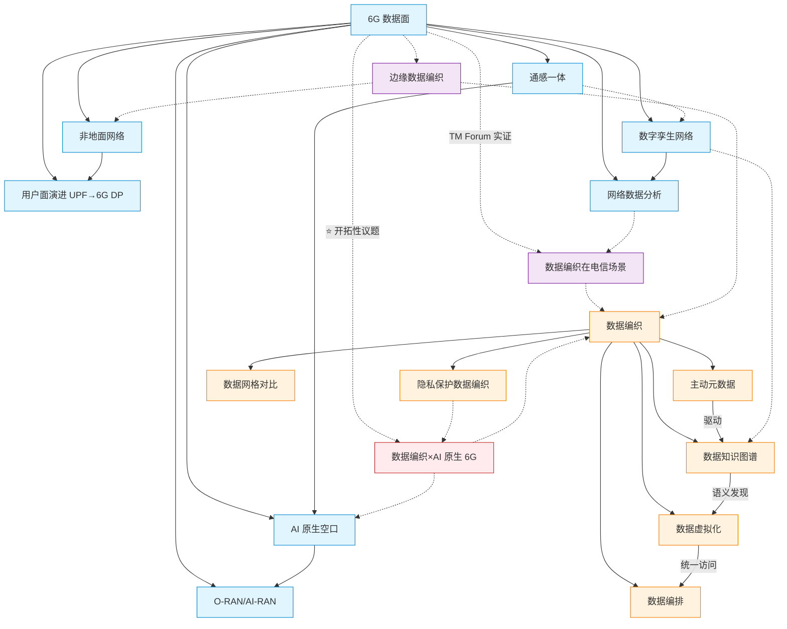

# Concepts：核心概念地图

> 由 `6g-wiki-curator` 维护。每加入新概念卡片后刷新这张图。

## 概念地图

## 概念清单

### A. 6G 数据面侧
- [x] `6g-overview` — 6G 总体愿景 (draft)
- [x] `6g-data-plane` — 6G 数据面 (draft)
- [x] `user-plane-evolution` — 用户面演进 (draft)
- [x] `ai-native-air-interface` — AI 原生空口 (draft)
- [x] `ran-architecture-evolution` — RAN 架构演进 (draft)
- [x] `network-data-analytics` — 网络数据分析 (draft)
- [x] `digital-twin-network` — 数字孪生网络 (draft)
- [x] `isac` — 通感一体 (draft)
- [x] `non-terrestrial-network` — 非地面网络 (draft)

### B. 数据编织侧
- [x] `data-fabric-definition` — 数据编织定义 (draft)
- [x] `data-fabric-vs-data-mesh` — 数据编织 vs 数据网格 (draft)
- [x] `data-fabric-capabilities` — 数据编织核心能力域 (draft)
- [x] `active-metadata` — 主动元数据 (draft)
- [x] `knowledge-graph-for-data` — 数据知识图谱 (draft)
- [x] `data-virtualization` — 数据虚拟化 (draft)
- [x] `data-orchestration` — 数据编排 (draft)

### C. 交集议题（W2 重点）
- [x] `data-fabric-in-telecom` — 数据编织在电信场景 (draft)
- [x] `data-fabric-for-ai-native-6g` — 数据编织×AI原生6G (draft) ⚠️ 文献稀缺
- [x] `edge-data-fabric` — 边缘数据编织 (draft)
- [x] `privacy-preserving-data-fabric` — 隐私保护数据编织 (draft)

> 由 `6g-onboarding` 创建占位卡片，由 `6g-deep-dive` 充实内容，由 `6g-wiki-curator` 治理。
