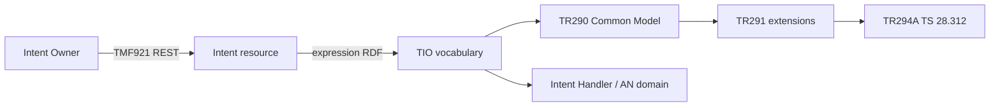
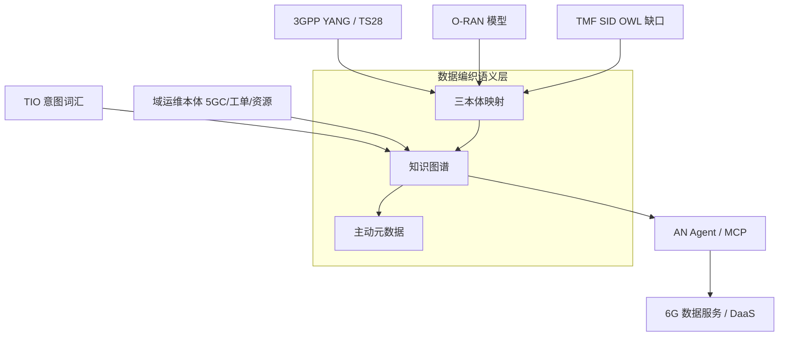

# TM Forum 自智网络本体工程

## 核心结论（150 字内）

「TMF AN ontology project」不是单一 GitHub 仓，而是三层语义栈：①官方 **TIO（TR292 v3.6.0，GA）** 给意图 RDF 词汇，TMF921 用它校验表达式；②**SID/MODA 仍是 UML/XMI**，OWL 化由 Catalyst `sid-ontology` 与厂商推进；③OpenAN 把 **AN Ontology 列为第三奠基项目**，但 2026-09-20 公开仓仍无 ontology。可克隆的 OWL 样本是亚信 AN-Ontology（89 类）与 Orange NORIA-O（已对齐 SID）。电信数据编织缺的不是「再一个湖」，而是这三层的机器可执行映射。[信心：中]

## 1. 现状定义

本子题覆盖 **TM Forum Autonomous Networks Project 及其产业实现里、用形式化本体表达 AN 知识** 的全部工作，边界如下：

| 层 | 回答的问题 | 权威形态 | 2026-09 公开状态 |
|---|---|---|---|
| **意图层 TIO** | Agent/域之间如何表达目标、约束、期望 | RDF/OWL 词汇 + TMF921 API | 规范 GA；TTL 在成员 Confluence，IRI 尚不解析 |
| **信息框架层 SID** | BSS/OSS/产品/服务/资源的共享「事物」 | UML/XMI（MODA 25.5，2026-01） | 官方无 OWL；Catalyst 承诺 SPARQL+MCP 版 |
| **域运维层 AN Ontology** | 故障/工单/网元/家客资源等可推理知识 | 厂商 OWL 模块 + OpenAN 规划项 | 亚信三模块已开源；OpenAN 未捐代码 |

**不是什么**：不是 3GPP YANG/NRM 的替代，也不是企业数据目录产品。IG1251 的 **K 参考点**（自治域 ↔ knowledge and intelligence platform）才是它在 AN 参考架构里的位置：本体是 K 平面的 schema，不是 I/F 平面的接口。

与既有报告判断对齐：电信语义层长期卡在「3GPP YANG、O-RAN 模型、TMF SID 三套并存、自动构建不成熟」。本子题说明——TMF 自己也还没把 SID 做成可解析 OWL，TIO 只覆盖意图这一窄条。

## 2. 标准与组织动态（近 3 年）

- **2022-07**：IG1251 AN Reference Architecture v1.0.1 — 定义 I/F/K 参考点，K 指向知识与智能平台。
- **2023-04**：TR294A/B — TIO 与 3GPP TS 28.312 Intent NRM、TS 28.541 的模型连接。
- **2024-07/08**：TR292 TIO v3.6.0 Team Approved → TM Forum Approved（GA）。同期 TR292A/C–G/R 与 TR290A/B/V 成套冻结。
- **2024-02～**：Orange NORIA-O 开源并在 ESWC 2024 发表，类级对齐 SID Domain/ABE 与 TMF638 Service。
- **2025-05**：IG1421 v1.0.0（Alpha）— AI Agent MAS 意图本体，基于 IG1253 IMF。
- **2025-07**：IG1251C AN L4 Target Architecture v1.1.0 — Agent 跨 Business/Service/Resource；知识/记忆成为 agent 功能块。
- **2025-09-11**：亚信 GitHub `AN-Ontology` 创建；10-24 提交 5GC 与家客资源两个 OWL。
- **2025-10-03**：`tmforum-apis/TMF921_Intent` 公开镜像。
- **2025-11-21**：TR292B 状态机、TR292H 数学函数升至 3.7.0（会员）。
- **2026-01-23**：MODA HTML/Sparx v25.5 Team Approved（SID 最新可浏览模型，仍非 OWL）。
- **2026-03**：MWC Barcelona 宣布 OpenAN；TR290 v3.8.0、TR292I Security Ontology v4.0.0。
- **2026-06**：DTW Copenhagen / MWC Shanghai — OpenAN 成为 LFN Candidate；Phase 1 开源 A2A-T SDK + Registry + Orchestration。LFN 原文把 **AN ontology** 列为三类组件之一，但捐赠清单不含本体仓。Catalyst C26.0.910 Agent Fabric 获奖，演示 SID OWL 与 AN KG（MCP）。
- **2026-09-20 本调研核实**：`github.com/project-openan` 仍无 ontology / sid-ontology / c-kg 仓库。

## 3. 关键玩家

| 玩家 | 定位 | 差异化 | 来源 |
|---|---|---|---|
| TM Forum AN Project | 官方词汇与架构 | TIO GA；SID 仍 UML；Turtle 分发差 | TR292 / Toolkit |
| China Mobile + Huawei | OpenAN 发起与 Phase 1 代码捐赠 | 把 A2A-T 做成可跑运行时；SID OWL 演示在 Catalyst | LFN 2026-06 |
| Vodafone | C26.0.910 `c-kg` 联合方 | AN 用例知识图谱 + MCP | Agent Fabric |
| AsiaInfo | 场景 OWL 开源 + OpenAN 支持方 | 唯一可克隆的「AN-Ontology」品牌仓；ODLM 数据湖本体 43★ | GitHub |
| Orange | NORIA-O + OpenAN 支持 | 公开 OWL 里真正写 TMF 等价关系 | ESWC 2024 |
| ZTE | OpenAN founding member | LFN 点名；C26.0.910 vendor 表未列；Fault Agent 生产 KG 是另一条线 | LFN；公司背景 |
| Semantic Arts | Frameworx/SID → gist OWL | 证明 SID 可直接进三元组库，绕过概念/逻辑/物理三层变换 | 2025-01 PDF |
| Ericsson Research | openapi-to-rdf | 从 OpenAPI 生成 RDF/SHACL，引用 TIO/TR290 | JOSS 预审记录 |

## 4. 技术机制

### 4.1 官方意图管道：TIO + TMF921

运行时信封是 JSON（id、name、expression.iri、expressionValue）；**语义正文是 RDF**，必须能被 TIO 形状/词汇校验。TIO 提供意图管理函数分类、量、逻辑/集合算子、度量与观测；扩展模型覆盖 probing、best intent、validity、utility、security。

这解决的是 **「目标怎么说」**，不解决 **「网元/服务/客户是什么」**。后者仍在 SID。

### 4.2 SID 的 OWL 化缺口

官方 SID 发布路径：GB922 Excel + MODA UML 2.5.1/XMI + HTML 浏览器。`tmforum-rand/MODA` 只放 XMI zip。

产业三条绕路：

1. **Catalyst sid-ontology**：号称从 MODA 25.5 导出 OWL，SPARQL + MCP（Agent 用）。仓库未公开，无法审计完整度。
2. **Semantic Arts gist**：企业知识图谱实践，强调取消三层模型变换。
3. **NORIA-O**：不整库翻译 SID，只对 Domain/ABE/Service 做 `equivalent` 注释。

在 SID OWL 缺位时，数据编织只能把 SID 当文档，不能当可推理 schema。

### 4.3 OpenAN「AN Ontology」工作流（规划 ≠ 代码）

LFN 与 Telecom Review 均写明三个奠基项目：A2A-T 公共组件、Agent Framework、**AN Ontology**。Phase 1 明确优先 A2A-T。因此 2026 年内 AN Ontology 仍是 **governance 承诺**，不是可依赖的上游依赖。

Agent Fabric 把本体拆成两件：全局 SID KG + 解耦的 AN 用例 KG。这比「一个万能电信本体」更接近可落地的模块化——也与亚信三模块策略同构，但亚信没有 SID 锚点。

### 4.4 亚信 AN-Ontology：可审计的 OWL 样本

三模块独立命名空间，无 `owl:imports` 统一 upper ontology：

| 模块 | 覆盖 | 规模（TTL 实计） | 对 6G/编织的可用性 |
|---|---|---|---|
| IoT 投诉工单 | Ticket–Complaint–Device–SIM–SLA | 30c / 18op / 16dp / 99ind | 对齐 HVS「投诉处理」；有 inverse/functional |
| 5GC 网元 | AMF/SMF/UPF/UDM + N2–N22 接口 | 31c / 64op / 20dp / 26ind | 用户面 UPF 接口可挂数据面讨论；缺 PCF/AUSF 类 |
| 家客资源 | OLT/ONU/POS/客户/宽带/IPTV | 28c / 39op / 56dp | 固定接入资源拓扑；与无线/6G 数据面距离远 |

已知缺陷（降低直接采用信心）：`InfterfaceN*` 系统性拼写错误；Resource README 整页复制 5GC；文档示例类（`ServiceFault` 等）未进 TTL；无 SHACL；ns 大小写分裂；与 SID/TIO 零 `equivalentClass`。

### 4.5 与数据编织、6G 数据面的接口

- **管理面（分钟级）**：TIO + SID OWL + 域本体可以直接作为数据编织目录的电信词汇表；MCP（Catalyst / IBM watsonx 同构）是 Agent 访问该目录的事实接口。
- **网络数据面（亚秒）**：TIO/SID 不进入 GTP-U/SRv6 快路径。5GC 本体里的 UPF/N3/N4/N6 描述可用于 **意图下发与根因解释**，不能替代用户面协议。
- **LLM 抽管道**：GSMA O-RAN KG、KU-DFI Rel-19 KG 已证明规范→图谱可自动化；TMF 侧缺同等开源抽取（SID XMI → OWL 正是该管道的 TMF 版）。

## 5. 趋势驱动力

- **业务**：AN L4 采购已发生（Jio ODA、Fault Agent 类）。跨厂商 Agent 互操作的阻塞点从「会不会说话」（A2A）转到「说的是不是同一个词」（ontology）。18 家 CSP 给 C26.0.910 站台，说明运营商认这个缺口。
- **技术**：MCP 把 KG 从 SPARQL 专家工具变成 Agent 默认工具；TMF921 强制 RDF 表达式，倒逼意图侧必须有本体。Gartner 2026 预测语义层将成为关键基础设施，与本栈同构。
- **政策/治理**：OpenAN 进 LFN + Apache 2.0，意图用开源降低多厂商集成税；TIO Security Ontology 4.0.0（2026-03）显示安全开始本体化，而不只写在 API 网关。

## 6. 批评与风险

- **官方机器可读性差**：TIO「Available to all」仍要登录；IRI 不解析；会员 TTL 与公开 PDF 双轨。ETSI/学术实现只能硬编码旧 prefix。这会拖垮互操作测试。
- **名实不符**：OpenAN 与 Catalyst 高调承诺 ontology 开源，DTW 已过三个月仍无仓。存在「协议开源、语义闭源」风险——语义闭源等于换一种锁死。
- **三套本体继续分裂**：TIO ≠ SID ≠ 域 OWL；亚信模块彼此也不 import。若不做 mapping 层，Agent 会同时出现「意图合格、资源对不上、故障类不在 SID」的组合失败。
- **样本质量不足**：亚信仓是目前唯一 AN 品牌 OWL，但拼写、文档污染、示例/TBox 不一致，直接进生产推理器会放大错误。
- **SID 版权/IPR**：SID 以 RAND 会员资产发布；把 MODA 25.5 转 OWL 开源可能撞 IPR。Catalyst 能否真正 Apache 化 sid-ontology 未经检验。
- **覆盖盲区**：公开 AN 本体几乎不碰 RAN 实时遥测、ISAC、NTN，对 6G 数据面主战场贡献有限。

## 7. 对我司的相关性

背景：中兴是 **OpenAN founding member**（LFN 点名），AIR Net 数据引擎已在 Fault Agent 用 KG+大模型做跨域诊断；数据中台战略是把该引擎延到 6G 数据服务。C26.0.910 的 SID OWL / AN KG 演示方是华为+沃达丰，不包含我司。

可执行（专家组/数据中台，千万级、年内）：

1. **做映射白皮书，而不是再造一套 SID。** 把 Fault Agent 已有实体（告警、网元、工单、域）显式对齐 TIO Expectation + SID Service/Resource ABE + 亚信/NORIA 可复用类。输出 SSSOM 或等价映射表，作为内部数据引擎的「电信语义层 v0」。
2. **在 OpenAN AN Ontology 工作流占位。** Phase 1 已过，2026-12 IHPP 是窗口。以故障 HVS 的 OWL 模块（可公开的那一层）提交，避免只当 logo 成员。
3. **TIO 接入 Fault Agent 意图面。** TMF921 expression 用 TIO Turtle 描述现有闭环目标（MTTR、受影响用户），先在试验网跑通「意图 RDF → 已有 KG 查询」，验证 K 参考点。
4. **不要 fork 亚信仓当公司标准。** 可借鉴模块切分（工单/5GC/资源），但必须修 ns、SHACL、3GPP 参考点，并补 SID `equivalentClass`。

需上升公司决策：

- 是否把 SID OWL / MCP catalog 做成 SDI 产品能力（对标 Catalyst 演示），而非仅自智网络内部资产。
- 是否投入会员力量推动 TIO IRI 解析与 SID 官方 OWL 发布（标准话语权，对标华为在 IG1453 的位置）。

反方：OpenAN ontology 若 2027 才商用验证，过早押注 OWL 栈会空转；更稳的短路径是加强现有 KG 质量与 MCP 暴露，等 sid-ontology 公开再对齐。

## 矛盾与待核实

- **矛盾 A：SID 官方形态** — TMF 发布 UML/XMI；Catalyst/Semantic Arts 按 OWL KG 叙述。倾向：官方未改格式，OWL 是实现层。待 sid-ontology 公开验证。
- **矛盾 B：OpenAN ontology 时间** — 2026-06 列为三类组件；2026-09 仍无仓。倾向：Phase 1 不含本体，承诺超前于代码。
- **矛盾 C：亚信发布状态** — README 未勾选核心网/资源本体；仓库已有 TTL。以 git 为准。
- **矛盾 D：TIO 命名空间** — 已发布文档 `tio.models.tmforum.org` vs 团队约定 `models.tmforum.org`。实现必须兼容两者。
- **矛盾 E：TIO vs AN Ontology** — 媒体常把「AN 本体」说成一件事。本调研把意图词汇与域知识本体拆开。

## 数据缺口

- P0：TIO v3.6.0 Turtle 全文（会员 Confluence）未获取，无法做 triple 级审计与和亚信仓的 mapping 实验。
- P1：`sid-ontology` / `c-kg` 仓库与 MODA 25.5 覆盖率未知。
- P1：OpenAN AN Ontology 章程范围（是否包含 SID 翻译、是否接受厂商模块）未公开。
- P1：TR292I Security Ontology 4.0.0、TR290 3.8.0 会员件正文。
- P2：亚信本体是否已用于商用 AN Agent；与 ODLM 的 join 方式未说明。
- P2：ZTE Fault Agent KG schema 与 TIO/SID 的内部映射（需内部资料）。

## 来源

### 一手资料 / 官方 ★
1. [TR292 TIO v3.6.0](https://www.tmforum.org/resources/introductory-guide/tr292-tm-forum-intent-ontology-tio-v3-6-0/) — AN Project，意图管理本体 GA
2. [Intent Toolkit](https://www.tmforum.org/toolkits/intent/) — TR292/TR290/TR291/TR294 版本表（含 2026-03 更新）
3. [TMF921 GitHub](https://github.com/tmforum-apis/TMF921_Intent) — expression 由 TIO 校验
4. [TMF921B Conformance v5.0](https://tmf-open-api-table-documents.s3.eu-west-1.amazonaws.com/OpenApiTable/TMF921_Intent/5.0.0/conformance/TMF921_Intent_Management_v5.0.0_conformance.pdf) — RDF 序列化强制项
5. [IG1251 AN Reference Architecture](https://www.tmforum.org/resources/introductory-guide/ig1251-autonomous-networks-reference-architecture-v1-0-1/) — K 参考点
6. [IG1421 MAS Intent Ontology](https://www.tmforum.org/resources/component/ig1421-ai-agent-mas-intent-based-ontology-operation-service-management-model-v1-0-0/) — 2025-05 Alpha
7. [MODA v25.5](https://www.tmforum.org/resources/model/master-oda-moda-html-model-v25-5/) — SID 最新 HTML 模型
8. [tmforum-rand/MODA](https://github.com/tmforum-rand/MODA) — XMI 公开镜像
9. [LFN OpenAN](https://lfnetworking.org/lf-networking-brings-a2a-t-to-live-network-through-openan-for-agent-driven-autonomous-networks/) — AN ontology 列为三类组件；ZTE founding
10. [Access to TIO models](https://engage.tmforum.org/discussion/access-to-tio-models) — TTL 托管与 ns 迁移

### 开源实现 / Catalyst
11. [asiainfo/AN-Ontology](https://github.com/asiainfo/AN-Ontology) — 三模块 OWL，clone SHA d8bf5f7
12. [project-openan](https://github.com/project-openan) — 2026-09-20 无 ontology 仓
13. [Agent Fabric](https://agent-fabric.github.io/) — sid-ontology / c-kg 承诺
14. [C26.0.910](https://www.tmforum.org/catalysts/projects/C26.0.910) — Winner 页
15. [Orange NORIA-O](https://github.com/Orange-OpenSource/noria-ontology) — SID/TMF638 对齐

### 厂商 / 媒体
16. [Telecom Review Europe on OpenAN](https://www.telecomrevieweurope.com/articles/reports-and-coverage/openan-building-open-source-components-to-advance-an-l4-deployment/) — 三个奠基项目表述
17. [Huawei OpenAN 新闻](https://www.huawei.com/en/news/2026/6/openan-project) — 捐赠 SDK/Registry/Orchestration
18. [Huawei Agents of ADN](https://www-file.huawei.com/admin/asset/v1/pro/view/ce64b49355724c0f956e93aad447d795.pdf) — 知识与记忆模块；CMCC 故障 Agent 指标
19. [Semantic Arts Frameworx](https://www.semanticarts.com/wp-content/uploads/2025/01/Telecom-Frameworx-Model.pdf) — SID→OWL 实践
20. [openan.dev](https://openan.dev/) — 路线图 2026.12 IHPP / 2027 商用验证
